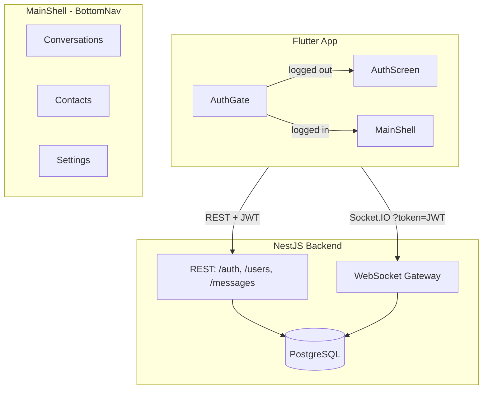
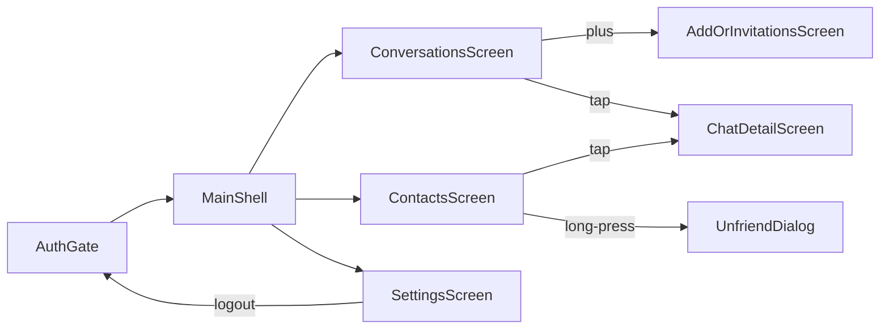
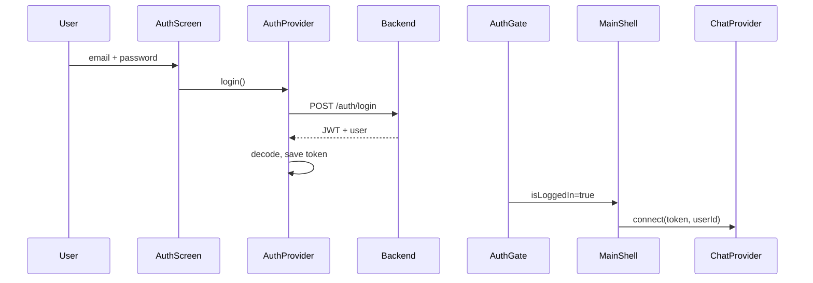
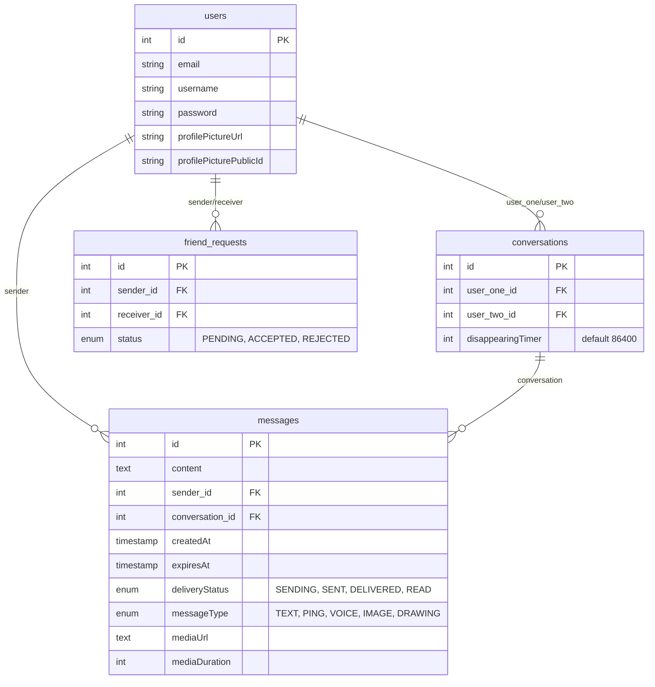

# CLAUDE.md — MVP Chat App

**Last updated:** 2026-02-16

**Rules:**
- Update this file after every code change
- Single source of truth for agents
- Read `.cursor/session-summaries/LATEST.md` at start; write `YYYY-MM-DD-session.md` and update `LATEST.md` at end
- All code in English (vars, functions, comments, commits). Polish OK in .md files only

---

## 0. Quick Start

**Stack:** NestJS + Flutter + PostgreSQL + Socket.IO + JWT. Web-first (dev), mobile later.

**Structure:** `backend/` :3000, `frontend/` Flutter app. Manual E2E scripts in `scripts/`.

**Run (current - web):**

```bash
# Terminal 1: Backend + DB (auto hot-reload)
docker-compose up

# Terminal 2: Flutter web (manual hot-reload with 'r')
cd frontend
flutter run -d chrome
```

**Before start:**
- Kill node: `taskkill //F //IM node.exe`
- Frontend: http://localhost:<random-port> (check terminal)
- Backend: http://localhost:3000
- Hot-reload web: Press `r` in terminal after changes

**Mobile (on hold):** Network config issues. Will return to this later.

---

## 1. Critical Rules — Must Read First

| Rule | Why |
|------|-----|
| **TypeORM relations** | Always `relations: ['sender','receiver']` on friendRequestRepository. Without: empty objects, crashes. |
| **TypeORM .delete()** | Cannot use nested relation conditions. Use find-then-remove: `.find()` then `.remove()`. |
| **TypeORM timestamps** | `expiresAt` may be string or Date from pg. Always use `new Date(val).getTime()` for comparisons. |
| **Socket.IO (Dart)** | Use `enableForceNew()` when reconnecting with new JWT (logout→login). Caches by URL otherwise. |
| **Provider→Navigator** | `ChatProvider` can't call `Navigator.push`. Use `consumePendingOpen()`: set ID, notifyListeners, screen pops in build. |
| **Multiple backends** | If frontend shows weird data vs backend logs: kill local `node.exe`, use Docker only. |
| **Notifications** | Use `showTopSnackBar()` (top of screen). Never `ScaffoldMessenger` (covers input bar). |

---

## 2. Architecture

### 2.1 Stack & Flow



### 2.2 Navigation (Post-login)



- **Conversations tab:** Custom header + list. Plus → AddOrInvitationsScreen. Swipe-to-delete → removes chat history only (preserves friend).
- **Contacts tab:** Friends list. Tap → open chat. Long-press → unfriend dialog (total delete).
- **Desktop (>600px):** Sidebar + embedded ChatDetailScreen.

### 2.3 Auth Flow



**Logout:** Settings → `chat.disconnect()` + `auth.logout()` → AuthGate shows AuthScreen.

### 2.4 Database Schema

**PostgreSQL, TypeORM `synchronize: true` (column additions auto-apply).**



**Key rules:**
- **users:** No cascade. Delete account manually deletes dependents (users.service deleteAccount).
- **messages:** Delete conversation: delete messages first, then conversation.
- **friend_requests:** Use **find-then-remove** for delete/unfriend (no .delete() with relation conditions).

---

## 3. API Reference

### 3.1 WebSocket Events

**Connection:** `?token=JWT`. Gateway verifies, sets `client.data.user = { id, email, username }`.

| Client emit | Server emit (to caller) | Server emit (to others) |
|-------------|--------------------------|--------------------------|
| **sendMessage** | `messageSent` | To recipient: `newMessage` |
| **getMessages** | `messageHistory` (array) | — |
| **startConversation** | `conversationsList`, `openConversation` | — |
| **getConversations** | `conversationsList` | — |
| **deleteConversationOnly** | `conversationDeleted`, `conversationsList` | To other: same |
| **sendFriendRequest** | `friendRequestSent` or `friendRequestAccepted` + `openConversation` | To recipient: `newFriendRequest` or `friendRequestAccepted` + `openConversation` |
| **acceptFriendRequest** | `friendRequestAccepted`, `friendsList`, `conversationsList`, `openConversation` | To sender: same |
| **rejectFriendRequest** | `friendRequestRejected`, `friendRequestsList` | — |
| **getFriendRequests** | `friendRequestsList` | — |
| **getFriends** | `friendsList` | — |
| **unfriend** | `unfriended`, `conversationsList` | To other: `unfriended`, `conversationsList` |
| **messageDelivered** | — | To sender: `messageDelivered` { messageId, deliveryStatus } |
| **markConversationRead** | — | To senders: `messageDelivered` (READ) for each message |
| **sendPing** | `pingSent` | To recipient: `newPing` |
| **clearChatHistory** | — | To other: chat messages cleared |
| **setDisappearingTimer** | `disappearingTimerUpdated` | To other: `disappearingTimerUpdated` |

**Key payloads:**
- **messageSent/newMessage:** `{ id, content, senderId, conversationId, createdAt, deliveryStatus, messageType, mediaUrl, mediaDuration, expiresAt }`
- **conversationsList:** `[{ id, userOne, userTwo, disappearingTimer, unreadCount }]`
- **openConversation:** `{ conversationId }`

### 3.2 REST API

| Method | Path | Auth | Purpose |
|--------|------|------|---------|
| POST | /auth/register | — | email, password, username → 201 |
| POST | /auth/login | — | email, password → { accessToken } |
| POST | /users/profile-picture | JWT | multipart JPEG/PNG (max 5MB) → update avatar |
| POST | /users/reset-password | JWT | oldPassword, newPassword |
| DELETE | /users/account | JWT | { password } → delete user + all dependents |
| POST | /messages/voice | JWT | multipart audio (AAC/M4A/MP3/WebM, max 10MB), duration, expiresIn? → { mediaUrl, publicId, duration } |

**Password rules:** 8+ chars, 1 uppercase, 1 lowercase, 1 number.

**Rate limits:** login 5/15min, register 3/h, upload 10/h.

---

## 4. File Location Map

**Backend (NestJS):**

| Change | Files |
|--------|-------|
| Auth | auth/auth.service.ts, auth.controller.ts |
| User (profile, password, delete) | users/users.service.ts, users.controller.ts |
| Friend request logic | friends/friends.service.ts, chat/services/chat-friend-request.service.ts |
| Conversation logic | conversations/conversations.service.ts, chat/services/chat-conversation.service.ts |
| Message logic | messages/messages.service.ts, chat/services/chat-message.service.ts |
| WebSocket gateway | chat/chat.gateway.ts |
| WebSocket DTOs | chat/dto/chat.dto.ts |
| Cloudinary (avatar, voice) | cloudinary/cloudinary.service.ts |
| Voice upload endpoint | messages/messages.controller.ts |

**Frontend (Flutter):**

| Change | Files |
|--------|-------|
| Auth gate | main.dart |
| Bottom nav / shell | screens/main_shell.dart |
| Conversations list | screens/conversations_screen.dart |
| Add friend / requests | screens/add_or_invitations_screen.dart |
| Contacts list | screens/contacts_screen.dart |
| Settings / logout | screens/settings_screen.dart |
| Chat screen | screens/chat_detail_screen.dart |
| Chat input / action tiles | widgets/chat_input_bar.dart, widgets/chat_action_tiles.dart |
| Message bubbles | widgets/chat_message_bubble.dart, widgets/voice_message_bubble.dart |
| Voice recording overlay | widgets/voice_recording_overlay.dart |
| Swipe-to-delete | widgets/conversation_tile.dart (Dismissible) |
| Socket connection | services/socket_service.dart |
| Chat state / events | providers/chat_provider.dart |
| Auth state | providers/auth_provider.dart |
| API calls | services/api_service.dart |
| Theme | theme/rpg_theme.dart, providers/settings_provider.dart |
| Top notifications | widgets/top_snackbar.dart |
| Constants | constants/app_constants.dart |

**Quick patterns:**
- Add WebSocket event: `chat.dto.ts` → handler in `chat/services/*.service.ts` → `chat.gateway.ts` @SubscribeMessage → `socket_service.dart` → `chat_provider.dart`
- Add REST endpoint: `*.service.ts` → `*.controller.ts` @UseGuards(JwtAuthGuard) → `api_service.dart` → provider/screen
- Add DB column: `*.entity.ts` → restart backend (TypeORM sync) → update frontend model

---

## 5. Key Features

### 5.1 Disappearing Messages

**Architecture:**
- **Timer storage:** Database (`conversations.disappearingTimer`, default 86400s = 1 day). Synced via WebSocket to both users.
- **Timer starts on DELIVERY**, not send (Telegram/Signal behavior).
- **Three-layer expiration:**
  1. Frontend: `ChatProvider.removeExpiredMessages()` called every 1s → instant vanish at zero.
  2. Backend cron: deletes from DB every minute (DELIVERED/READ only).
  3. `handleGetMessages` + `onMessageHistory`: filter out expired messages.

**Key fields:**
- `expiresAt`: timestamp when message expires
- `expiresInSeconds`: original timer duration (for display)

**Frontend logic in:** `chat_provider.dart` (removeExpiredMessages, onMessageHistory filter).

**Backend logic in:** `messages.service.ts` (findByConversation filter), `chat-message.service.ts` (handleSendMessage sets expiresAt, updateDeliveryStatus recalculates on DELIVERED).

### 5.2 Voice Messages

**Recording (Telegram-style):**
- Long-press mic in `ChatInputBar` → recording bar appears inline (timer, “⬅ Slide to cancel”).
- **Release** → send; **slide left** (~100px) → cancel (trash icon, then discard). Drag uses **global** position so slide works across the screen.
- **Mic stays visible** during recording (no `if (!_isRecording)` hiding it): the same GestureDetector stays in the tree so `onLongPressEnd`/`onLongPressCancel` and drag updates are received. Mic icon is wrapped in `Transform.translate` so it slides left with the finger; recording bar also shifts left and shows trash when sliding.
- `onLongPressCancel` handled: if user releases and gesture is canceled, still call `_stopRecording()` unless they had slid to cancel (`_canceledBySlide`).
- Format: AAC/M4A (native), WAV (web). 44.1kHz mono. Max 2 min, min 1s.
- **Permission:** `permission_handler` on mobile only (`!kIsWeb`). Web: browser handles.
- **Timer:** Managed by parent (ChatInputBar) via `ValueNotifier<int>` (prevents timer freeze on rebuild).

**Upload:**
- **Optimistic UI:** Message appears with SENDING status, uploads in background.
- POST /messages/voice → Cloudinary (`resource_type: 'video'`, folder `voice-messages/`).
- **TTL:** If disappearing timer active, `expires_at = expiresIn + 3600` (1h buffer). Cloudinary auto-deletes.
- **Retry:** FAILED status + retry button. Web: no retry (no cached bytes). Native: re-upload from local file.

**Playback:**
- **Lazy download:** Audio downloaded on first play from `message.mediaUrl`.
- **Caching:** `{appDocDir}/audio_cache/{messageId}.m4a` (avoid re-download).
- **Controls:** Play/pause, waveform (CustomPainter), scrub slider, speed (1x/1.5x/2x) via `just_audio`.
- **Expiration:** Play button greyed if `expiresAt < now`.

**Files:** `voice_recording_overlay.dart`, `voice_message_bubble.dart`, `chat_input_bar.dart`, `chat_message_bubble.dart`, `messages.controller.ts`, `cloudinary.service.ts`, `message.entity.ts`.

### 5.3 Delivery Status

**Statuses:** SENDING (clock) → SENT (✓ grey) → DELIVERED (✓ grey) → READ (✓✓ blue). Own messages only.

**Flow:**
1. Send: SENDING → backend → SENT.
2. Recipient receives: emits `messageDelivered` → sender sees DELIVERED.
3. Recipient opens chat: emits `markConversationRead` → sender sees READ (✓✓).

**Frontend:** `ChatProvider._handleMessageDelivered()`, `chat_message_bubble.dart` (delivery icons).

**Backend:** `chat-message.service.ts` (handleMessageDelivered, handleMarkConversationRead).

### 5.4 Delete Conversation vs Unfriend

| Action | Location | Effect | WebSocket Event |
|--------|----------|--------|-----------------|
| **Delete conversation** | Conversations tab (swipe) | Removes chat history only. Friend remains in Contacts. | `deleteConversationOnly` |
| **Unfriend** | Contacts tab (long-press) | Total delete: friend_request + conversation + messages. | `unfriend` |

**Re-open chat:** After delete conversation, tap contact in Contacts → `startConversation` → new empty conversation (friendship exists).

### 5.5 Ping Messages

**Purpose:** One-shot notification. Empty content, `messageType=PING`.

**Flow:**
- User taps Ping tile → `sendPing` event → backend creates PING message.
- Backend emits: `pingSent` (sender), `newPing` (recipient).
- Frontend handles both via `_handlePingReceived()`.

**UI:** Campaign icon + "PING!" text in bubble.

### 5.6 Unread Badge

**Display:** Orange badge with count (e.g. "4") on conversation tile.

**Logic:**
- Backend: `MessagesService.countUnreadForRecipient()` counts messages where sender ≠ user and deliveryStatus ≠ READ (excluding expired).
- `conversationsList` payload includes `unreadCount`.
- Frontend: `ChatProvider._unreadCounts` stores counts, increments on `newMessage` when chat not active, clears on `openConversation`.

---

## 6. Recent Changes (Last 14 Days)

**2026-02-16:**

- **Voice recording Telegram-style:** (1) Release now sends: use **global** position for drag; `onLongPressCancel` so release always calls `_stopRecording()` unless slid to cancel. (2) Slide-left to cancel: 100px threshold, trash icon. (3) **Mic stays visible during recording** so the GestureDetector is not unmounted—release and drag are received; mic icon uses `Transform.translate` so it slides left with the finger. File: `chat_input_bar.dart`.

**2026-02-15:**

- **Voice recording timer fix:** Timer was freezing/jumping due to overlay rebuilds. Fix: moved timer to parent (ChatInputBar) with `ValueNotifier<int>`, overlay uses `ValueListenableBuilder`. Duration computed from `_recordingStartTime`.

- **Voice messages web fix:** Fixed `Platform._operatingSystem` error on web. Guard Platform usage with `!kIsWeb`. Web: use WAV encoder, blob URL fetch, `uploadVoiceMessage(audioBytes)`. Retry not available on web (no cached bytes).

- **Voice messages full implementation:** Hold-to-record mic, full-screen overlay, optimistic UI, Cloudinary storage with TTL auto-delete, lazy download playback with caching, rich controls (play/pause, waveform, scrub, speed toggle). Backend: POST /messages/voice, `mediaDuration` column. Frontend: `VoiceRecordingOverlay`, `VoiceMessageBubble`. Design: `docs/plans/2026-02-15-voice-messages-design.md`.

**2026-02-14:**

- **Contacts tab:** New tab replaces Archive. Shows friends list. Long-press → unfriend (total delete). Tap → open chat.

- **Swipe-to-delete conversations:** Conversations tab uses swipe gesture (left-to-right) + confirmation dialog. Calls `deleteConversationOnly` (preserves friend).

- **Delete chat history:** Long-press action tile in ChatActionTiles permanently deletes all messages for both users. Real-time sync via `clearChatHistory` WebSocket event.

- **Ping instant display fix:** Ping didn't appear in sender's chat. Frontend only handled `newPing`, not `pingSent`. Fix: added `onPingSent` listener using same handler.

- **Default 1-day disappearing timer:** New conversations get 86400s timer stored in DB. Synced via `setDisappearingTimer` / `disappearingTimerUpdated` WebSocket events.

**2026-02-08:**

- **Unread badge:** Orange badge with count on conversation tiles. Backend counts unread (sender ≠ user, deliveryStatus ≠ READ, not expired). Frontend updates on `newMessage`, clears on `openConversation`.

- **Messages disappear after switching chat:** Backend `findByConversation` returned 50 oldest (ASC). Fix: `order: DESC`, `take`, then `.reverse()` to return most recent N oldest-first.

**2026-02-07:**

- **Docker optimization:** Frontend 7.64GB → 136MB (98%). Backend 644MB → 357MB (44%). Added `.dockerignore`, multi-stage builds, cache cleanup.

- **Notifications at top:** All notifications use `showTopSnackBar()` (top of screen) instead of `ScaffoldMessenger` (covered input bar).

**2026-02-06:**

- **Disappearing messages fix:** Three bugs: (1) Timer zero showed "Expired" → added `removeExpiredMessages()`. (2) Messages disappeared on re-entry → TypeORM returns `expiresAt` as string, `string > Date` = NaN → use `new Date(val).getTime()`. (3) Added orange timer indicator bar in ChatInputBar.

- **Docker hot-reload:** Windows volumes don't propagate inotify. Backend: polling in tsconfig.json. Frontend: polling watcher script (dev-entrypoint.sh).

---

## 7. Patterns & Gotchas

### 7.1 TypeORM Patterns

- **Relations required:** Always `relations: ['sender','receiver']` on friendRequestRepository. Otherwise: empty objects.
- **.delete() limitation:** Cannot use nested relation conditions. Use find-then-remove: `.find({ where: [...] })` then `.remove(records)`.
- **Timestamp comparison:** `expiresAt` may be string or Date from pg driver. Always `new Date(val).getTime()` for comparisons.
- **Single-relation delete OK:** `messageRepo.delete({ conversation: { id } })` works (single relation).

### 7.2 Frontend Patterns

- **consumePendingOpen (Provider→Navigator):**
  - Problem: ChatProvider can't call Navigator.push (no BuildContext).
  - Solution: Backend emits `openConversation` { conversationId }. ChatProvider sets `_pendingOpenConversationId`, notifyListeners. Screen in build() calls `chat.consumePendingOpen()` → returns id, clears. If id != null, addPostFrameCallback → Navigator.pop(context, id).
  - Used in: AddOrInvitationsScreen, ConversationsScreen.

- **consumeFriendRequestSent:**
  - After `sendFriendRequest`, backend emits `friendRequestSent`. ChatProvider sets `_friendRequestJustSent = true`. Screen calls `consumeFriendRequestSent()` in build() → shows snackbar, Navigator.pop.

- **Socket reconnect:**
  - `connect(token, userId)`: cancels reconnect timer, sets `_intentionalDisconnect = false`, **clears all state**, disposes old socket, creates new with `enableForceNew()`.
  - `disconnect()`: sets `_intentionalDisconnect = true`, cancels timer, disposes socket.
  - `onDisconnect`: if not intentional and token exists, exponential backoff reconnect (max 5 attempts).

- **Notifications:**
  - Always use `showTopSnackBar(context, message, backgroundColor?)` (top of screen).
  - Never `ScaffoldMessenger.showSnackBar` (covers input bar).

- **Theme:**
  - `RpgTheme`: themeData (dark), themeDataLight. SettingsProvider.themeMode drives MaterialApp.
  - Breakpoint 600px: `AppConstants.layoutBreakpointDesktop`.

### 7.3 Backend Patterns

- **Delete account cascade (users.service.ts deleteAccount):**
  1. Verify password.
  2. Delete Cloudinary avatar if `profilePicturePublicId` set.
  3. Find all conversations (userOne or userTwo). For each: delete messages, delete conversation.
  4. Find all friend_requests (sender or receiver). **remove(records)** (find-then-remove).
  5. Remove user.

- **Avatar update (Cloudinary):**
  - Only call `deleteAvatar(oldPublicId)` when `oldPublicId !== newPublicId` (overwrite uses same public_id).

- **deleteConversation:**
  - Must call `friendsService.unfriend()` first (removes friend_request), then delete messages, then conversation.

### 7.4 Bug Lessons Learned

- **Avatar blink:** ChatDetailScreen Timer.periodic(1s) triggered full rebuilds. AvatarCircle used `DateTime.now()` in URL → image reload. Fix: stable cache-bust per profilePictureUrl.

- **Disappearing messages not vanishing:** Frontend never removed expired. Fix: `removeExpiredMessages()` called every 1s.

- **Disappearing messages vanish on re-entry:** TypeORM returns `expiresAt` as string; `string > Date` = NaN in JS, filtering ALL timed messages. Fix: `new Date(m.expiresAt).getTime() > nowMs`.

- **Messages disappear after chat switch:** Backend returned 50 oldest (ASC). Fix: `order: DESC`, take, reverse.

- **Ping not appearing in sender chat:** Frontend only handled `newPing`, not `pingSent`. Fix: added `onPingSent` listener.

- **Voice recording "Platform._operatingSystem" on web:** `dart:io` unsupported on web. Fix: guard with `!kIsWeb`, use WAV encoder + blob URL fetch on web.

- **Voice messages not reaching recipient:** SendMessageDto had `@MinLength(1)` on content, rejected VOICE (empty content). Fix: `@ValidateIf((o) => !['VOICE','PING'].includes(o?.messageType))`.

---

## 8. Environment, Limits & Tech Debt

### 8.1 Environment Variables

| Var | Required | Purpose |
|-----|----------|---------|
| DB_HOST, DB_PORT, DB_USER, DB_PASS, DB_NAME | ✓ | PostgreSQL connection |
| JWT_SECRET | ✓ | JWT signing |
| CLOUDINARY_CLOUD_NAME, _API_KEY, _API_SECRET | ✓ | Avatar + voice storage |
| PORT, NODE_ENV, ALLOWED_ORIGINS | — | Optional |

**Frontend:** BASE_URL dart define (default localhost:3000). JWT in SharedPreferences (`jwt_token`).

### 8.2 Known Limitations

- No user search
- No typing indicators
- No message edit/delete (only clear chat history)
- No unique constraint on (sender, receiver) in friend_requests → duplicate requests allowed
- Last message not in conversationsList payload (client keeps `_lastMessages` map)
- Message pagination: limit/offset, default 50

### 8.3 Tech Debt

- Manual E2E scripts in `scripts/` (Node, run against running backend). Not part of shipped app.
- Flutter tests: 9 (AppConstants, UserModel, ConversationModel, widget). Run: `flutter test`.
- Constants in `app_constants.dart`: layoutBreakpointDesktop, conversationsRefreshDelay, messagePageSize, reconnect*.
- Reconnect: exponential backoff, max 5 attempts; token stored; onDisconnect triggers unless intentional logout.

---

**Maintain this file.** After every code change, update the relevant section so an agent reading only CLAUDE.md understands the current state.
