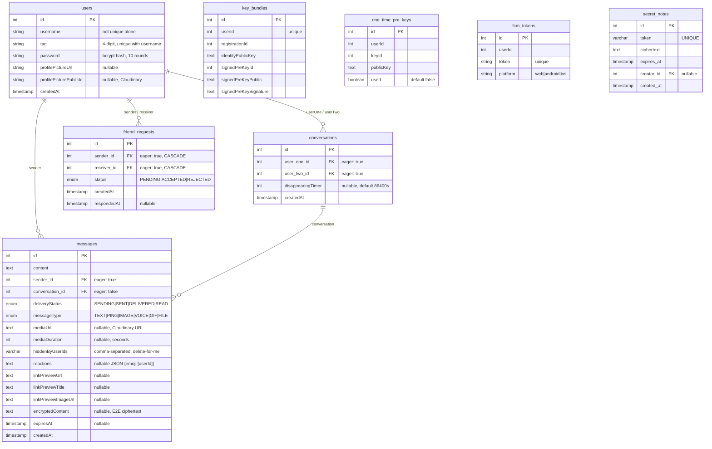

---
description:
alwaysApply: true
---

# CLAUDE.md — Fireplace

**Rules:**
- Always read this file before every code change
- Update this file after every code change
- Single source of truth for agents — if CLAUDE.md says X, X is correct
- All code in English (vars, functions, comments, commits). Polish OK in .md files only

---

## 0. Quick Start

```bash
# Terminal 1: Backend + DB (auto hot-reload)
docker-compose up

# Terminal 2: Flutter web (press 'r' for hot-reload)
cd frontend && flutter run -d chrome
```

**Before start:** Kill stale node processes: `taskkill //F //IM node.exe`

**Ports:** Backend :3000 | Frontend :random (check terminal) | DB :5433 (host) -> :5432 (container)

**Stack:** NestJS 11 + Flutter 3.x + PostgreSQL 16 + Socket.IO 4 + JWT + Cloudinary

**Phone (same WiFi):** `cd frontend && .\run_web_for_phone.ps1` or `flutter run -d web-server --web-hostname 0.0.0.0 --web-port 8080 --dart-define=BASE_URL=http://YOUR_PC_IP:3000`

**Tests:** `cd backend && npm test` (152 unit tests, 17 suites, no DB required); `cd frontend && flutter test` (61 tests)

**Production:** https://fireplace.ignorelist.com — Google Cloud e2-medium VM (Warszawa), Docker + Nginx + Let's Encrypt. Deploy: SSH to server → `~/deploy.sh` (git pull + docker build + flutter web build).

---

## 1. Critical Rules & Gotchas

### TypeORM
- Always `relations: ['sender', 'receiver']` on friendRequestRepository queries — without: empty objects/crash
- Use find-then-remove for friend_requests delete — `.delete()` can't use nested relation conditions
- Always `new Date(val).getTime()` for expiresAt comparisons — TypeORM returns string or Date
- `deliveryStatus` never downgrades — enforced via `DELIVERY_STATUS_ORDER` map
- `synchronize: true` — column additions auto-apply on restart. No migrations

### Frontend
- `file_utils_stub.dart` / `file_utils_io.dart` — conditional import for temp file deletion (web: no-op; native: dart:io)
- Use `showTopSnackBar()` — ScaffoldMessenger covers chat input bar
- `enableForceNew()` on Socket.IO reconnect — Dart caches socket by URL, old JWT reused
- Provider can't call Navigator — use `consumePendingOpen()` / `consumeFriendRequestSent()` patterns
- Do NOT call `getConversations()` or `getFriends()` in `onFriendRequestAccepted` — backend already emits updated lists; extra get* causes race and overwrites with stale data (conversation/contact lost on acceptor)
- On reconnect (same user), `connect()` must NOT clear `_conversations`/`_friends` so the UI does not flicker (empty → full) when socket reconnects after screen wake; use `isReconnect = (_currentUserId == userId)` (no `_conversations.isNotEmpty` check so slow first response does not cause clear). Preserve `_activeConversationId` on reconnect and in `onConnect` call `getMessages(_activeConversationId!)` so the open chat refetches and is not left empty. Backend `messageHistory` payload is `{ conversationId, messages }`; frontend ignores response when `conversationId != _activeConversationId` (avoids overwriting wrong chat).
- Guard `Platform` with `!kIsWeb` — `dart:io` crashes on web
- `copyWith` must include ALL fields — missing field = data silently lost
- Voice recording: mic must stay in widget tree — GestureDetector unmounts -> no events
- Timer via `ValueNotifier<int>` — overlay rebuilds freeze timer
- `clearStatus()` in AuthProvider appears unused but is called from auth_screen.dart — DO NOT DELETE
- Always run `flutter analyze` before deleting "unused" methods
- Multiple backends: if weird data, kill local `node.exe`, use Docker only
- Mobile _openChat: only Navigator.push; ChatDetailScreen initState calls openConversation (avoids double getMessages and decrypt loop)

### Backend
- `ChatValidationService.validateCanMessage(senderId, recipientId)` — shared validation for blocked + friends; used by sendMessage, startConversation
- mediaUrl must be Cloudinary URL when provided — prevents SSRF; validated via `@Matches` regex
- Delete account cascade: key bundles -> OTPs -> msgs -> convs -> friend_reqs -> user (no cascade on User entity)
- `conversationsService.delete()` deletes msgs first (no cascade)
- Chat services: critical failures stop execution; non-critical (emit lists) log and continue
- Skip server-side link preview when `encryptedContent` present (server can't read content)
- Reply-to preview: MessageMapper uses "Encrypted message" when replyTo has encryptedContent; frontend fallback for `[encrypted]`
- `handleMessageDelivered` verifies caller is recipient (not sender) — ownership enforced
- `handleStartConversation` requires friendship — blocks strangers from opening DMs
- `handleStartConversation` emits `conversationsList` + `openConversation` to caller only; recipient gets only `conversationsList` (B does not auto-open chat; B sees unread badge when A sends first message)
- OTP claim is atomic: `UPDATE ... WHERE id = (SELECT ... LIMIT 1) RETURNING *` in `key-bundles.service.ts`
- `isBlockedByEither` uses single OR query (one DB round-trip, not two)
- `_conversationsWithUnread` uses `Promise.all` — parallel, not sequential
- `findByConversation` uses DB-level `skip`/`take` when no hidden messages
- `og:image` from link preview validated via `isSafeImageUrl` (HTTPS + non-private host only); IPv6 brackets stripped before regex; backend resolves relative og:image URLs using pageUrl
- WS rate limiting: `WsThrottlerGuard` on `sendMessage` — provides mock `res` with no-op `header()` (Socket has no such method; ThrottlerGuard expects it)
- Raw SQL in `markConversationAsReadFromSender`: use `"deliveryStatus"` (quoted) — PostgreSQL column is camelCase
- `_conversationsWithUnread` uses batch `countUnreadForRecipientBatch` + `getLastMessagesBatch` (2 queries total, not 2N)
- Production: logger level `['error','warn','log']` — no debug
- friend_requests: unique index on (sender, receiver)

### E2E Encryption
- Fresh install: 20 one-time pre-keys (not 100) for fast startup; preKeysLow replenishes when < 10
- Pre-key storage: parallel writes (Future.wait); replenishment uses chunked parallel (25 at a time)
- `EncryptionService.decrypt()` returns `Future` — must use async patterns
- Message history decrypts async: renders immediately, then decrypts in-place with `notifyListeners()`
- Own messages skip decryption (sender has plaintext from optimistic display)
- Conversation list shows "Encrypted message" for encrypted lastMessage (not decrypted at list level)
- Session establishment uses Completer with 10s timeout — on failure, message marked as failed (no unencrypted fallback)
- Send when recipient offline: on encrypt/session failure we clear `_pendingPreKeyFetches[recipientId]` so retry gets a fresh pre-key fetch. If failure is key-bundle or timeout, we schedule a single delayed retry (4s) so when recipient logs in and uploads keys, the message can send without user tapping Retry. Manual Retry cancels the delayed retry; connect/logout cancels it via `_cancelDelayedRetryIfAny()`.
- Keys NOT cleared on logout (persist for re-login). Only cleared on account deletion via `clearEncryptionKeys()`
- All Signal store keys use `e2e_${userId}_` prefix — multi-account isolation in same browser
- `clearAllKeys()` uses selective deletion (reads all, deletes by prefix) — never wipes other data
- **DualStorage**: All Signal stores use `DualStorage` (writes to both `flutter_secure_storage` AND `SharedPreferences`). On web, IndexedDB+WebCrypto can lose data when all tabs are closed; localStorage (SharedPreferences) is the reliable fallback. Reads try flutter_secure_storage first, then SharedPreferences.
- Web: WebOptions(dbName: 'FireplaceE2E') for app-specific storage; Privacy & Safety shows web key-storage warning
- **Cache-first history decryption**: `_decryptMessageHistory` checks persisted cache (SharedPreferences/localStorage) BEFORE attempting live decryption. Avoids unnecessary session ratchet advancement and recovers messages when keys are lost.
- `_pendingSendContent: Map<String, Map<String, dynamic>>` stores tempId→{content, messageType?, mediaUrl?, mediaDuration?, linkPreviewUrl?, linkPreviewTitle?, linkPreviewImageUrl?} when any send method creates the optimistic message; extra fields added in `_encryptAndSend()`. Survives `_messages` list overwrites (e.g. `messageHistory` arriving before `messageSent`). Drained in `_addMessageToState`. Prevents own messages showing `[encrypted]` and restores all fields for sender after re-login. Use explicit type when assigning: `_pendingSendContent[tempId] = <String, dynamic>{'content': content}` to avoid DDC/JS IdentityMap subtype errors on web.
- `_initializeE2E()` skips `_encryptionService.initialize()` when `_e2eInitialized = true` (reconnect path) — prevents transient mobile storage errors from setting `_e2eInitialized = false` and causing all history messages to become permanently `[Decryption failed]`. Key bundle re-upload still runs on every connect.

---

## 2. Architecture Overview


```mermaid
flowchart TB
    subgraph Client["Flutter App (Web / Mobile)"]
        AuthGate -->|logged out| AuthScreen
        AuthGate -->|logged in| MainShell
        MainShell --> ConversationsScreen
        MainShell --> ContactsScreen
        MainShell --> SettingsScreen
        ConversationsScreen -->|tap| ChatDetailScreen
        ContactsScreen -->|tap| ChatDetailScreen
    end

    subgraph Backend["NestJS Backend :3000"]
        REST["REST API\n/auth /users /messages"]
        WS["WebSocket Gateway\nSocket.IO"]
        REST --> Services
        WS --> ChatServices["Chat Services\nmessage | conversation | friend-request | key-exchange"]
        ChatServices --> Services
        Services["Core Services\nusers | conversations | messages | friends | key-bundles"]
        Services --> DB[(PostgreSQL :5433)]
        Services --> Cloud["Cloudinary\navatars + voice + images"]
    end

    Client -->|"REST + Bearer JWT"| REST
    Client -->|"Socket.IO auth.token"| WS
```

**State Management:** 3 providers (ChangeNotifier): `AuthProvider` (login/logout/token/user), `ChatProvider` (conversations/messages/friends/socket/encryption), `SettingsProvider` (themeMode: light/dark/blue; locale: pl/en, default pl). Services: `SocketService` (Socket.IO), `ApiService` (REST), `EncryptionService` (Signal Protocol), `LinkPreviewService` (OG metadata).

**Backend services:** `ChatGateway` (17 handlers) delegates to `ChatMessageService`, `ChatConversationService`, `ChatFriendRequestService`, `ChatKeyExchangeService`. REST: `AuthController`, `UsersController`, `MessagesController`. Mappers: `UserMapper`, `MessageMapper`, `ConversationMapper`, `FriendRequestMapper` — all have `toPayload()`.

**DTO validation:** `chat/utils/dto.validator.ts` — runtime validation via `class-transformer` + `class-validator`. DTOs in `chat/dto/`.

---

## 3. File Location Map

### Backend (`backend/src/`)

| Domain | Key Files |
|---|---|
| **Auth** | `auth/auth.service.ts`, `auth/auth.controller.ts`, `auth/jwt-auth.guard.ts`, `auth/jwt.strategy.ts`, `auth/password.constants.ts` |
| **Users** | `users/user.entity.ts`, `users/users.service.ts`, `users/users.controller.ts` |
| **Conversations** | `conversations/conversation.entity.ts`, `conversations/conversations.service.ts` |
| **Messages** | `messages/message.entity.ts`, `messages/message.mapper.ts`, `messages/messages.service.ts`, `messages/messages.controller.ts`, `messages/dto/upload-media.dto.ts` |
| **Friends** | `friends/friend-request.entity.ts`, `friends/friends.service.ts` |
| **Chat** | `chat/chat.gateway.ts`, `chat/services/chat-{message,conversation,friend-request,key-exchange}.service.ts` |
| **DTOs** | `chat/dto/chat.dto.ts` + `{typing,recording-voice,...}.dto.ts` |
| **Key Bundles** | `key-bundles/key-bundle.entity.ts`, `key-bundles/one-time-pre-key.entity.ts`, `key-bundles/key-bundles.service.ts` |
| **Mappers** | `chat/mappers/{conversation,user,friend-request}.mapper.ts`, `messages/message.mapper.ts` |
| **FCM/Push** | `fcm-tokens/fcm-token.entity.ts`, `fcm-tokens/fcm-tokens.service.ts`, `push-notifications/push-notifications.service.ts` |
| **Secret Notes** | `secret-notes/secret-note.entity.ts`, `secret-notes/secret-notes.service.ts`, `secret-notes/secret-notes.controller.ts`, `secret-notes/secret-notes.module.ts` |
| **Utils** | `chat/utils/dto.validator.ts`, `chat/services/chat-validation.service.ts`, `chat/services/link-preview.service.ts`, `cloudinary/cloudinary.service.ts` (uploadImage, uploadVoiceMessage, uploadRawFile), `app.module.ts` |

### Frontend (`frontend/lib/`)

| Domain | Key Files |
|---|---|
| **Entry** | `main.dart`, `config/app_config.dart`, `constants/app_constants.dart` |
| **Models** | `models/{user,conversation,message,friend_request}_model.dart` |
| **L10n** | `l10n/app_pl.arb`, `l10n/app_en.arb`, `l10n/app_localizations.dart` (generated), `l10n.yaml` |
| **Providers** | `providers/{auth,chat,settings}_provider.dart`, `providers/chat_reconnect_manager.dart`, `providers/conversation_helpers.dart` |
| **Services** | `services/{socket_service,api_service,encryption_service,link_preview_service,push_service,gif_service}.dart` |
| **Encryption** | `services/encryption/signal_stores.dart` (4 persistent Signal stores) |
| **Screens** | `screens/{auth,main_shell,conversations,contacts,settings,chat_detail,add_or_invitations,privacy_safety}_screen.dart` |
| **Widgets** | `widgets/{chat_input_bar,chat_action_tiles,chat_message_bubble,voice_message_bubble,conversation_tile,top_snackbar,avatar_circle,anti_quantum_note_dialog,gif_picker_sheet}.dart` |
| **Theme** | `theme/rpg_theme.dart` (`FireplaceColors` ThemeExtension) |
| **Push** | `services/push_service.dart`, `firebase_options.dart` |

---

## 4. Database Schema


```mermaid
erDiagram
    users ||--o{ conversations : "userOne / userTwo"
    users ||--o{ messages : "sender"
    users ||--o{ friend_requests : "sender / receiver"
    conversations ||--o{ messages : "conversation"

    users {
        int id PK
        string username "not unique alone"
        string tag "4-digit, unique with username"
        string password "bcrypt hash, 10 rounds"
        string profilePictureUrl "nullable"
        string profilePicturePublicId "nullable, Cloudinary"
        timestamp createdAt
    }

    conversations {
        int id PK
        int user_one_id FK "eager: true"
        int user_two_id FK "eager: true"
        int disappearingTimer "nullable, default 86400s"
        timestamp createdAt
    }

    messages {
        int id PK
        text content
        int sender_id FK "eager: true"
        int conversation_id FK "eager: false"
        enum deliveryStatus "SENDING|SENT|DELIVERED|READ"
        enum messageType "TEXT|PING|IMAGE|VOICE|GIF|FILE"
        text mediaUrl "nullable, Cloudinary URL"
        int mediaDuration "nullable, seconds"
        varchar hiddenByUserIds "comma-separated, delete-for-me"
        text reactions "nullable JSON {emoji:[userId]}"
        text linkPreviewUrl "nullable"
        text linkPreviewTitle "nullable"
        text linkPreviewImageUrl "nullable"
        text encryptedContent "nullable, E2E ciphertext"
        timestamp expiresAt "nullable"
        timestamp createdAt
    }

    key_bundles {
        int id PK
        int userId "unique"
        int registrationId
        text identityPublicKey
        int signedPreKeyId
        text signedPreKeyPublic
        text signedPreKeySignature
    }

    one_time_pre_keys {
        int id PK
        int userId
        int keyId
        text publicKey
        boolean used "default false"
    }

    friend_requests {
        int id PK
        int sender_id FK "eager: true, CASCADE"
        int receiver_id FK "eager: true, CASCADE"
        enum status "PENDING|ACCEPTED|REJECTED"
        timestamp createdAt
        timestamp respondedAt "nullable"
    }

    fcm_tokens {
        int id PK
        int userId
        string token "unique"
        string platform "web|android|ios"
    }

    secret_notes {
        int id PK
        varchar token "UNIQUE"
        text ciphertext
        timestamp expires_at
        int creator_id FK "nullable"
        timestamp created_at
    }
```

**Constraints:** `users` unique on `(username, tag)` — Discord-style `username#tag`. No cascade on User entity — `deleteAccount()` manually cleans dependents. `secret_notes.token` unique — used as the public URL token for one-time reveal.

---

## 5. How-To: Adding New Features

### Add a new WebSocket event:
1. Define DTO in `chat/dto/` with class-validator decorators
2. Add handler in `chat/services/chat-*.service.ts`
3. Add `@SubscribeMessage` in `chat/chat.gateway.ts` -> delegate to service
4. Add emit + listener in `services/socket_service.dart`
5. Pass handler from `ChatProvider.connect()`, handle state + `notifyListeners()`

### Add a new REST endpoint:
1. Add method in `*.service.ts`, route in `*.controller.ts` with `@UseGuards(JwtAuthGuard)`
2. Add API call in `services/api_service.dart`, call from provider/screen

### Add a new DB column:
1. Add to `*.entity.ts` (@Column) -> restart backend (auto-sync)
2. Update mapper if WebSocket payload, update frontend model (constructor, `fromJson()`, `copyWith()`)

---

## 6. WebSocket API

**Connection:** `io(baseUrl, { auth: { token: JWT } })` — token in auth only (not query). Gateway verifies JWT, tracks `onlineUsers: Map<userId, socketId>`.

### Message Events

| Client Emit | Server Emit (caller) | Server Emit (recipient) |
|---|---|---|
| `sendMessage` | `messageSent` | `newMessage` |
| `getMessages` | `messageHistory` `{ conversationId, messages }` | -- |
| `messageDelivered` | -- | `messageDelivered` (to sender) |
| `markConversationRead` | -- | `messageDelivered` (READ) per msg |
| `clearChatHistory` | `chatHistoryCleared` | `chatHistoryCleared` |
| `deleteMessage` | `messageDeleted` | `messageDeleted` (for_everyone only) |
| `addReaction` / `removeReaction` | `reactionUpdated` | `reactionUpdated` |
| -- (async) | `linkPreviewReady` | `linkPreviewReady` |

### Conversation Events

| Client Emit | Server Emit (caller) | Server Emit (other) |
|---|---|---|
| `startConversation` | `conversationsList` + `openConversation` | `conversationsList` only (no openConversation) |
| `getConversations` | `conversationsList` | -- |
| `deleteConversationOnly` | `conversationDeleted` + `conversationsList` | `conversationsList` only (no conversationDeleted — B's chat shows "deleted by other", no auto-close) |
| `setDisappearingTimer` | `disappearingTimerUpdated` | `disappearingTimerUpdated` |

### Friend Events

| Client Emit | Server Emit (caller) | Server Emit (other) |
|---|---|---|
| `searchUsers` | `searchUsersResult` | -- |
| `sendFriendRequest` | `friendRequestSent` OR auto-accept | `newFriendRequest` OR auto-accept |
| `acceptFriendRequest` | `friendRequestAccepted` + lists + `openConversation` | `friendRequestAccepted` + lists (no openConversation; snackbar "X accepted your friend request") |
| `rejectFriendRequest` | `friendRequestRejected` + `friendRequestsList` | -- |
| `getFriendRequests` | `friendRequestsList` + `pendingRequestsCount` | -- |
| `getFriends` | `friendsList` | -- |
| `unfriend` | `unfriended` + `conversationsList` + `friendsList` | same |
| `blockUser` | `blockedList` | `youWereBlocked` |
| `unblockUser` | `blockedList` | -- |
| `getBlockedList` | `blockedList` | -- |

### E2E Key Exchange Events

| Client Emit | Server Emit (caller) | Server Emit (target) |
|---|---|---|
| `uploadKeyBundle` | `keyBundleUploaded` | -- |
| `uploadOneTimePreKeys` | `oneTimePreKeysUploaded` | -- |
| `fetchPreKeyBundle` | `preKeyBundleResponse` | `preKeysLow` (when < 10) |

---

## 7. REST API

| Method | Path | Auth | Body / Params | Response |
|---|---|---|---|---|
| POST | `/auth/register` | -- | `{ username, password }` | `{ id, username, tag }` |
| POST | `/auth/login` | -- | `{ identifier, password }` | `{ access_token }` |
| POST | `/users/profile-picture` | JWT | multipart `file` (JPEG/PNG, 5MB) | `{ profilePictureUrl }` |
| POST | `/users/reset-password` | JWT | `{ oldPassword, newPassword }` | 200 |
| DELETE | `/users/account` | JWT | `{ password }` | 200 |
| POST | `/messages/upload-media` | JWT | multipart `file` (10MB) + `type` ('image'\|'voice'\|'gif'\|'file') + `duration?` + `expiresIn?` | `{ mediaUrl, mediaDuration? }` or `{ mediaUrl, fileName }` for type=file |
| POST | `/messages/link-preview` | JWT | `{ text }` | `{ url, title, imageUrl }` or `{}` |
| POST | `/notes` | JWT | `{ ciphertext, expiresIn }` | `{ token }` |
| GET | `/note/:token` | None | -- | HTML page (landing/revealed/destroyed) |
| POST | `/note/:token/reveal` | None | -- | `{ ciphertext }` or 404 |

**Password:** 8+ chars, 1 uppercase, 1 lowercase, 1 number. **Login:** username or `username#tag`. **JWT:** `{ sub: userId, username, tag, profilePictureUrl }`. **Rate limits:** Login 5/15min, Register 3/h, Image 10/min, Voice 10/60s, LinkPreview 30/min.

---

## 8. Key Features & Behaviors

### State Management (ChatProvider)

**Connect flow:** cancel reconnect -> clear ALL state -> dispose old socket + create new with `enableForceNew()` -> on connect: fetch conversations/friendRequests/friends + register listeners -> delayed re-fetch 500ms if empty.

**Optimistic messaging:** Create temp message (id=-timestamp, SENDING, tempId) -> `notifyListeners` -> encrypt async -> emit `sendMessage` -> backend returns `messageSent` with tempId -> replace temp with real.

**Blocking state:** `_blockedUsers` = blocked **by me**. `_blockedByUserIds` (Set) = users who blocked **me** (from `youWereBlocked` push). On `youWereBlocked`: add to set, remove from friends, remove conversations, clear active chat.

**Reconnection:** `ChatReconnectManager`: exponential backoff capped at 30s, max 5 attempts, only when `intentionalDisconnect == false`.

**Key patterns:** `consumePendingOpen()` (backend emits `openConversation` -> provider stores ID -> screen consumes + navigates). `consumeFriendRequestSent()` (same for friend request -> snackbar + pop). `consumePendingFriendAccepted()` (when we sent request and other accepts -> MainShell shows snackbar).

### E2E Encryption (Signal Protocol)

`libsignal_protocol_dart` v0.7.4 + `flutter_secure_storage`. **All message types encrypted** (text, ping, voice, image, gif, file). X3DH key agreement -> Double Ratchet. Single-device (deviceId=1). TOFU verification. Media files on Cloudinary are NOT encrypted — only the URL is hidden inside the encrypted envelope.

**E2E Envelope:** `{ content, messageType?, mediaUrl?, mediaDuration?, linkPreview? }` — `messageType` defaults to `TEXT` when absent (backward compat). Server stores all encrypted messages as `messageType=TEXT`, `mediaUrl=null` — blind to real type. GIF uses `messageType: 'GIF'` with `mediaUrl` pointing to Cloudinary. FILE uses `messageType: 'FILE'`, `content` = filename, `mediaUrl` = Cloudinary raw URL.

**Send (all types):** create optimistic message -> for voice/image: upload to `POST /messages/upload-media` first -> build envelope with all fields -> `_encryptAndSend()` -> `_ensureSession(recipientId)` -> `encrypt()` -> emit `sendMessage` with `encryptedContent` only. Link preview fetched for TEXT only (web: backend proxy; native: direct). **Receive:** decrypt async -> `E2eEnvelope.parse()` -> `copyWith(messageType, mediaUrl, mediaDuration, ...)` to restore real type. Ping effect triggered on decrypt when type is PING. **No fallback:** if E2E not ready or encryption fails, message is marked as failed (no unencrypted sending).

**Ciphertext format:** `"{type}:{base64}"` (type 3 = PreKeySignalMessage, type 1 = SignalMessage). Server stores in `encryptedContent`, stores `"[encrypted]"` as `content` placeholder.

**Keys:** 100 one-time pre-keys per batch. `preKeysLow` when < 10 -> auto-replenish. Backend: zero-knowledge pass-through (stores public material only).

### Username#Tag (Discord-style)

4-digit tag (1000-9999), random at registration. **Username is unique** (case-insensitive). Display: Settings shows `username#tag`, Contacts/Conversations/chat header show username only. Tap avatar in chat -> reveals `username#tag` for 5s (tag in accent color). Login: username or `username#tag`.

### Disappearing Messages

Three-layer: (1) Frontend `removeExpiredMessages()` every 1s, (2) Backend filters on `getMessages`, (3) Cloudinary TTL. Default 86400s (1 day). `null` = disabled. Timer starts on DELIVERY.

### Voice Messages

Hold-to-record mic, drag to trash to cancel. Optimistic UI -> POST /messages/upload-media (voice) -> Cloudinary URL -> `_encryptAndSend` (URL in envelope) -> WebSocket. Playback: cached at `audio_cache/`, scrubbable waveform, speed 1x/1.5x/2x. Format: AAC/M4A (native), WAV (web).

### Delete Actions

| Action | Deletes | Friend? | Event |
|---|---|---|---|
| Delete Conversation (swipe) | Messages + Conversation | Kept | `deleteConversationOnly` |
| Unfriend (long-press contacts) | FriendRequest + Conv + Messages | Removed | `unfriend` |
| Clear History (action tile) | Messages only | Kept | `clearChatHistory` |
| Delete for me (long-press msg) | Hidden for current user | Kept | `deleteMessage` mode=for_me |
| Delete for everyone (own msg) | Hard-deleted for both | Kept | `deleteMessage` mode=for_everyone |

### Other Features

- **Reactions:** Long-press message -> 6 emoji picker. Max 1 per user. `reactions` column (JSON). `addReaction`/`removeReaction` events.
- **Tap-to-expand media:** Image and GIF bubbles open a fullscreen dialog on tap (transparent overlay, pinch-zoom via InteractiveViewer). Tap outside to close. Documents (FILE): tap opens mediaUrl in external app.
- **Typing indicators:** 300ms debounce, 3s auto-clear. Backend relay only (no DB). `typing` -> `partnerTyping`.
- **Unread badge:** Backend `countUnreadForRecipient()`. Frontend `_unreadCounts` map.
- **Link preview:** E2E: client fetches OG before encrypting, stores in envelope; recipient decrypts and displays. On web, client uses `POST /messages/link-preview` backend proxy (CORS blocks direct fetch). Unencrypted: server fetches, `linkPreviewReady` event. SSRF: `isSafeImageUrl` on og:image (frontend + backend); frontend validates when restoring from persisted decrypted content.
- **Image messages:** Optimistic UI -> POST /messages/upload-media (image) -> Cloudinary URL -> `_encryptAndSend` (URL in envelope). Friend validation happens in `handleSendMessage`. Tap image in bubble opens fullscreen viewer (same as GIF); tap outside or use pinch to close/zoom.
- **File (document) messages:** Attachment tile: one tap opens system file picker (gallery or folder). Allowed: images (jpg, png, gif) and documents (PDF, DOC, DOCX, XLS, XLSX, TXT, CSV). User chooses file; app sends as image or document by extension. Documents: upload type=file -> Cloudinary raw -> E2E envelope content=fileName, messageType=FILE, mediaUrl. Bubble: icon + filename; tap opens URL in external app. Backend: `uploadRawFile` in CloudinaryService; MessageType.FILE.
- **Ping:** Encrypted via `sendMessage` (no dedicated `sendPing` event). Optimistic PING message -> `_encryptAndSend` with `messageType: 'PING'`. Uses conversation's `disappearingTimer`. Recipient sees ping effect after decrypting envelope.
- **Push (FCM):** Silent payload (no content). Gracefully disabled without `FIREBASE_SERVICE_ACCOUNT`. Firebase config in gitignored `firebase_secrets.dart` / `firebase-config.js`.
- **3 themes:** Light, Dark (Wire-style gray), Blue (Telegram-style: dark blue background #17212B, blue accent #2AABEE, sent bubble #2481CC, received #2B2B2B). Default for new users: Dark. `FireplaceColors` ThemeExtension.
- **App language:** Polish (default) or English. Settings tile "Language" (Język) with Polski / English toggle; choice persisted in SharedPreferences (`locale_preference`). Flutter l10n: `lib/l10n/app_pl.arb`, `app_en.arb`; generated `app_localizations.dart`; `MaterialApp` uses `locale` from `SettingsProvider`, `supportedLocales` (pl, en), `localizationsDelegates`. Settings screen and main shell tab labels use `AppLocalizations.of(context)`.
- **GIF messages:** GIF picker (Giphy API) in action tiles. Trending + search with 500ms debounce. Download from Giphy → upload to Cloudinary → Cloudinary URL encrypted in E2E envelope. `Image.network` for native GIF animation. Tap to expand in fullscreen (same as images). API key via `--dart-define=GIPHY_API_KEY=...` (beta key in dev).
- **Friend auto-accept:** If B has pending request to A when A sends to B -> auto-accept, create conversation, emit `openConversation` to A only (B gets lists, no auto-open).

---

## 9. Frontend Screens & Widgets

**Navigation:** AuthGate -> AuthScreen (login/register) OR MainShell (IndexedStack: Conversations, Contacts, Settings). Desktop >600px: sidebar+detail layout.

**Key screens:** AuthScreen (`clearStatus()` on tab switch — DO NOT DELETE), MainShell (consumes `consumePendingFriendAccepted()` for snackbar), ConversationsScreen (swipe-to-delete, `consumePendingOpen()`), ChatDetailScreen (Timer.periodic 1s for expired msgs, `markConversationRead` on open), AddOrInvitationsScreen (searchUsers -> auto-send if 1 result, picker if multiple, `consumeFriendRequestSent()`), ContactsScreen (consumes `pendingOpenConversationId` and navigates to chat when user tapped contact and `startConversation` returned), PrivacySafetyScreen (E2E info: UI states all messages are encrypted; identity fingerprint).

**Key widgets:** ChatInputBar (text+send+mic+action tiles), ChatActionTiles (icons centered in viewport; Camera/Gallery/Ping/Timer/Clear/Anti-Quantum Note; fully localized tooltips + messages), ChatMessageBubble (Telegram-style: intrinsic width so bubble fits content; short messages narrow, long messages expand to 85% of chat width; time + delivery icon + optional timer in one row on the right for sent / left for received; Wire-style rounded corners, no tail; padding 16,10,16,8; margin bottom 10; colors per theme), VoiceMessageBubble (same style), ChatBackgroundPattern (subtle dot pattern in chat area), ConversationTile (Dismissible, unread badge), TopSnackbar (never use ScaffoldMessenger), AvatarCircle, AntiQuantumNoteDialog (bottom sheet for creating one-time “anti‑quantum” secret note with localized copy and TTL presets).

**Models:** `UserModel` (`displayHandle` getter), `ConversationModel` (immutable), `MessageModel` (`copyWith` for status/content/media), `FriendRequestModel`. Frontend-only: `MessageDeliveryStatus.failed`.

---

## 10. Environment & Config

| Variable | Required | Purpose |
|---|---|---|
| `DB_HOST/PORT/USER/PASS/NAME` | Yes | PostgreSQL |
| `JWT_SECRET` | Yes | JWT signing (>=32 chars in prod) |
| `CLOUDINARY_CLOUD_NAME/API_KEY/API_SECRET` | Yes | Media storage |
| `FIREBASE_SERVICE_ACCOUNT` | No | FCM push (graceful if missing) |
| `ALLOWED_ORIGINS` | No | CORS (comma-separated, strict in prod) |
| `BASE_URL` | No | Frontend dart define, defaults to `http://{host}:3000` |
| `GIPHY_API_KEY` | No | Frontend dart define for Giphy API (defaults to beta key in dev) |
| `METADATA_RETENTION_DAYS` | No | Reserved for future auto-purge of old metadata |

**Docker:** `db` postgres:16-alpine (5433->5432, postgres/postgres/chatdb), `backend` node:20-alpine (:3000). Frontend runs locally.

**Firebase setup:** Copy `.example` files -> fill values: `firebase_secrets.dart`, `firebase-config.js`, `FIREBASE_SERVICE_ACCOUNT` env var.

---

## 11. Known Limitations & Tech Debt

- E2E: all types encrypted (text, ping, voice, image, gif). Media files on Cloudinary NOT encrypted (only URLs encrypted in envelope). No multi-device, no key recovery, conversation list shows "Encrypted message". History messages for sender show `[encrypted]` after re-login when browser evicted storage (own messages not re-decryptable by design). Key rotation is handled: `isTrustedIdentity` auto-accepts new identities; broken sessions are reset on live decrypt failure so next send rebuilds via X3DH.
- No message edit, no fuzzy search, no iOS APNs
- Image messages: no tap-to-fullscreen viewer yet (research: `docs/superpowers/specs/2026-03-16-image-fullscreen-viewer-research.md`)
- No unique constraint on `(sender, receiver)` in friend_requests
- Pagination: simple limit/offset (default 50), N+1 in `_conversationsWithUnread()`
- Large files: `chat_provider.dart` (~1970 lines), `chat-friend-request.service.ts` (~428 lines)
- Migration scripts in `backend/scripts/` (manual)
- Metadata: server stores who, with whom, when, conversation structure (see `docs/METADATA.md`); design for future options in `docs/plans/2026-03-11-metadata-privacy-design.md`
- `secret_notes` table uses `synchronize: true` auto-creation — fine for dev, requires `NODE_ENV=development` in docker-compose

---

**Maintain this file.** After every code change, update the relevant section.
