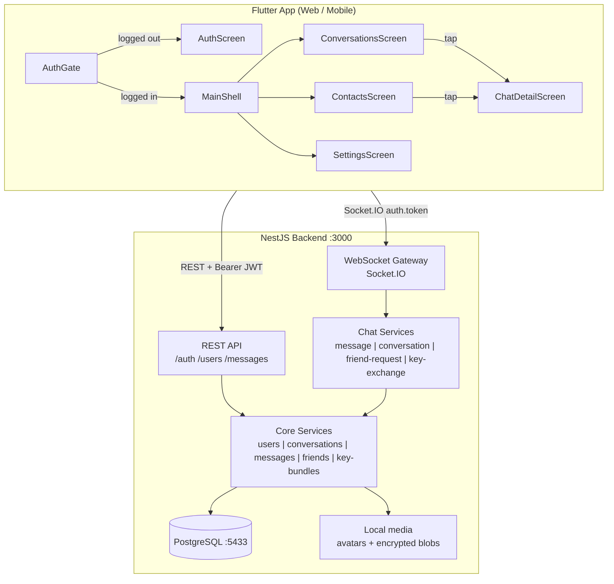
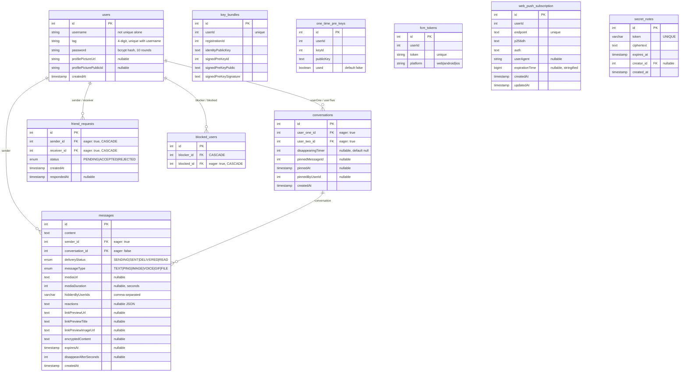

---
description:
alwaysApply: true
---

# CLAUDE.md — Fireplace

**Rules:**
- Always read this file before every code change; update it after
- **At session start:** read `.cursor/session-summaries/LATEST.md`
- **At task end:** write/update `.cursor/session-summaries/YYYY-MM-DD-session.md` + `LATEST.md` — format in `.kiro/steering/session-summaries.md`
- **Before any change:** read ALL files the task touches; trace code paths; verify names in source — never guess
- Code wins over this file — update when they conflict
- All code in English; Polish OK in .md only
- **Scope:** change only what was asked; flag extras; don't add unrequested features/refactors

---

## 0. Quick Start

```bash
docker-compose up                             # Terminal 1: Backend + DB
cd frontend && flutter run -d chrome          # Terminal 2: Flutter web
```

**Before start:** `taskkill //F //IM node.exe`
**Android:** `cd frontend && flutter devices && flutter run -d <deviceId>` (`--dart-define=BASE_URL=http://10.0.2.2:3000` for emulator)
**Gradle cache broken:** Set `$env:GRADLE_USER_HOME='D:\gradle-home'` before `flutter run`. Repair: `gradlew.bat --stop`, delete `%USERPROFILE%\.gradle\caches\8.14`, then `flutter clean` + rebuild. `flutter clean` alone does NOT fix gradle cache.
**Low-space Android:** `frontend/run_android_on_x.ps1` (requires `X:` drive). Runs `patch_webcrypto_16k.ps1` before build.
**Ports:** Backend :3000 | Frontend :random | DB :5433→:5432
**Stack:** NestJS 11 + Flutter 3.x + PostgreSQL 16 + Socket.IO 4 + JWT + self-hosted media
**Phone (WiFi):** `.\run_web_for_phone.ps1` or `flutter run -d web-server --web-hostname 0.0.0.0 --web-port 8080 --dart-define=BASE_URL=http://YOUR_PC_IP:3000`
**Tests:** `cd backend && npm test` (281 unit tests, 39 suites; verified by `node scripts/verify-claude-backend-test-counts.mjs`). `cd frontend && flutter test`. CI: `.github/workflows/ci.yml`.
**Production:** https://fireplace.ignorelist.com — GCP VM (Warszawa), user `olek292`, repo `~/fireplace`. Deploy: `cd ~/fireplace && ./deploy.sh && cp -a frontend/build/web/. frontend-build/`. Verify: `curl -sS https://fireplace.ignorelist.com/version`. Rules: `.cursor/rules/version-bump.mdc`, `.cursor/rules/production-vm-deploy.mdc`.

---

## 1. Critical Rules & Gotchas

### TypeORM
- Always `relations: ['sender', 'receiver']` on friendRequestRepository — without: empty objects/crash
- Use find-then-remove for friend_requests delete — `.delete()` can't use nested relation conditions
- Always `new Date(val).getTime()` for expiresAt comparisons — TypeORM returns string or Date
- **Read-based disappearing messages:** Sends store `disappearAfterSeconds` with `expiresAt = null`. On `markConversationRead`, backend sets `expiresAt = now + disappearAfterSeconds` and emits on `messageDelivered`. Never-read fallback: expire after `createdAt + 86400s`. Grandfathered rows: send-time `expiresAt` only. Shared expiry: `backend/src/messages/message-expiry.util.ts`, frontend `lib/utils/message_expiry.dart`. Hearth Fade UI: `disappearing_timer_sheet.dart`, `hearth_fade_arc.dart`. Ephemeral accent: `RpgTheme.ephemeralAccent` (ember/light, teal/teal). Prod SQL: `ALTER TABLE messages ADD COLUMN "disappearAfterSeconds" integer NULL;`
- `deliveryStatus` never downgrades — enforced via `DELIVERY_STATUS_ORDER` map
- `synchronize` enabled only when `NODE_ENV !== 'production'` — no migrations

### Frontend
- `file_utils_stub.dart` / `file_utils_io.dart` — conditional import for temp file deletion (web: no-op; native: dart:io)
- Android 16KB: `libwebcrypto.so` built with `Align 0x1000` (arm64+x86_64) — not 16KB-safe. `patch_webcrypto_16k.ps1` adds `-Wl,-z,max-page-size=16384` linker flags. `flutter pub run webcrypto:setup` is for tests only, not APK/AAB.
- `MainActivity` package must be `com.fireplace.app` — mismatch causes `ClassNotFoundException`
- `kotlin.incremental=false` in `frontend/android/gradle.properties` (mixed-drive cache workaround)
- **Portrait-only:** `PortraitLockService.initialize()` in `main()`. Fallback: `PortraitLockShell` shows `PortraitRequiredOverlay` when landscape + `shortestSide < 900`. Policy: `utils/portrait_lock_policy.dart`. Regression: `portrait_lock_policy_test.dart`, `portrait_required_overlay_test.dart`, `fireplace_app_portrait_lock_test.dart`.
- **Android overscroll:** `theme/app_scroll_behavior.dart` disables `StretchingOverscrollIndicator`. Wired via `MaterialApp(scrollBehavior: const AppScrollBehavior())`. Regression: `fireplace_app_scroll_behavior_test.dart`.
- Use `showTopSnackBar()` — ScaffoldMessenger covers chat input. Use ARB keys, no hardcoded English.
- Chat dates: `chatDateToday`/`chatDateYesterday` + `MaterialLocalizations.formatShortDate`. Always `date.toLocal()` for calendar-day logic.
- Chat composer bottom inset: `SafeArea(bottom: false)` on chat screen; `ChatInputBar` uses `max(viewPadding.bottom, padding.bottom)` +16 when inset>0 + keyboard hidden. Web-mobile fallback: 16dp on compact + keyboard hidden. `MainShell` wraps navbar in `SafeArea(top: false, minimum: EdgeInsets.only(bottom: 10))`.
- Chat composer horizontal: `SafeArea` only around message list, not whole column. `ChatInputBar` adds `MediaQuery.padding.left/right` + inner 8/4dp. Compact: +14dp right padding for OS gesture strip.
- **Chat composer viewport (non-embedded):** `widgets/input/chat_composer_viewport.dart` — Stack overlay; `ListView` bottom padding = composer height + `viewInsets.bottom`; `Scaffold(resizeToAvoidBottomInset: false)`. Keyboard scroll in `didChangeMetrics`. Spec: `docs/superpowers/specs/2026-05-23-chat-composer-viewport-design.md`.
- **Disappearing messages UI:** `DisappearingTimerSheet` (5s–30d, Turn off/Set timer). `HearthFadeArcIndicator` on bubbles + list. `ConversationsScreen` owns the 1Hz tick (`countdownTickNotifier`). `ChatInputBar.build` must `context.watch<ConversationsProvider>()` for banner (not `read`). Regression: `chat_input_bar_disappearing_banner_test.dart`, `conversation_tile_ephemeral_test.dart`.
- Local incoming sound: `assets/sounds/incoming_message_long_pop.wav` (non-self, non-PING). `PingEffectOverlay`: `assets/sounds/ping_alert.mp3`. Test hook: `setIncomingMessageSoundEnabledForTest(false)`.
- `enableForceNew()` on Socket.IO reconnect — Dart caches socket by URL
- Provider can't call Navigator — use `consumePendingOpen()` / `consumeFriendRequestSent()` patterns
- Do NOT call `getConversations()`/`getFriends()` in `onFriendRequestAccepted` — causes race, overwrites with stale data
- **`conversationsList` unread merge:** `onConversationsList` sets unread to `max(prev, server)` — prevents local `incrementUnreadCount` being wiped by stale snapshot
- On reconnect (same user): don't clear `_conversations`/`_friends`. Use `isReconnect = (_currentUserId == userId)`. `connect()` sets `_intentionalDisconnect` while replacing socket. `onConversationsList`/`onFriendsList` ignore empty payload when list already populated. Preserve `_activeConversationId` on reconnect; call `getMessages` for active chat. `messageHistory` payload `{ conversationId, messages }`; ignore when `conversationId != _activeConversationId`.
- Guard `Platform` with `!kIsWeb` — `dart:io` crashes on web
- `copyWith` must include ALL fields — missing field = data silently lost
- **Hold-to-record (voice):** Use **one** `GestureDetector` for idle + recording. Wrap mic in `Listener` (`onPointerUp`/`onPointerCancel`) for PWA release. `_finishRecordingGesture()` + `_gestureFinishHandled` dedupes pointer vs `onLongPressEnd`. `_pendingStopAfterStart` if user releases during async start. `_abortInFlightStart` on `onLongPressCancel` while starting. Minimum clip: `kMinVoiceRecordingMs` (500ms) from `_recordingStartTime`. `HapticFeedback.lightImpact()` on start (native only). **Lock-up:** `lockUpThresholdPx=72`, `lockUpHintShowPx=36`; slide up → `_enterLockedMode()` (medium haptic); release no-op when locked. Spec: `docs/superpowers/specs/2026-05-24-voice-lock-up-spec.md`. Regression: `recording_controller_lock_test.dart`.
- Mic resting offset: `_kMicRestingOffsetX = -6.0` — sits left in 48×48 slot. Cancel uses global coords (`_dragStartX`).
- Chat composer send: `TextInputAction.send` + `onSubmitted` → `_send()`. Enter inserts `\n`. `onEditingComplete: () {}` prevents IME blur. `CallbackShortcuts` maps Ctrl/Cmd+Enter → `_send()`. Mic-only trailing control (48×48).
- Timer via `ValueNotifier<int>` — overlay rebuilds freeze timer
- `clearStatus()` in AuthProvider — DO NOT DELETE (called from auth_screen.dart)
- Always run `flutter analyze` before deleting "unused" methods
- **Web Push (VAPID):** `PushService.initialize()` on web only syncs existing subscription. Permission via `PushService.requestWebPushFromUserGesture()`. SW: `frontend/web/web-push-sw.js` (scope `/web-push-scope/`). `WebPushBridge` uses `package:web` + `dart:js_interop`.
- **PWA badge:** `UnreadBadgeSync` debounced ~200ms → `BadgingBridge` → `navigator.setAppBadge(min(sum, kAppBadgeMaxDisplayCount))`. iOS Safari requires integer overload (not no-arg). `clearAppBadge` on unread=0 or logout (`clearPwaAppBadgeOnLogout()`). SW: `showNotification` first, then `setAppBadge(n)` — sequential, not `Promise.all`. `kAppBadgeMaxDisplayCount` must match `APP_BADGE_MAX` in `web-push-sw.js`.
- **iOS web push:** Requires Home Screen install + standalone. Gate enforced only on iOS WebKit (`isStandaloneOrNotRequired()`). iPadOS-13+: `Mac UA + maxTouchPoints > 1` heuristic.
- **Android FCM:** Data-only → `flutter_local_notifications` in `android_fcm_local_notifications.dart`. Background handler in isolate. `Firebase.initializeApp` only when `Firebase.apps.isEmpty` — duplicate-app blocks `runApp`. Tag: `conversation-<id>`. Taps → `requestNavigateToConversationFromNotification` → consumed by `MainShell`. `ChatDetailScreen` calls `openConversation` via `scheduleMicrotask` in `initState`. Conditional imports keep web builds clean.
- Widget tests with `AppLocalizations` need `localizationsDelegates` + `supportedLocales` in `MaterialApp`
- `SettingsScreen` tests must use `RpgTheme.themeDataLight` (requires `FireplaceColors` ThemeExtension)
- **App version:** Settings footer semver only (no `+build`). Bump PATCH per `.cursor/rules/version-bump.mdc`. Baseline `0.0.1`. Regression: `settings_screen_version_footer_test.dart`.
- `blockedByUserIds` returns `Set.unmodifiable` — use `provider.onYouWereBlocked(...)` in tests
- `use_build_context_synchronously`: capture providers via `context.read<>()` before first `await`
- Fire-and-forget futures: `.ignore()` not `.catchError((_){})`
- JWT no longer carries `profilePictureUrl` — load via `GET /users/me`
- **Auth token flow:** `_loadSavedToken` decodes minimal JWT fields first, then `/users/me`. Silent refresh on expired access + existing refresh token. `ensureSessionReady()` on socket connect, app resume, web visibilitychange, 15-min timer. `_refreshSessionLocked` mutex prevents rotation race. Transient refresh failures keep tokens; 401/403 → clear auth.
- Authenticated media: `ApiService.fetchMediaBytes(url, token)` for own-server URLs. Android emulator: rewrites `localhost` media URLs to `AppConfig.baseUrl` host.
- Message pagination: `_hasMore/_isLoadingMore/_paginationOffset`; `loadOlderMessages()` near scroll top. Reset `_isLoadingMore` on mismatch to avoid stuck state.
- `_conversationCache`: per-conversation RAM cache. Populated by `onMessageHistory`; updated by incoming messages; cleared on logout only (not back-nav or reconnect). `loadCachedMessages` before `getMessages`. `onMessageHistory` merge-by-id via `_mergeMessagePreferNewer` (prefer higher deliveryStatus / non-null expiresAt / non-null disappearAfterSeconds). FIFO `_pendingHistoryFetchSeq` skips superseded responses. `ListView(reverse: true)`: `pixels=0` = visual bottom; `jumpTo(0)` always correct.

### Backend
- `ChatValidationService.validateCanMessage(senderId, recipientId)` — shared blocked+friends check
- `mediaUrl` must match `MEDIA_URL_REGEX` in `chat.dto.ts` (Cloudinary or `${MEDIA_BASE_URL}/media/...`) — prevents SSRF
- Delete account cascade: key bundles → OTPs → msgs → convs → friend_reqs → user (no entity cascade)
- `conversationsService.delete()` deletes msgs first (no cascade)
- Skip server-side link preview when `encryptedContent` present
- `handleMessageDelivered` verifies caller is recipient (not sender)
- `handleStartConversation` requires friendship; emits `conversationsList` + `openConversation` to caller only
- OTP claim atomic: `UPDATE ... WHERE id = (SELECT ... LIMIT 1) RETURNING *`
- `isBlockedByEither` uses single OR query
- `_conversationsWithUnread` uses batch (2 queries total, not 2N)
- `og:image` validated via `isSafeImageUrl` (HTTPS + non-private); IPv6 brackets stripped; relative URLs resolved
- WS rate limiting: `WsThrottlerGuard`; `sendMessage` 300/15min; read events 300/15min; `searchUsers` 30/60s. Mock `res` with no-op `header()` for Socket.
- Pre-key anti-depletion: same requester→target limited to 750ms min interval; tracker pruned TTL 10min + capped 10k entries
- JWT invalidation after password change: `passwordChangedAt` in `resetPassword`; `JwtStrategy.validate()` rejects `iat <= passwordChangedAt`. Also revokes all refresh tokens.
- **Pinned message:** `conversations.pinnedMessageId/pinnedAt/pinnedByUserId`. WS `pinMessage/unpinMessage` → `messagePinned/messageUnpinned`. Delete-for-everyone clears pin. Prod SQL: `ALTER TABLE conversations ADD COLUMN "pinnedMessageId" integer NULL;` / `"pinnedAt" timestamp NULL;` / `"pinnedByUserId" integer NULL;`
- **Sessions:** JWT TTL 24h. Refresh tokens: 365-day rolling, rotation on each refresh, SHA-256 stored. `POST /auth/logout` revokes token.
- `GET /media/msgs/:filename` JWT-guarded; avatars public
- Daily cleanup: expired media deleted before rows removed. `cleanupOrphanedFiles()` daily safety net.
- **E2E upload gap (I1):** upload success + sendMessage failure → orphaned `.bin` until daily cron. No metric/alert.
- Block user: deletes self-hosted media before conversation/messages (no wait for daily sweep)
- `GET /health`: `SELECT 1`, returns 503 on failure — no version fields (healthcheck contract)
- `GET /version` (no auth): `{ version, gitCommit, buildTime }` from env
- Raw SQL: use `"deliveryStatus"` quoted — PostgreSQL column is camelCase
- Composite index `idx_messages_conv_created` on `(conversation_id, createdAt DESC)` — manual in prod: `CREATE INDEX CONCURRENTLY idx_messages_conv_created ON messages (conversation_id, "createdAt" DESC);`
- SSRF: `PRIVATE_IP_RE` blocks 169.254.x, fe80:, RFC-1918, loopback
- Push: dual-channel FCM + Web Push. Coalesced per `(recipientUserId, conversationId)` ~2.5s debounce, ~10s max. Metadata-only payload.
- `pushClientState` `{ activeConversationId, clientVisible }` — skip push when client visible + active matches. Set `clientVisible=false` on `AppLifecycleState.inactive` (not just paused). `ChatDetailScreen.dispose` clears active id.
- Web Push subscriptions in `web_push_subscription`. REST: `POST /users/web-push-subscription`, `DELETE /users/web-push-subscription`.

### E2E Encryption
- `uploadOneTimePreKeys` payload must be `{ keys: [...] }` not bare array
- Fresh install: 20 OTPs; replenish when <10 (chunked parallel, 25 at a time)
- `EncryptionService.decrypt()` returns `Future` — use async
- Own messages skip decryption (sender has plaintext)
- Session Completer: 10s timeout — failure marks message failed (no plaintext fallback)
- Offline send: clear `_pendingPreKeyFetches[recipientId]` on failure; schedule 4s retry for key-bundle/timeout failures. `_cancelDelayedRetryIfAny()` on manual retry/connect/logout.
- Keys persist through logout; cleared only on account deletion (`clearEncryptionKeys()`)
- All Signal store keys: `e2e_${userId}_` prefix. `clearAllKeys()` uses selective deletion.
- **DualStorage:** **Mobile:** writes to both `flutter_secure_storage` (primary) AND `SharedPreferences` (fallback); reads: secure first, then SP fallback. **Web:** ONLY SharedPreferences (localStorage) — `flutter_secure_storage` uses IndexedDB+WebCrypto which loses data on tab close/WebCrypto eviction; `DualStorage` bypasses it via `kIsWeb`. `WebOptions(dbName: 'FireplaceE2E')` is in the constructor but never reached on web.
- **Cache-first history decrypt:** check persisted cache before live decrypt. `EncryptionProvider` owns cache via `saveDecryptedContent()`/`getDecryptedContent()`. Cap: 2000 entries per user. "Clear local message cache" in `PrivacySafetyScreen` — clears plaintext cache + audio only, NOT Signal keys.
- **E2E diagnostic log:** `utils/e2e_diag_log.dart` — static ring buffer, 30 entries, always writes (no `kDebugMode` gate). Both `EncryptionProvider` and `MessagingProvider` call `E2eDiagLog.add(step, data ?? {})` in `_e2eFlowLog`. Viewable in Privacy & Safety screen via long-press on shield icon. Copy + Clear buttons. In-memory only — resets on restart.
- `_pendingSendContent: Map<String, Map<String, dynamic>>` (tempId → {content, mediaKey, mediaIv, ...}). Write `mediaKey`/`mediaIv` **immediately** after `MediaCryptoService.encrypt()`, before any awaits. Cleared on connect/reconnect. Drained in `_addMessageToState`.
- `_initializeE2E()` skips `_encryptionService.initialize()` when `_e2eInitialized = true` (reconnect)
- **Socket auth race:** `ConnectionProvider` fetches conversations/friends on `socketReady`, not raw `connect`. E2E `initializeE2E` runs on transport `connect`.
- **Decrypt ordering:** Live decrypt serialized per senderId (`_runDecryptSerialized`). Don't live-decrypt outside active conversation — breaks Signal order. Skip when row has usable plaintext (`_hasUsableDecryptedContent`). `_hasUsableDecryptedContent` for non-TEXT media requires `mediaKey`+`mediaIv` (URL alone insufficient). `DuplicateMessageException`: ratchet key already consumed — mark `[Decryption failed]` immediately, do NOT delete session or retry (session is valid). `NoSessionException`: add to retry queue, `deleteSessionWithPeer` (harmless when no session) + `requestSessionRebuild`. `hadIdentityReset == true` (reinstall/storage loss): all messages encrypted for old identity are unrecoverable — mark `[Decryption failed]` immediately, do NOT delete session or retry. `[Decryption failed]` is TERMINAL — never retry (causes cascade: `_retryDecryptForPeers` calls `deleteSessionWithPeer` which destroys working sessions for future messages). Live decrypt fail: 800ms debounce → `_retryDecryptForPeers` (`deleteSessionWithPeer` + `requestSessionRebuild`). `_conversationHasUndecryptedInbound` only checks `displayAsEncryptedPlaceholder` (NOT `[Decryption failed]`) to prevent the 900ms `retryDecryptActiveConversation` timer from triggering session deletion on every reconnect. Never downgrades `[Decryption failed]` → `[encrypted]`. After live decrypt: `_reEnrichAllReplyQuotes()`. `_mergeMessagePreferNewer`: preserve local `[Decryption failed]` over server `[encrypted]`; successful decrypt wins; preserve local `messageType`/`mediaUrl`/`mediaDuration` over server TEXT-only snapshots. Regression: `messaging_provider_race_test.dart`.
- **Reconnect storm guard:** 2s cooldown between connects. Exponential backoff; `resetAttempts()` on `socketReady`.
- Regression: `messaging_provider_race_test.dart`, `encryption_provider_test.dart`

---

## 2. Architecture Overview


```mermaid
flowchart TB
    subgraph Client["Flutter App (Web / Mobile)"]
        AuthGate -->|logged out| AuthScreen
        AuthGate -->|logged in| MainShell
        MainShell --> ConversationsScreen
        MainShell --> ContactsScreen
        MainShell --> SettingsScreen
        ConversationsScreen -->|tap| ChatDetailScreen
        ContactsScreen -->|tap| ChatDetailScreen
    end

    subgraph Backend["NestJS Backend :3000"]
        REST["REST API\n/auth /users /messages"]
        WS["WebSocket Gateway\nSocket.IO"]
        REST --> Services
        WS --> ChatServices["Chat Services\nmessage | conversation | friend-request | key-exchange"]
        ChatServices --> Services
        Services["Core Services\nusers | conversations | messages | friends | key-bundles"]
        Services --> DB[(PostgreSQL :5433)]
        Services --> Media["Local media\navatars + encrypted blobs"]
    end

    Client -->|"REST + Bearer JWT"| REST
    Client -->|"Socket.IO auth.token"| WS
```

**7 Providers (ChangeNotifier):** `AuthProvider`, `ConnectionProvider` (socket lifecycle), `ConversationsProvider` (list/active/unread), `MessagingProvider` (messages/E2E/typing), `FriendsProvider`, `EncryptionProvider` (Signal), `SettingsProvider` (theme: light|teal|dark|blue; locale: pl/en default pl).
**Services:** `SocketService` (event-map), `ApiService` (REST), `EncryptionService` (Signal Protocol), `MediaCryptoService` (AES-256-GCM in isolate), `LinkPreviewService`.
**Provider wiring:** `ConnectionProvider` routes socket events to sub-providers via `on()`. Sub-providers receive `_emit` callback. Wired in `conversations_screen.dart` initState.
**Backend:** `ChatGateway` (~459 LOC, pure delegation) → 9 chat services. Mappers: `UserMapper`, `MessageMapper`, `ConversationMapper`, `FriendRequestMapper` (all `toPayload()`). DTOs validated by `chat/utils/dto.validator.ts`.

---

## 3. File Location Map

### Backend (`backend/src/`)

| Domain | Key Files |
|---|---|
| **Auth** | `auth/auth.service.ts`, `auth.controller.ts`, `refresh-token.entity.ts`, `refresh-tokens.service.ts`, `jwt-auth.guard.ts`, `strategies/jwt.strategy.ts`, `password.constants.ts` |
| **Users** | `users/user.entity.ts`, `users.service.ts`, `users.controller.ts` |
| **Conversations** | `conversations/conversation.entity.ts`, `conversations.service.ts` |
| **Messages** | `messages/message.entity.ts`, `message.mapper.ts`, `messages.service.ts`, `messages.controller.ts` |
| **Media** | `media/local-storage.service.ts`, `media.controller.ts`, `media-cleanup.service.ts` |
| **Friends** | `friends/friend-request.entity.ts`, `friends.service.ts` |
| **Blocked** | `blocked/blocked-user.entity.ts`, `blocked.service.ts` |
| **Chat** | `chat/chat.gateway.ts`, `chat/services/chat-{message,conversation,friend-request,key-exchange,presence,block,search,reaction,link-preview}.service.ts` |
| **DTOs** | `chat/dto/chat.dto.ts` + typing/recording-voice DTOs |
| **Key Bundles** | `key-bundles/key-bundle.entity.ts`, `one-time-pre-key.entity.ts`, `key-bundles.service.ts` |
| **Push** | `fcm-tokens/fcm-token.entity.ts`, `fcm-tokens.service.ts`, `web-push-subscriptions/web-push-subscription.entity.ts`, `push-notifications/push-notifications.service.ts` |
| **Secret Notes** | `secret-notes/secret-note.entity.ts`, `secret-notes.service.ts`, `secret-notes.controller.ts` |
| **Utils** | `chat/utils/dto.validator.ts`, `chat/services/chat-validation.service.ts`, `link-preview.service.ts`, `app.module.ts` |

### Frontend (`frontend/lib/`)

| Domain | Key Files |
|---|---|
| **Entry** | `main.dart`, `config/app_config.dart`, `config/app_version_info.dart`, `constants/app_constants.dart` |
| **Models** | `models/{user,conversation,message,friend_request}_model.dart` |
| **L10n** | `l10n/app_pl.arb`, `l10n/app_en.arb`, `l10n/app_localizations.dart` (generated) |
| **Providers** | `providers/{auth,connection,conversations,messaging,friends,encryption,settings}_provider.dart`, `chat_reconnect_manager.dart` |
| **Services** | `services/{socket_service,api_service,encryption_service,media_crypto_service,link_preview_service,push_service,gif_service}.dart` |
| **Utils** | `utils/e2e_envelope.dart`, `portrait_lock_policy.dart`; stub/io/web pairs: `file_utils`, `audio_blob_url`, `gif_blob_url`, `secure_context`, `download_utils`; `init_file_picker_{stub,web}.dart` |
| **Portrait lock** | `services/portrait_lock_service.dart`, `web_orientation_lock_{stub,web}.dart`, `widgets/portrait_lock_shell.dart`, `widgets/portrait_required_overlay.dart` |
| **Encryption** | `services/encryption/signal_stores.dart` (4 persistent Signal stores) |
| **Screens** | `screens/{auth,main_shell,conversations,contacts,settings,chat_detail,add_or_invitations,privacy_safety,blocked_users}_screen.dart` |
| **Widgets** | `widgets/{main_tab_screen_header,chat_action_tiles,conversation_tile,top_snackbar,avatar_circle,gif_picker_sheet,chat_background_pattern,message_date_separator,message_swipe_wrapper,ping_effect_overlay}.dart`; `widgets/message/{chat_message_bubble,text_message_content,image_message_content,gif_message_content,file_message_content,voice_message_content,message_content_factory,message_metadata_row,reaction_chips_row,message_bubble_inline_time,message_context_menu_overlay,message_context_menu_bubble_highlight,context_menu_bubble_anchor,message_action_panel}.dart`; `widgets/input/{chat_composer_viewport,chat_input_bar,recording_controller,attachment_handler,reply_preview_bar}.dart`; `widgets/audio/{playback_controller,waveform_display}.dart` |
| **Theme** | `theme/rpg_theme.dart` (`FireplaceColors` ThemeExtension; light/teal/dark/blue themes), `theme/app_scroll_behavior.dart` |
| **Push** | `services/push_service.dart`, `android_fcm_local_notifications.dart`, `web_push_bridge_{stub,web}.dart`, `badging_bridge_{stub,web}.dart`, `pwa_app_badge_clear.dart`, `unread_badge_sync.dart`, `utils/app_badge_math.dart`, `web/web-push-sw.js` |

---

## 4. Database Schema


```mermaid
erDiagram
    users ||--o{ conversations : "userOne / userTwo"
    users ||--o{ messages : "sender"
    users ||--o{ friend_requests : "sender / receiver"
    users ||--o{ blocked_users : "blocker / blocked"
    conversations ||--o{ messages : "conversation"

    users {
        int id PK
        string username "not unique alone"
        string tag "4-digit, unique with username"
        string password "bcrypt hash, 10 rounds"
        string profilePictureUrl "nullable"
        string profilePicturePublicId "nullable"
        timestamp createdAt
    }

    conversations {
        int id PK
        int user_one_id FK "eager: true"
        int user_two_id FK "eager: true"
        int disappearingTimer "nullable, default null"
        int pinnedMessageId "nullable"
        timestamp pinnedAt "nullable"
        int pinnedByUserId "nullable"
        timestamp createdAt
    }

    messages {
        int id PK
        text content
        int sender_id FK "eager: true"
        int conversation_id FK "eager: false"
        enum deliveryStatus "SENDING|SENT|DELIVERED|READ"
        enum messageType "TEXT|PING|IMAGE|VOICE|GIF|FILE"
        text mediaUrl "nullable"
        int mediaDuration "nullable, seconds"
        varchar hiddenByUserIds "comma-separated"
        text reactions "nullable JSON"
        text linkPreviewUrl "nullable"
        text linkPreviewTitle "nullable"
        text linkPreviewImageUrl "nullable"
        text encryptedContent "nullable"
        timestamp expiresAt "nullable"
        int disappearAfterSeconds "nullable"
        timestamp createdAt
    }

    key_bundles {
        int id PK
        int userId "unique"
        int registrationId
        text identityPublicKey
        int signedPreKeyId
        text signedPreKeyPublic
        text signedPreKeySignature
    }

    one_time_pre_keys {
        int id PK
        int userId
        int keyId
        text publicKey
        boolean used "default false"
    }

    friend_requests {
        int id PK
        int sender_id FK "eager: true, CASCADE"
        int receiver_id FK "eager: true, CASCADE"
        enum status "PENDING|ACCEPTED|REJECTED"
        timestamp createdAt
        timestamp respondedAt "nullable"
    }

    fcm_tokens {
        int id PK
        int userId
        string token "unique"
        string platform "web|android|ios"
    }

    web_push_subscription {
        int id PK
        int userId
        text endpoint "unique"
        text p256dh
        text auth
        string userAgent "nullable"
        bigint expirationTime "nullable, stringified"
        timestamp createdAt
        timestamp updatedAt
    }

    secret_notes {
        int id PK
        varchar token "UNIQUE"
        text ciphertext
        timestamp expires_at
        int creator_id FK "nullable"
        timestamp created_at
    }

    blocked_users {
        int id PK
        int blocker_id FK "CASCADE"
        int blocked_id FK "eager: true, CASCADE"
    }
```

**Constraints:** `users` unique on `(username, tag)`. No cascade on User entity. `secret_notes.token` unique. `blocked_users` unique on `(blocker_id, blocked_id)`. `refresh_tokens`: unique `token_hash`, FK `user_id` CASCADE.

---

## 5. How-To: Adding New Features

**New WebSocket event:**
1. DTO in `chat/dto/` with class-validator decorators
2. Handler in `chat/services/chat-*.service.ts`
3. `@SubscribeMessage` in `chat.gateway.ts` → delegate
4. Emit + listener in `services/socket_service.dart`
5. Register in `ConnectionProvider._registerEventListeners()` → target provider state + `notifyListeners()`

**New REST endpoint:**
1. `*.service.ts` + `*.controller.ts` with `@UseGuards(JwtAuthGuard)`
2. `services/api_service.dart` call from provider/screen

**New DB column:**
1. `*.entity.ts` @Column → restart backend (auto-sync in dev)
2. Update mapper + frontend model (`fromJson()`, `copyWith()`)

---

## 6. Key Behaviors & Gotchas (Runtime)

**Optimistic messaging:** temp (id=-timestamp, SENDING, tempId) → encrypt → `sendMessage` → `messageSent` with tempId → replace with real.

**Blocking state:** `_blockedUsers` = blocked by me. `_blockedByUserIds` = blocked me — cleared on connect. On `youWereBlocked`: add, remove from friends/convs, clear active. `friendsList` clears `_blockedByUserIds` entries for incoming friends.

**Navigation patterns:** `consumePendingOpen()` / `consumeFriendRequestSent()` / `consumePendingFriendAccepted` — providers store ID/flag; screens poll. Required because providers can't call Navigator.

**E2E envelope:** `{ content, messageType?, mediaUrl?, mediaDuration?, mediaKey?, mediaIv?, linkPreview? }`. `messageType` defaults `TEXT`. Ciphertext: `"{type}:{base64}"` (3=PreKey, 1=Signal). `sendMessage` payload includes `messageType`/`mediaUrl`/`mediaDuration` for DB orphan/expiry tracking — server doesn't see plaintext or keys.

**Delete actions:**

| Action | Deletes | Friend? | WS Event |
|---|---|---|---|
| Delete Conversation | Messages + Conversation | Kept | `deleteConversationOnly` |
| Unfriend | FriendRequest + Conv + Messages | Removed | `unfriend` |
| Clear History | Messages only | Kept | `clearChatHistory` |
| Delete for me | Hidden for user | Kept | `deleteMessage` mode=for_me |
| Delete for everyone | Hard-delete both; clears pin | Kept | `deleteMessage` mode=for_everyone |

---

## 7. Frontend Screens & Widgets

**Navigation:** AuthGate → AuthScreen OR MainShell (IndexedStack: Conversations, Contacts, Settings). Desktop ≥600px: sidebar+detail.

**Screen gotchas:**
- Tabs share `MainTabScreenHeader`: `width: double.infinity`, `kToolbarHeight`, `Row+Expanded` title. Settings uses `Column` + header (not `AppBar`).
- `AuthScreen`: `clearStatus()` on tab switch — DO NOT DELETE
- `ChatDetailScreen`: `Timer.periodic` 1s for expired msgs; `markConversationRead` on open
- `AddOrInvitationsScreen`: auto-send if 1 result, picker if multiple; `consumeFriendRequestSent()`
- `SettingsScreen`: footer semver `0.0.x · <git> · <UTC time>` via `settingsAppVersion` ARB

**Widget gotchas:**
- `chat_message_bubble.dart`, `chat_input_bar.dart`, `voice_message_bubble.dart` at top-level are re-export shims — do not delete
- `ConversationTile`: call `onConversationDeleted` AND optimistically remove row in same gesture
- `ChatInputBar`: `minLines:1/maxLines:6`; mic-only 48×48 trailing (always mounted)
- **Chat bubbles:** Plain text (no link preview) → bottom-right time overlay via ghost `WidgetSpan` (~66px) + `Stack/Positioned`. GIF/image: full-bleed `SizedBox(width: infinity, height: 220)` (`kMessageMediaBubbleHeight`) + dark pill time overlay. All times use `toLocal()`. Meta color: `RpgTheme.messageBubbleMetaColor(context, isMine, themePreference)`. Light theme sent: `mineMsgBgLight` `#FFE4D6`. `messageBubbleUsesInlineTime()` shared by `ChatMessageBubble` + `MessageContextMenuBubbleHighlight`.
- **Context menu (long-press):** Full-screen `BackdropFilter` blur + `MessageContextMenuBubbleHighlight` (scale 1.02). Emoji bar above bubble (`kMessageContextMenuEmojiRowHeight=44dp`). `MessageActionPanel` below. Gap: `kMessageContextMenuOverlayGap=12dp`. Near-composer shifts stack up. Emoji bar uses `Positioned left/right` (intrinsic width). `ContextMenuBubbleAnchor.renderBoxOf` walks descendant subtree. Edit row muted → `showTopSnackBar(messageEditComingSoon)`. Delete only via `MessageDeleteDialog`. Regression: `message_context_menu_overlay_test.dart`.
- **Pinned banner:** Shown when `pinnedMessageId` + `pinnedMessagePreview` exist — not gated on local messages. Tap → `scroll_to_message_helper.dart` + `Scrollable.ensureVisible`. Pagination awaits `loadOlderMessages()` Future. Regression: `chat_detail_pinned_banner_test.dart`.
- **Reply preview:** `reply_preview_helper.dart` — `replyPreviewForMessageModel` shows type labels (Ping/GIF/Voice/Image) for E2E rows. `ReplyPreviewBar` resolves via `findMessageById` + `context.watch<MessagingProvider>()`. Backend snapshots use `Encrypted message` / type labels — never plaintext.

**Models:** `UserModel.displayHandle`, `ConversationModel` (immutable), `MessageModel.copyWith`. `MessageDeliveryStatus.failed` frontend-only.

---

## 8. Environment & Config

| Variable | Required | Purpose |
|---|---|---|
| `DB_HOST/PORT/USER/PASS/NAME` | Yes | PostgreSQL |
| `JWT_SECRET` | Yes | JWT signing (≥32 chars prod) |
| `MEDIA_BASE_URL` | No | Public base URL for media (default `http://localhost:3000`) |
| `MEDIA_DIR` | No | Filesystem root for media (default `/app/media`) |
| `FIREBASE_SERVICE_ACCOUNT` | No | FCM push |
| `WEB_PUSH_VAPID_PUBLIC_KEY` | No | VAPID public key |
| `WEB_PUSH_VAPID_PRIVATE_KEY` | No | VAPID private key |
| `WEB_PUSH_VAPID_SUBJECT` | No | VAPID subject (`mailto:` or URL) |
| `ALLOWED_ORIGINS` | No | CORS comma-separated |
| `BASE_URL` | No | Frontend dart define (default `http://{host}:3000`) |
| `GIPHY_API_KEY` | No | Frontend dart define |
| `GIT_COMMIT` | No | Short SHA; local default `dev` |
| `BUILD_TIME` | No | UTC ISO timestamp |
| `APP_VERSION` | No | Semver from pubspec; fallback `0.0.2` |

**Docker:** `db` postgres:16-alpine (5433→5432), `backend` node:20-alpine (:3000), volume `media_storage` → `/app/media`. `frontend/nginx.conf` proxies `/media/*`, `/health`, `/version` (exact match).
**Push:** VAPID keys must match frontend dart-define and backend env — mismatch → `Registration failed`. iOS web push requires outbound to `*.push.apple.com`. `deploy.sh` loads `WEB_PUSH_VAPID_PUBLIC_KEY` from repo `.env`.

---

## 9. Known Limitations

- **Android native composer layout jump:** Fixed for non-embedded via `ChatComposerViewport`. Embedded desktop unchanged. Manual QA required.
- **Android Chrome/PWA composer jump (unfixed):** Tapping field shifts UI. Do not reintroduce May 2026 global scroll-lock.
- **iOS Safari PWA keyboard (partial):** Mitigations: `setComposerFocusRequest`, `interactive-widget=overlays-content`, `web_viewport_scroll.dart`. Manual iPhone QA required.
- **E2E limits:** No multi-device, no key recovery. 20MB decrypt limit. Legacy Cloudinary media loads direct URL (no keys).
- No message edit, no fuzzy search, no iOS APNs
- Large files: `messaging_provider.dart`, `chat-message.service.ts`, `chat-friend-request.service.ts`
- `secret_notes` table auto-creation requires `NODE_ENV !== 'production'`
- Android 16KB: `libwebcrypto.so` `LOAD Align 0x1000` — no fix in pub yet

---

**Maintain this file.** Update relevant section after every code change. Update backend test count after adding/removing tests; ensure `node scripts/verify-claude-backend-test-counts.mjs` passes.
