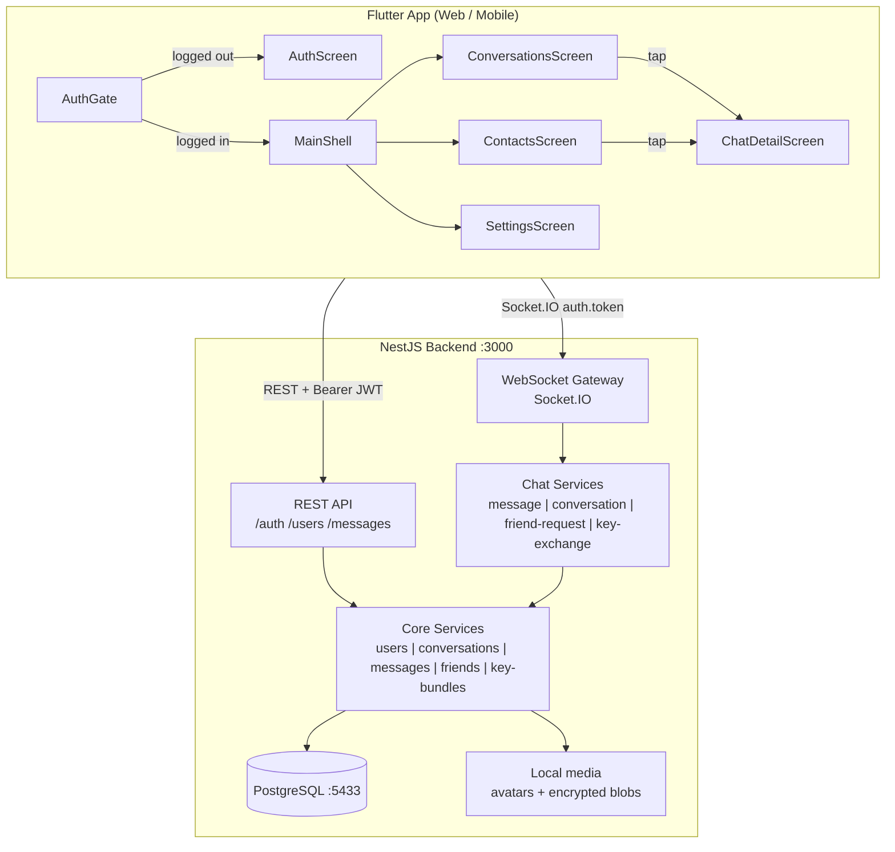
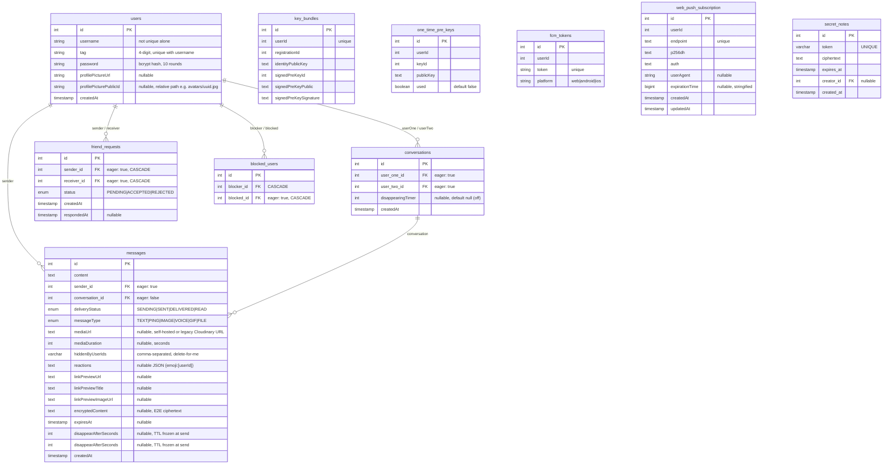

---
description:
alwaysApply: true
---

# CLAUDE.md — Fireplace

**Rules:**
- Always read this file before every code change
- Update this file after every code change
- **Before any review or code change:** read ALL files the task touches before writing anything; trace every code path; verify method/field/event names in actual source — never guess
- Single source of truth for agents — if CLAUDE.md says X, X is correct
- All code in English (vars, functions, comments, commits). Polish OK in .md files only

---

## 0. Quick Start

```bash
# Terminal 1: Backend + DB (auto hot-reload)
docker-compose up

# Terminal 2: Flutter web (press 'r' for hot-reload)
cd frontend && flutter run -d chrome
```

**Before start:** Kill stale node processes: `taskkill //F //IM node.exe`
**Android (emulator or USB):** `cd frontend` → `flutter devices` → `flutter run -d <deviceId>` (emulator + backend on host: often `--dart-define=BASE_URL=http://10.0.2.2:3000`). Uses `%USERPROFILE%\.gradle` on `C:` — enough free space on `C:` after a clean install is the normal case; no extra drive letter required.
**Optional — low free space on `C:` or broken/locked Gradle cache there:** `frontend/run_android_on_x.ps1` sets `GRADLE_USER_HOME`, `TEMP`/`TMP`, and a junction `frontend/build` → `X:\fireplace-build\frontend-build` using paths **hardcoded to `X:\` in the script**. That only works if **`X:` exists** (second partition, VHD, or change the script to another letter). It also runs `patch_webcrypto_16k.ps1` then `flutter run` (add `-d …` inside the script if you need a specific device when several are connected). If you do not use this script, you can still run `patch_webcrypto_16k.ps1` manually before Android builds when you need the 16KB webcrypto patch. `flutter clean` does **not** clear `%USERPROFILE%\.gradle` — corrupt `metadata.bin` there is fixed by cache repair or pointing `GRADLE_USER_HOME` at any folder on a drive with space (not only `X:`).

**Ports:** Backend :3000 | Frontend :random (check terminal) | DB :5433 (host) -> :5432 (container)

**Stack:** NestJS 11 + Flutter 3.x + PostgreSQL 16 + Socket.IO 4 + JWT + self-hosted media (`MEDIA_BASE_URL` / disk volume; Nginx `X-Accel-Redirect` in prod)

**Phone (same WiFi):** `cd frontend && .\run_web_for_phone.ps1` or `flutter run -d web-server --web-hostname 0.0.0.0 --web-port 8080 --dart-define=BASE_URL=http://YOUR_PC_IP:3000`

**Tests:** `cd backend && npm test` (258 unit tests, 36 suites, no DB required); `cd frontend && flutter test` (includes `test/services/api_service_session_test.dart` for login/refresh HTTP contract, `test/providers/auth_provider_session_test.dart` for refresh 401 vs transient + parallel `ensureSessionReady` mutex, `test/providers/conversations_provider_test.dart` for `pushClientState` / active-chat emission / `conversationsList` unread merge, `test/utils/app_badge_math_test.dart` for PWA badge cap/sum, `test/widgets/message/bubble_redesign_test.dart`, conversations notification-navigation guards). `ApiService` accepts optional `http.Client` for tests (`MockClient`). CI (`.github/workflows/ci.yml`) runs backend `npm ci` + `npm test`, then Flutter `flutter pub get`, `flutter analyze`, and `flutter test` on pushes to `master` and pull requests. Media crypto round-trip tests skip when `webcrypto:setup` was not run (e.g. no cmake on Windows); the 20MB limit test always runs (throws before native crypto).

**Production:** https://fireplace.ignorelist.com — Google Cloud e2-medium VM (Warszawa), Docker + Nginx + Let's Encrypt. Deploy: SSH to server → `~/deploy.sh` (git pull + docker build + flutter web build).

---

## 1. Critical Rules & Gotchas

### TypeORM
- Always `relations: ['sender', 'receiver']` on friendRequestRepository queries — without: empty objects/crash
- Use find-then-remove for friend_requests delete — `.delete()` can't use nested relation conditions
- Always `new Date(val).getTime()` for expiresAt comparisons — TypeORM returns string or Date
- **Read-based disappearing messages:** New sends store `disappearAfterSeconds` (from `expiresIn` or conversation `disappearingTimer`) with `expiresAt = null` at send. On `markConversationRead`, backend sets `expiresAt = now + disappearAfterSeconds` and emits it on `messageDelivered` to sender and reader. **Never-read fallback:** read-mode rows with null `expiresAt` expire after `createdAt + DISAPPEARING_MAX_UNREAD_SECONDS` (86400). **Grandfathered** rows keep send-time `expiresAt` only (no `disappearAfterSeconds`). Shared expiry: `backend/src/messages/message-expiry.util.ts` (`isMessageExpired`, `MESSAGE_NOT_EXPIRED_SQL`); frontend `lib/utils/message_expiry.dart`. **Hearth Fade UI:** `disappearing_timer_sheet.dart` (hero arc, read explainer, **Set timer** / **Turn off**), `hearth_fade_arc.dart` (bubble/list arcs), composer banner + `ConversationTile` indicator. Ephemeral accent: `RpgTheme.ephemeralAccent(context, themePreference: …)` — ember on `light`, `primaryTealStone` on `teal`, theme accents on dark/blue. Production: `ALTER TABLE messages ADD COLUMN "disappearAfterSeconds" integer NULL;`
- `deliveryStatus` never downgrades — enforced via `DELIVERY_STATUS_ORDER` map
- `synchronize` is enabled only when `NODE_ENV !== 'production'` — column additions auto-apply on restart in non-prod. No migrations

### Frontend
- `file_utils_stub.dart` / `file_utils_io.dart` — conditional import for temp file deletion (web: no-op; native: dart:io)
- Android 16KB page-size compatibility: `zipalign -P 16` can pass while app still shows compatibility warning — verify ELF `LOAD` alignment with `llvm-readelf -l` for `.so` files. In current state `webcrypto` (`libwebcrypto.so`) is built with `Align 0x1000` (arm64 + x86_64), while `libflutter.so` / `libdatastore_shared_counter.so` are 16KB-safe.
- `flutter pub run webcrypto:setup` is for `flutter test` / scripts only (builds `.dart_tool/webcrypto/...`), not for Flutter app plugin binaries packaged into APK/AAB.
- `frontend/patch_webcrypto_16k.ps1` patches cached `webcrypto` Android `CMakeLists.txt` with linker flags `-Wl,-z,max-page-size=16384 -Wl,-z,common-page-size=16384` to produce 16KB-compatible `.so` files; `run_android_on_x.ps1` runs it before its bundled `flutter run`, or invoke the patch script yourself before a plain `flutter run`.
- `MainActivity` package must match Android namespace/applicationId (`com.fireplace.app`); mismatch (`com.rpgchat.frontend`) causes runtime crash `ClassNotFoundException: com.fireplace.app.MainActivity`.
- Android build outputs should stay at the default `frontend/build` path for Flutter tooling; optional low-`C:` layout: map `frontend/build` to a folder on another volume via junction (see `run_android_on_x.ps1`, which expects `X:\` unless you edit it).
- Do not move `PUB_CACHE` to a different drive than the project root on Windows (`X:` vs `C:`) for Android builds; Kotlin incremental caches can fail with `IllegalArgumentException: this and base files have different roots`.
- Android/Kotlin workaround for mixed-drive cache paths: `frontend/android/gradle.properties` sets `kotlin.incremental=false` to avoid daemon cache-close failures on Windows.
- **Gradle “Could not read workspace metadata” under `%USERPROFILE%\.gradle\caches\8.14\transforms\... \metadata.bin`:** Corrupt or locked user Gradle cache on `C:` (often full disk, antivirus, interrupted build). **Fast bypass:** point Gradle elsewhere before `flutter run`, e.g. `$env:GRADLE_USER_HOME='D:\gradle-home'` (any folder on a drive with free space; create the directory first). **`run_android_on_x.ps1`** does the same idea but hardcodes `X:\gradle-home` — use it only if you have `X:` (or edit the script). **Repair default cache:** set `JAVA_HOME` to Android Studio JBR, `cd frontend/android` → `gradlew.bat --stop`; if deletes fail, close Android Studio and `taskkill /F /IM java.exe`; delete `%USERPROFILE%\.gradle\caches\8.14`; optionally `frontend/android/.gradle`; `flutter clean` → rebuild. **`flutter clean` alone does not fix this** — it does not remove `%USERPROFILE%\.gradle`.
- Emulator ANR note (Android 17 / ps16k image): `System UI isn't responding` can occur in `com.android.systemui`/launcher independently of app startup; verify with `adb logcat` (`ANR in com.android.systemui`, `Input dispatching timed out`) before blaming app code.
- **Android overscroll stretch:** Material 3’s `StretchingOverscrollIndicator` (default under `MaterialScrollBehavior`) can warp the whole UI when dragging past scroll edges. `theme/app_scroll_behavior.dart` returns `child` from `buildOverscrollIndicator` and is wired globally via `MaterialApp(scrollBehavior: const AppScrollBehavior())` in `frontend/lib/main.dart`.
- Use `showTopSnackBar()` — ScaffoldMessenger covers chat input bar; pass `AppLocalizations.of(context)` strings (`snackbar*` keys in `app_en.arb` / `app_pl.arb`) — do not hardcode English for top notifications
- Chat composer hint: `chatMessageHint` in `app_pl.arb` / `app_en.arb`. Chat date chips: `chatDateToday` / `chatDateYesterday` + `MaterialLocalizations.formatShortDate` for older days (`MessageDateSeparator`) — use **`date.toLocal()`** for calendar-day logic and labels (`ChatDetailScreen._isDifferentDay`, `MessageDateSeparator`).
- Bottom interactive bars (chat composer / action tiles / bottom tabs): keep controls above system gesture area on all platforms using bottom inset + small ergonomic buffer (not fixed-only padding). Current approach: chat screen `SafeArea(bottom: false)` delegates bottom spacing to `ChatInputBar`/`ChatActionTiles`; composer uses `max(viewPadding.bottom, padding.bottom)` and adds +16 only when inset > 0 and keyboard is hidden (avoids desktop/zero-inset gaps). Because some mobile Web/PWA environments report zero bottom inset despite gesture area, `ChatInputBar` applies a web-mobile fallback bottom inset (16) on compact layouts when keyboard is hidden. Spacer uses surface color (no transparent seam). Blocked-state banner is wrapped in `SafeArea(top: false)`. `MainShell` wraps `BottomNavigationBar` in `SafeArea(top: false, minimum: EdgeInsets.only(bottom: 10))`. Web shell keeps `<meta name="viewport" content="... viewport-fit=cover">` so iOS/Android PWA expose safe-area insets correctly.
- Chat composer horizontal: `ChatDetailScreen` applies horizontal `SafeArea` only around the **message list** (`Expanded`), not the whole column — `ChatInputBar` is full-width so its `surface` fill reaches the screen edge (avoids a dead strip of `Scaffold` background beside the composer on PWA/notched insets). `ChatInputBar` adds `MediaQuery.padding.left/right` to its row `Container` padding (plus inner 8 / 4 dp) so trailing controls stay off cutouts while the field can use the reclaimed width. On **compact** layouts (`width < layoutBreakpointDesktop`), add **+14dp** to the **right** padding so the mic sits left of the OS/browser **right-edge back gesture** strip.
- **Disappearing messages (read-based):** Conversation timer via Hearth Fade `DisappearingTimerSheet` (`disappearing_timer_sheet.dart`; 5s–30d; **Turn off** / **Set timer**; entity default **null** — timer off until user enables). Hearth Fade chrome uses `RpgTheme.ephemeralAccent` (teal theme = teal, light = ember orange). New sends store `disappearAfterSeconds` only when conversation `disappearingTimer != null` (or explicit `expiresIn`). `HearthFadeArcIndicator` on bubbles (with countdown label) and **conversation list** (Option B: arc only when `lastMessage` has active ephemeral state via `showsEphemeralState`, not when `conv.disappearingTimer` alone; dotted pre-read, filled arc after read — no list countdown text; remaining time in tooltip only; `ConversationsScreen` owns the sole 1 Hz tick (`countdownTickNotifier` + `pruneExpiredLastMessages`; `ChatDetailScreen` does not start a second timer). List perf: `itemBuilder` uses `Selector<MessagingProvider, bool>` per tile for `isPartnerTyping` only (not `context.watch<MessagingProvider>()`); `ConversationTile` passes unread/time via `ValueListenableBuilder` `child` so only the arc rebuilds each tick. Composer banner is **display-only** (no tap — timer via action tile only); `ChatInputBar` **`build` must `context.watch<ConversationsProvider>()`** for the banner (not `read` — otherwise the label only refreshes when `MessagingProvider` notifies, e.g. after sending a message); `setDisappearingTimer` optimistically updates local `disappearingTimer`. Regression: `test/widgets/input/chat_input_bar_disappearing_banner_test.dart`, `test/widgets/conversation_tile_ephemeral_test.dart`. Client expiry: `utils/message_expiry.dart` (`isMessageExpired`, `kNeverReadRetentionSeconds` 86400). Optimistic sends must not set send-time `expiresAt`. Grandfathered messages (send-time `expiresAt` only) unchanged.
- Local incoming-message sound (mobile): `MessagingProvider` plays `assets/sounds/incoming_message_long_pop.wav` on incoming non-self messages (plain + decrypted) except `PING`; `PingEffectOverlay` uses `assets/sounds/ping_alert.mp3`
- `MessagingProvider` has test hook `setIncomingMessageSoundEnabledForTest(false)` used by provider unit tests to avoid `just_audio` plugin channel calls in non-widget test environments.
- `enableForceNew()` on Socket.IO reconnect — Dart caches socket by URL, old JWT reused
- Provider can't call Navigator — use `consumePendingOpen()` / `consumeFriendRequestSent()` patterns
- Do NOT call `getConversations()` or `getFriends()` in `onFriendRequestAccepted` — backend already emits updated lists; extra get* causes race and overwrites with stale data (conversation/contact lost on acceptor)
- **`conversationsList` unread merge:** `ConversationsProvider.onConversationsList` sets each conversation’s unread to **`prev > server ? prev : server`** (snapshot from before clear vs payload `unreadCount`) so local `incrementUnreadCount` from a newer `newMessage` is not wiped by a slightly older list snapshot (fixes PWA icon badge / tiles dropping). No extra overwrite for “active” chat — forcing zero after merge had cleared real server unread after push/refetch while `activeConversationId` still pointed at the last-open conversation.
- On reconnect (same user), `connect()` must NOT clear `_conversations`/`_friends` so the UI does not flicker (empty → full) when socket reconnects after screen wake; use `isReconnect = (_currentUserId == userId)` (no `_conversations.isNotEmpty` check so slow first response does not cause clear). **`connect()` sets `_intentionalDisconnect` while replacing the socket** so the old socket’s `disconnect` does not schedule a spurious reconnect (WiFi↔LTE / wake-up handoff). **`ChatReconnectManager` reconnect uses `tokenForReconnect`** (updated by `applyRefreshedAccessToken`), not the JWT captured when the disconnect listener was registered. **`onConversationsList` / `onFriendsList` ignore an empty payload when the local list is already populated** (stale/raced snapshot must not wipe Chat + Contacts). `_onSocketReady` delayed retry refetches **both** conversations and friends when still empty after `conversationsRefreshDelay`. Preserve `_activeConversationId` on reconnect and in `onConnect` call `getMessages(_activeConversationId!)` so the open chat refetches and is not left empty. Backend `messageHistory` payload is `{ conversationId, messages }`; frontend ignores response when `conversationId != _activeConversationId` (avoids overwriting wrong chat).
- Guard `Platform` with `!kIsWeb` — `dart:io` crashes on web
- `copyWith` must include ALL fields — missing field = data silently lost
- Voice recording: mic must stay in widget tree — GestureDetector unmounts -> no events
- Hold-to-record: use **one** `GestureDetector` for idle + active recording (same subtree); swapping to a second detector when `_isRecording` flips disposed the long-press recognizer mid-gesture so release often skipped `_stopRecording`. Mic area also wraps a `Listener` (`onPointerUp` / `onPointerCancel`) so PWA/web release is reliable; `_finishRecordingGesture()` + `_gestureFinishHandled` dedupe pointer vs `onLongPressEnd`. If the user releases during async mic startup, `_pendingStopAfterStart` stops right after recording becomes active. `onLongPressCancel` while `_isStartingRecording` sets `_abortInFlightStart` so `_startRecording` exits after awaits without activating the mic; `_releaseRecorderSilently()` also covers early-return leaks (insecure web / denied permission). Minimum kept clip: `RecordingControllerState.kMinVoiceRecordingMs` (500) — duration measured from `_recordingStartTime` (recorder actually started), not long-press down; shorter clips show `snackbarHoldLongerForVoiceMessage`. Slide-to-cancel shows `snackbarVoiceRecordingCanceled`; `path == null` or missing native file shows `snackbarFailedToReadRecording`. `HapticFeedback.lightImpact()` when `_isRecording` becomes true (native only, skip web). `MessagingProvider.sendVoiceMessage` throws `StateError` when not authenticated or no conversation (caller snackbar). Recording bar hint + semantics: `voiceRecordingSlideToCancel` / `voiceRecordingSemanticsLabel` in ARB.
- Composer trailing mic hit target uses a small **negative** resting X offset (`_kMicRestingOffsetX = -6.0` in `recording_controller.dart`) so the mic icon sits **left** within the 48×48 slot, away from the screen’s right edge; drag-to-cancel still uses **global** coordinates (`_dragStartX` / `globalPosition.dx`) — the visual translate does not break cancel thresholds.
- Chat composer send (text): multiline `TextField` uses **`TextInputAction.send`** + `onSubmitted` as the **sole** text-send path (no trailing send icon). Plain **Enter** inserts `\n` in the multiline field (desktop/PWA keyboard; typical mobile multiline IME). **`onEditingComplete: () {}`** overrides the default that unfocuses after IME “Send”, which otherwise dismisses the keyboard while `hasFocus` can still read true in the same synchronous turn. After send, **`WidgetsBinding.instance.addPostFrameCallback`** refocuses only when **`!_focusNode.hasFocus`** (covers async focus loss on PWA without redundant sync `requestFocus`). `ChatInputBar` wraps the field in **`ConstrainedBox`** with a **`MediaQuery.textScalerOf`-scaled** max height (~6 lines + padding, clamped 120–400). Trailing **`RecordingController`** is **mic-only** when idle (no `hasText` swap, no newline button — removed `chatComposerNewlineTooltip` / `_insertNewline`); mic hit target uses **`ExcludeFocus`** so long-press does not steal field focus. Reply-bar still uses post-frame **`requestFocus` when `!hasFocus`**. `CallbackShortcuts` maps **Ctrl/Cmd+Enter** → send for web/desktop. Do **not** reintroduce a second send control beside the field (duplicate send vs IME was the original bug).
- Timer via `ValueNotifier<int>` — overlay rebuilds freeze timer
- `clearStatus()` in AuthProvider appears unused but is called from auth_screen.dart — DO NOT DELETE
- Always run `flutter analyze` before deleting "unused" methods
- Web/PWA push now uses standards-based Web Push (VAPID) instead of Firebase Web Messaging. `PushService.initialize()` on web only syncs an existing subscription (no permission prompt). Permission prompt must be triggered by explicit user gesture via `PushService.requestWebPushFromUserGesture()` (wired from `SettingsScreen`).
- **PWA app icon badge (Badging API):** `UnreadBadgeSync` (`services/unread_badge_sync.dart`) listens to `ConversationsProvider` debounced (~200 ms) on **web** and calls `BadgingBridge` → **`navigator.setAppBadge(capped)`** with **`capped = min(sum(unreadCounts), kAppBadgeMaxDisplayCount)`** (`capUnreadForBadge` in `utils/app_badge_math.dart`, **`kAppBadgeMaxDisplayCount`** must stay in sync with **`APP_BADGE_MAX`** in `web/web-push-sw.js`); **`clearAppBadge`** when capped is 0. Skips duplicate **`setAppBadge`** when capped unchanged. **Safari / iOS PWA:** WebKit often **does not show** a badge when **`setAppBadge()`** is called **with no arguments** — the **integer overload** is required for the icon badge there (regression note 2026). **Closing the PWA** (swipe from recents / process kill) must **not** clear the icon badge while unread remain — `UnreadBadgeSync.dispose()` only removes the listener; **`clearAppBadge`** when unread hits zero **or** via **`clearPwaAppBadgeOnLogout()`** (`services/pwa_app_badge_clear.dart`) from **`AuthProvider._clearLocalAuthState()`**. **`BadgingBridge`** (`badging_bridge_web.dart`) uses **`package:web`** (`web.window.navigator`) and **`JSObject.hasProperty`** for **`setAppBadge`** / **`clearAppBadge`** feature detection. Wired from `MainShell` post-frame. **`web/web-push-sw.js`:** on **`push`**, **`showNotification`** completes **first**, then **`setAppBadge(n)`** with **`n`** from **`messageCount`** (cap **`APP_BADGE_MAX`**, same as **`kAppBadgeMaxDisplayCount`**, else 1) — sequential so WebKit push handlers are not aborted by `Promise.all` rejection. SW **`postMessage`** (`push-notification-click`, `push-subscription-change`) is optional for future Dart listeners; tap flow today uses window **focus** only.
- iOS web push rules: requires Home Screen install + standalone mode; permission prompt must originate from direct tap/click; service worker must show a visible notification for push events. Standalone gate is enforced **only on iOS WebKit** (`WebPushBridge.isStandaloneOrNotRequired()` in `web_push_bridge_web.dart`); other engines (Chrome/Edge/Firefox/Comet on desktop and Android) can subscribe from a regular secure-context tab without PWA install. Detection: `iPhone|iPad|iPod` in UA, plus iPadOS-13+ "Mac UA + maxTouchPoints > 1" heuristic; on iOS, considered standalone when `(display-mode: standalone)` matches OR `navigator.standalone === true`.
- `WebPushBridge` (`web_push_bridge_web.dart`) uses **`package:web`** + **`dart:js_interop`** (not `dart:html` / `dart:js_util`). `PushManager.getSubscription()` is typed as `JSPromise<PushSubscription?>` so a missing subscription resolves to `null` safely. iOS-only `navigator.standalone` is read via a small `@JS` extension type. Feature detection uses `JSObject.hasProperty` for `serviceWorker` / `Notification` / Badging API methods.
- Web push service worker is `frontend/web/web-push-sw.js` (scope `/web-push-scope/`); registered by `web_push_bridge_web.dart`.
- **Android native:** FCM **data-only** messages show grouped tray notifications via `flutter_local_notifications` in `services/android_fcm_local_notifications.dart`: `firebaseMessagingBackgroundHandler` runs in a background isolate (registered from `main.dart` after `await Firebase.initializeApp`). Notifications use Android `tag` `conversation-<id>` (same grouping idea as PWA). `PushService.initialize(token, onAndroidNavigateToConversation: …)` initializes the plugin, handles cold/warm opens (`getNotificationAppLaunchDetails`, `getInitialMessage`, `onMessageOpenedApp`), cancels tap subscription on logout; taps call `ConversationsProvider.requestNavigateToConversationFromNotification`, consumed by `MainShell` (desktop: `setActiveConversation`, mobile: push `ChatDetailScreen` unless `activeConversationId` already matches — avoids duplicate route stack). `ChatDetailScreen` calls `openConversation` via `scheduleMicrotask` in `initState` so that id is registered before `MainShell` post-frame notification navigation. Conditional imports `push_android_stub.dart` / `fcm_background_stub.dart` keep **web** builds free of `flutter_local_notifications`. Foreground FCM still does **not** post a tray notification (socket delivers messages); no `onMessage` listener required for that policy.
- Widget tests using `AppLocalizations` need delegates: `localizationsDelegates: AppLocalizations.localizationsDelegates, supportedLocales: AppLocalizations.supportedLocales` in `MaterialApp` — without them `AppLocalizations.of(context)` returns null and tests crash
- Regression guard: `frontend/test/main/fireplace_app_scroll_behavior_test.dart` verifies `FireplaceApp` keeps `MaterialApp(scrollBehavior: const AppScrollBehavior())` wired, preventing Android overscroll stretch from silently returning
- `SettingsScreen` regression guard: `frontend/test/screens/settings_screen_scroll_physics_test.dart` verifies `ListView` uses `ClampingScrollPhysics`; test must use `RpgTheme.themeDataLight` because `SettingsScreen` relies on `FireplaceColors` ThemeExtension
- `blockedByUserIds` returns `Set.unmodifiable` — tests cannot mutate it directly; use `provider.onYouWereBlocked({'userId': X})` to set state
- `use_build_context_synchronously`: capture providers via `context.read<>()` before the first `await` in async methods
- Fire-and-forget futures: use `.ignore()` instead of `.catchError((_){})` — catchError requires callback to return the same type as the Future
- JWT payload no longer carries `profilePictureUrl`; `AuthProvider` loads user profile via `GET /users/me` in `_loadSavedToken`, `login`, and after avatar upload
- To avoid startup logout flicker, `_loadSavedToken` first decodes minimal user fields (`sub/username/tag`) from JWT for immediate local auth state, then refreshes with `/users/me`. If the access JWT is expired but `refresh_token` exists in `SharedPreferences`, `AuthProvider` calls `POST /auth/refresh` first (silent rotation). `ensureSessionReady()` runs before socket connect, on app **resume**, on **web `visibilitychange` → visible** (`MainShell` + `tab_visibility_web.dart`), and on a 15-minute timer while logged in.
- **Refresh error handling:** `ApiService.refreshSession` classifies status before JSON parse (401/403 → invalid even on HTML body; 429/408/5xx → transient). `AuthProvider` clears local auth **only** on invalid refresh; transient failures keep tokens + `isLoggedIn` via JWT decode. `_silentRefresh` retries transient errors up to 3× with short backoff. **`_refreshSessionLocked` mutex:** all refresh paths (`_loadSavedToken`, `fetchMe` 401 recovery, `ensureSessionReady`) share one in-flight refresh (avoids rotation race on PWA cold start + tab visible).
- `_loadSavedToken`: `fetchMe` 401 → try refresh; clear only on invalid refresh. Network/`fetchMe` failure keeps saved tokens and JWT user.
- Authenticated media fetch: `/media/msgs/` downloads use `ApiService.fetchMediaBytes(url, token)` (sends `Authorization` only for own-server URLs); legacy external URLs (e.g. Cloudinary) still fetch without auth
- Android emulator media URL fix: backend can emit media URLs with `localhost`; `ApiService.fetchMediaBytes` rewrites loopback `/media/*` URLs to the host from `AppConfig.baseUrl` (e.g. `10.0.2.2`) before GET so GIF/image/file/voice media loads on Android emulator
- `PlaybackController` refactor: capture JWT token once in `_loadAndPlayAudio()` and pass it explicitly to `_downloadAndCache(url, token)` (no hidden token read inside helper)
- `ChatDetailScreen` message loading uses `MessagingProvider.getMessages(conversationId)` (single entry point)
- Message pagination: `MessagingProvider` tracks `_hasMore/_isLoadingMore/_paginationOffset`, `loadOlderMessages()` is triggered near scroll top, and chat screen preserves visual position when prepending
- Pagination guard cleanup: if `messageHistory` is ignored due to conversation mismatch while pagination is active, reset `_isLoadingMore`/`_isPaginationLoad` to avoid a stuck loading state
- Multiple backends: if weird data, kill local `node.exe`, use Docker only
- Mobile _openChat: only Navigator.push; ChatDetailScreen initState calls openConversation (avoids double getMessages and decrypt loop)
- `_conversationCache` in MessagingProvider: per-conversation RAM cache (`Map<int, List<MessageModel>>`) for the current session. Populated by `onMessageHistory` (first snapshot after parse/filter, second after `_decryptMessageHistory` completes). Updated by `_handleIncomingMessage` (plain path and encrypted `.then()`), `_handleMessageDelivered` (in `_messages` or via `_patchMessageInCache` when the open list was clobbered), `_handleMessageDeleted`. Entry removed by `_handleChatHistoryCleared`,
  `onConversationDeleted`. Fully cleared by `clearAll()` (logout only). NOT cleared by `clearMessages()` (back navigation) or `onConnect` (socket reconnect). `ChatDetailScreen` calls `loadCachedMessages` before `getMessages`. **`onMessageHistory` (initial load):** merge-by-`id` into `_messages` (keep local rows missing from a stale page; prefer higher `deliveryStatus` / non-null `expiresAt` / non-null `disappearAfterSeconds` via `_mergeMessagePreferNewer`); FIFO `_pendingHistoryFetchSeq` skips superseded full applies when a newer `getMessages` was issued (stale responses still patch cache). **`_decryptMessageHistory` / live incoming decrypt:** apply decrypted or in-memory cache rows with `_mergeMessagePreferNewer` on the open row — never blind-assign cache/decrypted `MessageModel` or a stale history snapshot can wipe `disappearAfterSeconds` on the recipient burst path. `_addMessageToState` dedupes by `id`/`tempId` and uses `activeConversationId ?? _paginationConversationId`. `ChatDetailScreen` calls `openConversation` synchronously in `initState` (before post-frame `getMessages`). `ChatDetailScreen` uses `ListView(reverse: true)`: `pixels = 0` is the visual bottom (newest message), eliminating the need to chase `maxScrollExtent`. `jumpTo(0)` / `animateTo(0)` are always correct regardless of lazy build state. `_userHasScrolledChat` (set by `NotificationListener<UserScrollNotification>`) suppresses auto-scroll-to-bottom while the user reads history; cleared when `pixels <= _scrollToBottomThreshold` in `_onScroll`. Pagination trigger: `maxScrollExtent > 0 && pixels >= maxScrollExtent - 300` (near visual top; guards short non-scrollable lists). `loadCachedMessages(id)` returns bool — true when RAM cache was applied. `_effectiveActiveConversationId` (test override OR `ConversationsProvider.activeConversationId`) is used in `onMessageHistory` and incoming-message paths.

### Backend
- `ChatValidationService.validateCanMessage(senderId, recipientId)` — shared validation for blocked + friends; used by sendMessage, startConversation
- mediaUrl (non-E2E / legacy) must match `MEDIA_URL_REGEX` in `chat.dto.ts` — Cloudinary `https://res.cloudinary.com/.../(video|image|raw)/upload/...` or self-hosted `${MEDIA_BASE_URL}/media/...` (prevents SSRF)
- Delete account cascade: key bundles -> OTPs -> msgs -> convs -> friend_reqs -> user (no cascade on User entity)
- `conversationsService.delete()` deletes msgs first (no cascade)
- Chat services: critical failures stop execution; non-critical (emit lists) log and continue
- Skip server-side link preview when `encryptedContent` present (server can't read content)
- Reply-to preview: MessageMapper uses "Encrypted message" when replyTo has encryptedContent; frontend fallback for `[encrypted]`
- `handleMessageDelivered` verifies caller is recipient (not sender) — ownership enforced
- `handleStartConversation` requires friendship — blocks strangers from opening DMs
- `handleStartConversation` emits `conversationsList` + `openConversation` to caller only; recipient gets only `conversationsList` (B does not auto-open chat; B sees unread badge when A sends first message)
- OTP claim is atomic: `UPDATE ... WHERE id = (SELECT ... LIMIT 1) RETURNING *` in `key-bundles.service.ts`
- `isBlockedByEither` uses single OR query (one DB round-trip, not two)
- `_conversationsWithUnread` uses `Promise.all` — parallel, not sequential
- `findByConversation` uses DB-level `skip`/`take` when no hidden messages
- `og:image` from link preview validated via `isSafeImageUrl` (HTTPS + non-private host only); IPv6 brackets stripped before regex; backend resolves relative og:image URLs using pageUrl
- WS rate limiting: `WsThrottlerGuard` on `sendMessage` — per-user tracker (user id); `@Throttle({ default: { limit: 300, ttl: 900000 } })` on `handleSendMessage` overrides the global module default (100/15 min) so one active user cannot exhaust the cap and lose all outbound sends until the window expires. Guard provides mock `res` with no-op `header()` (Socket has no such method; ThrottlerGuard expects it)
- WS throttling also guards read-heavy events: `getMessages/getConversations/getFriends/getFriendRequests/getBlockedList` use `300/15m`; `searchUsers` uses `30/60s`; `fetchPreKeyBundle` uses guard-only with global limits
- `ChatKeyExchangeService.handleFetchPreKeyBundle` has an additional in-process anti-depletion guard: same `requesterId -> targetUserId` pre-key fetches are rate-limited (minimum 750ms between requests) and return socket `error` when exceeded; tracker map is pruned by TTL (10 min) and capped (10k entries) to avoid unbounded memory growth
- JWT invalidation after password change: `User.passwordChangedAt` is set in `resetPassword`; `JwtStrategy.validate()` rejects when `payload.iat <= passwordChangedAt` (seconds precision). `resetPassword` also revokes **all** refresh tokens for that user (`RefreshTokensService.revokeAllForUser`).
- **Session model:** Access JWT TTL **`24h`** (`auth.module.ts` `signOptions.expiresIn`). Long-lived sessions use opaque **refresh tokens** (table `refresh_tokens`, SHA-256 of token stored, **365-day** rolling expiry, **rotation** on each `POST /auth/refresh`). Login returns `{ access_token, refresh_token }`. `POST /auth/logout` revokes the submitted refresh token. Optional Phase 1 identity-key auth (`docs/superpowers/specs/2026-05-09-identity-key-auth-design.md`) remains a future upgrade.
- `GET /media/msgs/:filename` is JWT-guarded; avatars remain public
- Expired disappearing-message media is deleted before `MessageCleanupService` removes expired rows. `MediaCleanupService.cleanupOrphanedFiles()` still runs daily as a crash/legacy safety net.
- **E2E upload without DB row (I1):** If encrypted media upload succeeds but `sendMessage` fails (network, validation, session error), the `.bin` is on disk with no `messages.mediaUrl` reference. Daily `cleanupOrphanedFiles()` deletes it on the next cron run (~03:00). Retry after upload reuses optimistic `mediaUrl` on the failed message; failure before upload still requires re-pick. Documented gap — no metric/alert.
- Blocking a user deletes known self-hosted media for the conversation before deleting the conversation/messages, so block does not wait for the daily orphan sweep.
- Secret notes are one-shot and expired unread notes are purged daily by `SecretNotesService.deleteExpiredNotes()`.
- Avatar uploads validate actual file bytes (JPEG/PNG magic bytes) in both media upload avatar path and users profile-picture endpoint
- Health endpoint added: `GET /health` runs `SELECT 1` and returns `503` on DB failure (for Docker healthcheck)
- Raw SQL in `markConversationAsReadFromSender`: use `"deliveryStatus"` (quoted) — PostgreSQL column is camelCase
- `messages` table has composite index `idx_messages_conv_created` on `(conversation_id, createdAt DESC)` — auto-created in dev via synchronize; production requires manual: `CREATE INDEX CONCURRENTLY idx_messages_conv_created ON messages (conversation_id, "createdAt" DESC);`
- WS throttling reminder: global `ThrottlerModule` covers HTTP only; for WebSocket events apply `@UseGuards(WsThrottlerGuard)` (and `@Throttle(...)` where needed), especially on high-frequency or mutating handlers
- SSRF: `PRIVATE_IP_RE` in `link-preview.service.ts` blocks `169.254.x`, `fe80:`, RFC-1918 and loopback — verify coverage when adding new IP range exclusions
- `_conversationsWithUnread` uses batch `countUnreadForRecipientBatch` + `getLastMessagesBatch` (2 queries total, not 2N)
- Production: logger level `['error','warn','log']` — no debug
- friend_requests: unique index on (sender, receiver)
- Push delivery is dual-channel: `PushNotificationsService.notify()` dispatches FCM for `android/ios` tokens and Web Push (VAPID) for PWA subscriptions. Payload is metadata-only (`type`, optional `conversationId`, optional `messageCount` when coalesced bursts); no message body. Web Push removes stale subscriptions on HTTP 404/410.
- Outbound message pushes are **coalesced** per `(recipientUserId, conversationId)` via `PushNotificationCoalescingService` (~2.5s debounce, ~10s max wait) so bursts become one notification with aggregated `messageCount`.
- Clients emit **`pushClientState`** `{ activeConversationId, clientVisible }` over the socket (`ChatGateway` → `ChatPresenceService`); when `clientVisible && activeConversationId` matches the incoming message’s conversation, `ChatMessageService` skips scheduling push (WS still delivers `newMessage`). `ConversationsProvider` syncs state on chat open/close and tab/app visibility (`MainShell`: lifecycle + web `visibilitychange` via `tab_visibility.dart`). **`MainShell`:** set `clientVisible` false on **`AppLifecycleState.inactive`** too (not only paused/hidden) — home / app switcher often hits inactive first; otherwise users expect pushes after leaving the app while still “in” a conversation. **`ChatDetailScreen.dispose`** must clear active when this chat still owns `activeConversationId` (system back / block / auto-pop); otherwise push stays suppressed until reconnect. Desktop chat switch sets a new active id first, so dispose skips when the id no longer matches.
- Web Push subscriptions are stored in `web_push_subscription` (`endpoint`, `p256dh`, `auth`, optional `userAgent`, `expirationTime` stringified bigint). REST endpoints: `POST /users/web-push-subscription`, `DELETE /users/web-push-subscription`.

### E2E Encryption
- **`uploadOneTimePreKeys` payload:** must be `{ keys: [...] }`, not a bare array. `EncryptionProvider` emits via `_emit` (same as `socket.emit`) and must match `UploadOneTimePreKeysDto`; a raw list fails backend validation (`unknownValue` / non-object root).
- Fresh install: 20 one-time pre-keys (not 100) for fast startup; preKeysLow replenishes when < 10
- Pre-key storage: parallel writes (Future.wait); replenishment uses chunked parallel (25 at a time)
- `EncryptionService.decrypt()` returns `Future` — must use async patterns
- Message history decrypts async: renders immediately, then decrypts in-place with `notifyListeners()`
- Own messages skip decryption (sender has plaintext from optimistic display)
- Conversation list shows "Encrypted message" for encrypted lastMessage (not decrypted at list level)
- Session establishment uses Completer with 10s timeout — on failure, message marked as failed (no unencrypted fallback)
- Send when recipient offline: on encrypt/session failure we clear `_pendingPreKeyFetches[recipientId]` so retry gets a fresh pre-key fetch. If failure is key-bundle or timeout, we schedule a single delayed retry (4s) so when recipient logs in and uploads keys, the message can send without user tapping Retry. Manual Retry cancels the delayed retry; connect/logout cancels it via `_cancelDelayedRetryIfAny()`.
- Keys NOT cleared on logout (persist for re-login). Only cleared on account deletion via `clearEncryptionKeys()`
- All Signal store keys use `e2e_${userId}_` prefix — multi-account isolation in same browser
- `clearAllKeys()` uses selective deletion (reads all, deletes by prefix) — never wipes other data
- **DualStorage**: All Signal stores use `DualStorage` (writes to both `flutter_secure_storage` AND `SharedPreferences`). On web, IndexedDB+WebCrypto can lose data when all tabs are closed; localStorage (SharedPreferences) is the reliable fallback. Reads try flutter_secure_storage first, then SharedPreferences.
- Web: WebOptions(dbName: 'FireplaceE2E') for app-specific storage; Privacy & Safety shows web key-storage warning
- **Cache-first history decryption**: `_decryptMessageHistory` checks persisted cache (SharedPreferences/localStorage) BEFORE attempting live decryption. Avoids unnecessary session ratchet advancement and recovers messages when keys are lost. `EncryptionProvider` owns this cache via `saveDecryptedContent()` / `getDecryptedContent()` and an in-memory `_decryptedContentCache`; `MessagingProvider` no longer accesses `EncryptionService` directly and uses only `EncryptionProvider`'s delegation methods for decrypted-content persistence.
- Persisted decrypted-content cache is capped at 500 entries per user (`EncryptionService(decryptedContentCacheLimit: 500)` default) and oldest message IDs are pruned on save. `PrivacySafetyScreen` exposes "Clear local message cache", which calls `EncryptionProvider.clearLocalDecryptedContentCache()` and `PlaybackController.clearAudioCache()`; this removes local plaintext/message audio cache only and must NOT clear Signal keys or server history.
- `_pendingSendContent: Map<String, Map<String, dynamic>>` stores tempId→{content, messageType?, mediaUrl?, mediaDuration?, mediaKey?, mediaIv?, linkPreviewUrl?, ...} when any send method creates the optimistic message; extra fields added in `_encryptAndSend()`. Survives `_messages` list overwrites (e.g. `messageHistory` arriving before `messageSent`). Cleared on both fresh connect and reconnect in `onConnect`. Drained in `_addMessageToState`. CRITICAL: for image/voice/GIF/file, write `mediaKey`/`mediaIv` immediately after `MediaCryptoService.encrypt()` and **before** `uploadEncryptedMedia` / further awaits — if `messageHistory` interleaves, `_addMessageToState` must already see key+IV or they are lost.
- `retryFailedMessage`: if upload already succeeded, the optimistic `MessageModel` holds `mediaUrl` + `mediaKey` + `mediaIv`; retry calls `_encryptAndSend` again (image/GIF/file always; voice when `mediaUrl` is `http…` and keys present). Legacy Cloudinary media retries omit keys. GIF failures after upload are retriable; GIF failures before upload still cannot retry without re-picking.
- **Upload without DB row (I1):** Same as backend note — upload-then-send-fail leaves an unreferenced `.bin` until orphan cron; no server row means `cleanupOrphanedFiles` treats it as orphan.
- `_initializeE2E()` skips `_encryptionService.initialize()` when `_e2eInitialized = true` (reconnect path) — prevents transient mobile storage errors from setting `_e2eInitialized = false` and causing all history messages to become permanently `[Decryption failed]`. Key bundle re-upload still runs on every connect.
- **Socket auth race:** Backend emits `socketReady` after JWT + `client.data.user`; `ConnectionProvider` fetches conversations/friends only on `socketReady`, not raw `connect` (fixes `handleGetConversations: no userId in client.data`). E2E `initializeE2E` still runs on transport `connect`. Deploy backend + frontend together with full restart.
- **Decrypt ordering:** Live `newMessage` decrypt is serialized per `senderId` (`_runDecryptSerialized`); `_waitForE2EReady()` before decrypt; history pass retries `[Decryption failed]` rows (do not skip permanently); `_finishHistoryDecryptPass` drains `_incomingMessageQueue` after history. Stale `messageHistory` responses only merge cache — they must not clear `_decryptingHistory` while a newer `getMessages` is in flight. **History decrypt failure (wake-up / overnight):** when `_decryptingHistory` and live decrypt fails, track peer in `_historyDecryptFailedPeers` (no immediate `requestSessionRebuild` spam); after the history pass, `_retryHistoryDecryptForFailedPeers` calls `deleteSessionWithPeer`, emits `requestSessionRebuild` once per peer, resets failed rows to `[encrypted]`, and replays decrypt in chronological order — fixes permanent `[Decryption failed]` on first messages after sleep when the old guard skipped session rebuild during history. Regression: `test/providers/messaging_provider_race_test.dart` (`history decrypt failure resets session…`).
- **Reconnect storm guard:** `ConnectionProvider.connect` enforces `AppConstants.reconnectConnectCooldown` (2s) between full connects; `ChatReconnectManager.onDisconnect` uses `reconnectMaxAttempts` + exponential backoff; `resetAttempts()` runs on `socketReady` (not raw transport `connect`) so brief connect/disconnect loops do not wipe backoff. Intentional socket replacement during `connect()` must not count as a user-visible disconnect.
- Regression tests for crypto race paths: `frontend/test/providers/messaging_provider_race_test.dart` verifies no plaintext fallback emit on failed session bootstrap, confirms reconnect cancels delayed retry timers, and covers deterministic `reconnect + messageHistory + retry` interleaving with encrypted-only re-send; `frontend/test/providers/encryption_provider_test.dart` also covers duplicate `preKeyBundleResponse` handling and `preKeysLow` reentrancy guard

---

## 2. Architecture Overview


```mermaid
flowchart TB
    subgraph Client["Flutter App (Web / Mobile)"]
        AuthGate -->|logged out| AuthScreen
        AuthGate -->|logged in| MainShell
        MainShell --> ConversationsScreen
        MainShell --> ContactsScreen
        MainShell --> SettingsScreen
        ConversationsScreen -->|tap| ChatDetailScreen
        ContactsScreen -->|tap| ChatDetailScreen
    end

    subgraph Backend["NestJS Backend :3000"]
        REST["REST API\n/auth /users /messages"]
        WS["WebSocket Gateway\nSocket.IO"]
        REST --> Services
        WS --> ChatServices["Chat Services\nmessage | conversation | friend-request | key-exchange"]
        ChatServices --> Services
        Services["Core Services\nusers | conversations | messages | friends | key-bundles"]
        Services --> DB[(PostgreSQL :5433)]
        Services --> Media["Local media\navatars + encrypted blobs"]
    end

    Client -->|"REST + Bearer JWT"| REST
    Client -->|"Socket.IO auth.token"| WS
```

**State Management:** 7 providers (ChangeNotifier): `AuthProvider` (login/logout/token/user), `ConnectionProvider` (socket lifecycle, connect/disconnect, reconnect), `ConversationsProvider` (conversation list, active chat, unread counts), `MessagingProvider` (messages, send/receive, E2E orchestration, typing), `FriendsProvider` (friends, requests, blocking, search), `EncryptionProvider` (E2E keys, session management), `SettingsProvider` (`themePreference`: `light` | `teal` | `dark` | `blue`; `themeMode` light for `light`+`teal`; `MaterialApp.theme` = `lightTheme` → `RpgTheme.themeDataLight` or `themeDataTealStone`; locale: pl/en, default pl). Services: `SocketService` (Socket.IO, event-map pattern), `ApiService` (REST), `EncryptionService` (Signal Protocol), `MediaCryptoService` (AES-256-GCM for message media blobs in isolate), `LinkPreviewService` (OG metadata).

**Provider wiring:** ConnectionProvider orchestrates socket events and routes them to sub-providers via `on()` listeners. Sub-providers receive an `_emit` callback for sending socket events. Cross-provider calls use explicit method interfaces (`removeConversationsForUser`, `updateLastMessage`, etc.). Wired in `conversations_screen.dart` initState.

**Backend services:** `ChatGateway` (thin, ~446 LOC, pure delegation) delegates to `ChatMessageService`, `ChatConversationService`, `ChatFriendRequestService`, `ChatKeyExchangeService`, `ChatPresenceService`, `ChatBlockService`, `ChatSearchService`, `ChatReactionService`, `ChatLinkPreviewService`. REST: `AuthController`, `UsersController`, `MessagesController`. Mappers: `UserMapper`, `MessageMapper`, `ConversationMapper`, `FriendRequestMapper` — all have `toPayload()`.

**DTO validation:** `chat/utils/dto.validator.ts` — runtime validation via `class-transformer` + `class-validator`. DTOs in `chat/dto/`.

---

## 3. File Location Map

### Backend (`backend/src/`)

| Domain | Key Files |
|---|---|
| **Auth** | `auth/auth.service.ts`, `auth/auth.controller.ts`, `auth/refresh-token.entity.ts`, `auth/refresh-tokens.service.ts`, `auth/refresh-tokens.module.ts`, `auth/dto/refresh-body.dto.ts`, `auth/jwt-auth.guard.ts`, `auth/strategies/jwt.strategy.ts`, `auth/password.constants.ts` |
| **Users** | `users/user.entity.ts`, `users/users.service.ts`, `users/users.controller.ts` |
| **Conversations** | `conversations/conversation.entity.ts`, `conversations/conversations.service.ts` |
| **Messages** | `messages/message.entity.ts`, `messages/message.mapper.ts`, `messages/messages.service.ts`, `messages/messages.controller.ts` (link-preview only) |
| **Media** | `media/local-storage.service.ts`, `media/media.controller.ts`, `media/media-cleanup.service.ts`, `media/media.module.ts`, `media/dto/upload-media.dto.ts` |
| **Friends** | `friends/friend-request.entity.ts`, `friends/friends.service.ts` |
| **Blocked** | `blocked/blocked-user.entity.ts`, `blocked/blocked.module.ts`, `blocked/blocked.service.ts` |
| **Chat** | `chat/chat.gateway.ts`, `chat/services/chat-{message,conversation,friend-request,key-exchange,presence,block,search,reaction,link-preview}.service.ts` |
| **DTOs** | `chat/dto/chat.dto.ts` + `{typing,recording-voice,...}.dto.ts` |
| **Key Bundles** | `key-bundles/key-bundle.entity.ts`, `key-bundles/one-time-pre-key.entity.ts`, `key-bundles/key-bundles.service.ts` |
| **Mappers** | `chat/mappers/{conversation,user,friend-request}.mapper.ts`, `messages/message.mapper.ts` |
| **Push** | `fcm-tokens/fcm-token.entity.ts`, `fcm-tokens/fcm-tokens.service.ts`, `web-push-subscriptions/web-push-subscription.entity.ts`, `web-push-subscriptions/web-push-subscriptions.service.ts`, `push-notifications/push-notifications.service.ts` |
| **Secret Notes** | `secret-notes/secret-note.entity.ts`, `secret-notes/secret-notes.service.ts`, `secret-notes/secret-notes.controller.ts`, `secret-notes/secret-notes.module.ts` |
| **Health** | `health/health.controller.ts`, `health/health.module.ts` |
| **Config** | `config/env.validation.ts` |
| **Utils** | `chat/utils/dto.validator.ts`, `chat/services/chat-validation.service.ts`, `chat/services/link-preview.service.ts`, `app.module.ts` |

### Frontend (`frontend/lib/`)

| Domain | Key Files |
|---|---|
| **Entry** | `main.dart`, `config/app_config.dart`, `constants/app_constants.dart` |
| **Models** | `models/{user,conversation,message,friend_request}_model.dart` |
| **L10n** | `l10n/app_pl.arb`, `l10n/app_en.arb`, `l10n/app_localizations.dart` (generated), `l10n.yaml` |
| **Providers** | `providers/{auth,connection,conversations,messaging,friends,encryption,settings}_provider.dart`, `providers/chat_reconnect_manager.dart`, `providers/conversation_helpers.dart` |
| **Services** | `services/{socket_service,api_service,encryption_service,media_crypto_service,link_preview_service,push_service,gif_service}.dart` |
| **Utils** | `utils/e2e_envelope.dart` (Signal plaintext envelope build/parse); stub/web conditional-import pairs: `{file_utils,audio_blob_url,gif_blob_url,secure_context}_{stub,io/web}.dart`, `download_utils_{io,web}.dart`; `init_file_picker_{stub,web}.dart` (in `lib/` root) |
| **Encryption** | `services/encryption/signal_stores.dart` (4 persistent Signal stores) |
| **Screens** | `screens/{auth,main_shell,conversations,contacts,settings,chat_detail,add_or_invitations,privacy_safety,blocked_users}_screen.dart` |
| **Widgets** | `widgets/{main_tab_screen_header,chat_action_tiles,conversation_tile,top_snackbar,avatar_circle,anti_quantum_note_dialog,gif_picker_sheet,auth_form,chat_background_pattern,message_date_separator,message_swipe_wrapper,ping_effect_overlay}.dart`; `widgets/message/{chat_message_bubble,text_message_content,image_message_content,gif_message_content,file_message_content,ping_message_content,voice_message_content,message_content_factory,message_metadata_row,reaction_chips_row}.dart`; `widgets/input/{chat_input_bar,recording_controller,attachment_handler,reply_preview_bar}.dart`; `widgets/audio/{playback_controller,waveform_display}.dart`; `widgets/dialogs/{delete_account_dialog,reset_password_dialog}.dart`. Old top-level `chat_message_bubble.dart`, `chat_input_bar.dart`, `voice_message_bubble.dart` are re-export shims. |
| **Theme** | `theme/rpg_theme.dart` (`FireplaceColors` ThemeExtension; themes: **light** warm paper + ember, **teal** stone + teal (`themeDataTealStone`), **dark** gray + `#5C9EAD`, **blue** Telegram; app chrome uses Inter + `screenHeaderTitle`; `pressStart2P` auth only), `theme/app_scroll_behavior.dart` |
| **Push** | `services/push_service.dart`, `services/android_fcm_local_notifications.dart`, `push_android_stub.dart`, `fcm_background_stub.dart`, `services/web_push_bridge_{stub,web}.dart`, `services/badging_bridge_{stub,web}.dart`, `services/pwa_app_badge_clear.dart`, `services/unread_badge_sync.dart`, `utils/app_badge_math.dart`, `firebase_options.dart`, `web/web-push-sw.js` |

---

## 4. Database Schema


```mermaid
erDiagram
    users ||--o{ conversations : "userOne / userTwo"
    users ||--o{ messages : "sender"
    users ||--o{ friend_requests : "sender / receiver"
    users ||--o{ blocked_users : "blocker / blocked"
    conversations ||--o{ messages : "conversation"

    users {
        int id PK
        string username "not unique alone"
        string tag "4-digit, unique with username"
        string password "bcrypt hash, 10 rounds"
        string profilePictureUrl "nullable"
        string profilePicturePublicId "nullable, relative path e.g. avatars/uuid.jpg"
        timestamp createdAt
    }

    conversations {
        int id PK
        int user_one_id FK "eager: true"
        int user_two_id FK "eager: true"
        int disappearingTimer "nullable, default null (off)"
        timestamp createdAt
    }

    messages {
        int id PK
        text content
        int sender_id FK "eager: true"
        int conversation_id FK "eager: false"
        enum deliveryStatus "SENDING|SENT|DELIVERED|READ"
        enum messageType "TEXT|PING|IMAGE|VOICE|GIF|FILE"
        text mediaUrl "nullable, self-hosted or legacy Cloudinary URL"
        int mediaDuration "nullable, seconds"
        varchar hiddenByUserIds "comma-separated, delete-for-me"
        text reactions "nullable JSON {emoji:[userId]}"
        text linkPreviewUrl "nullable"
        text linkPreviewTitle "nullable"
        text linkPreviewImageUrl "nullable"
        text encryptedContent "nullable, E2E ciphertext"
        timestamp expiresAt "nullable"
        int disappearAfterSeconds "nullable, TTL frozen at send"
        int disappearAfterSeconds "nullable, TTL frozen at send"
        timestamp createdAt
    }

    key_bundles {
        int id PK
        int userId "unique"
        int registrationId
        text identityPublicKey
        int signedPreKeyId
        text signedPreKeyPublic
        text signedPreKeySignature
    }

    one_time_pre_keys {
        int id PK
        int userId
        int keyId
        text publicKey
        boolean used "default false"
    }

    friend_requests {
        int id PK
        int sender_id FK "eager: true, CASCADE"
        int receiver_id FK "eager: true, CASCADE"
        enum status "PENDING|ACCEPTED|REJECTED"
        timestamp createdAt
        timestamp respondedAt "nullable"
    }

    fcm_tokens {
        int id PK
        int userId
        string token "unique"
        string platform "web|android|ios"
    }

    web_push_subscription {
        int id PK
        int userId
        text endpoint "unique"
        text p256dh
        text auth
        string userAgent "nullable"
        bigint expirationTime "nullable, stringified"
        timestamp createdAt
        timestamp updatedAt
    }

    secret_notes {
        int id PK
        varchar token "UNIQUE"
        text ciphertext
        timestamp expires_at
        int creator_id FK "nullable"
        timestamp created_at
    }

    blocked_users {
        int id PK
        int blocker_id FK "CASCADE"
        int blocked_id FK "eager: true, CASCADE"
    }
```

**Constraints:** `users` unique on `(username, tag)` — Discord-style `username#tag`. No cascade on User entity — `deleteAccount()` manually cleans dependents. `secret_notes.token` unique — used as the public URL token for one-time reveal. `blocked_users` unique index on `(blocker_id, blocked_id)` — prevents duplicate blocks. **`refresh_tokens`:** unique `token_hash`; FK `user_id` → `users` ON DELETE CASCADE. With `synchronize: false` in production, create the table manually (mirror `refresh-token.entity.ts`) before deploying this feature.

---

## 5. How-To: Adding New Features

### Add a new WebSocket event:
1. Define DTO in `chat/dto/` with class-validator decorators
2. Add handler in `chat/services/chat-*.service.ts`
3. Add `@SubscribeMessage` in `chat/chat.gateway.ts` -> delegate to service
4. Add emit + listener in `services/socket_service.dart`
5. Register listener in `ConnectionProvider._registerEventListeners()` (routes to sub-provider), handle state + `notifyListeners()` in the target provider

### Add a new REST endpoint:
1. Add method in `*.service.ts`, route in `*.controller.ts` with `@UseGuards(JwtAuthGuard)`
2. Add API call in `services/api_service.dart`, call from provider/screen

### Add a new DB column:
1. Add to `*.entity.ts` (@Column) -> restart backend (auto-sync)
2. Update mapper if WebSocket payload, update frontend model (constructor, `fromJson()`, `copyWith()`)

---

## 6. Key Behaviors & Gotchas (Runtime)

**Optimistic messaging:** temp message (id=-timestamp, SENDING, tempId) → encrypt async → `sendMessage` → backend `messageSent` with tempId → replace temp with real.

**Blocking state:** `_blockedUsers` = blocked by me. `_blockedByUserIds` (Set) = users who blocked me — cleared on every connect (server doesn't replay `youWereBlocked` on reconnect). On `youWereBlocked`: add to set, remove from friends/conversations, clear active chat. When `friendsList` arrives, remove all friend IDs from `_blockedByUserIds` (clears "can't message" banner after unblock+re-add).

**consumePendingOpen / consumeFriendRequestSent / consumePendingFriendAccepted:** Provider stores ID/flag from socket event; screen polls and navigates/shows snackbar. Necessary because providers can't call Navigator.

**E2E envelope:** `{ content, messageType?, mediaUrl?, mediaDuration?, mediaKey?, mediaIv?, linkPreview? }` — `messageType` defaults to `TEXT` (backward compat). Ciphertext: `"{type}:{base64}"` (type 3 = PreKey, type 1 = Signal). Media keys travel **only** inside the envelope; `.bin` blobs on server are opaque. **`sendMessage` WS payload** still sends `content: '[encrypted]'` + `encryptedContent`, but also includes **`messageType`** (when not `TEXT`), **`mediaUrl`**, and **`mediaDuration`** when present so the DB row references self-hosted `/media/msgs/*.bin` for orphan cleanup and expiry deletes — server does not learn plaintext or keys.

**Delete actions:**

| Action | Deletes | Friend? | Event |
|---|---|---|---|
| Delete Conversation (swipe) | Messages + Conversation | Kept | `deleteConversationOnly` |
| Unfriend (long-press contacts) | FriendRequest + Conv + Messages | Removed | `unfriend` |
| Clear History (action tile) | Messages only | Kept | `clearChatHistory` |
| Delete for me (long-press msg) | Hidden for current user | Kept | `deleteMessage` mode=for_me |
| Delete for everyone (own msg) | Hard-deleted for both | Kept | `deleteMessage` mode=for_everyone |

---

## 7. Frontend Screens & Widgets

**Navigation:** AuthGate → AuthScreen OR MainShell (IndexedStack: Conversations, Contacts, Settings). Desktop >=600px: sidebar+detail layout.

**Screen gotchas:**
- Main tabs (Chat / Contacts / Settings) share `widgets/main_tab_screen_header.dart` (`MainTabScreenHeader`): `width: double.infinity`, fixed `kToolbarHeight` below top `SafeArea`, `Row` + `Expanded` centered title. Parent `Column`s use `crossAxisAlignment: CrossAxisAlignment.stretch`. Chat passes optional `leading` (avatar) / `trailing` (+ badge); Contacts and Settings title-only. Settings uses `Column` + header (not `AppBar`).
- `AuthScreen`: `clearStatus()` on tab switch — DO NOT DELETE (called from auth_screen.dart, appears unused in providers)
- `ConversationsScreen`: `consumePendingOpen()` after `startConversation` resolves
- `ChatDetailScreen`: Timer.periodic 1s for expired msgs; `markConversationRead` on open
- `AddOrInvitationsScreen`: auto-send if 1 search result, picker if multiple; `consumeFriendRequestSent()`

**Widget gotchas:**
- Old top-level `chat_message_bubble.dart`, `chat_input_bar.dart`, `voice_message_bubble.dart` are re-export shims — do not delete
- `ConversationTile`: calls `MessagingProvider.onConversationDeleted` **and** optimistically removes row before socket ack — both must happen in the same gesture or dismiss animation gets stuck with stuck red background
- `ChatInputBar`: `minLines:1/maxLines:6` prevents chat `Column` overflow on long drafts; trailing `RecordingController` is always mic (hold-to-record) — text send only via IME Send / Ctrl|Cmd+Enter (see §1 composer send gotcha)
- `ChatBackgroundPattern`: radius snapped to device pixels to prevent moiré at high DPR
- **Chat message bubbles (Telegram-style):** Plain `MessageType.text` without `linkPreviewUrl` uses a bottom-right time overlay inside `TextMessageContent` (ghost `WidgetSpan` width ~66px + `Stack` + `Positioned`; `MessageContentFactory.build` optional `timeOverlay`). Text with link preview, ping, file: unchanged inline/below-row time from `_isShortMessage` + `MessageMetadataRow`. **GIF/image:** `GifMessageContent` / `ImageMessageContent` are full-bleed `SizedBox(width: double.infinity, height: 220)`, `BoxFit.cover`, no inner `ConstrainedBox(200)` / `ClipRRect`; `ChatMessageBubble` uses transparent fill, `EdgeInsets.zero` padding, `Clip.hardEdge`, and a dark pill `Positioned` time overlay on the media `Stack`. **Timestamps:** API sends UTC (`createdAt`); UI uses **`toLocal()`** everywhere time/calendar matters: `RpgTheme.formatMessageClock` in bubbles and list (`MessageMetadataRow`, `VoiceMessageContent`, `ConversationTile`), `MessageDateSeparator` + `ChatDetailScreen._isDifferentDay` for day boundaries and chip labels. **Meta row color (blue / teal):** `RpgTheme.messageBubbleMetaColor(context, isMine, SettingsProvider.themePreference)` — near-white on own bubbles + `mutedText` on received when preference is `blue` or `teal`; dark gray / light (ember) themes keep `timeColorDark` / `textSecondaryLight` for both bubble sides. **Light theme sent bubble:** `mineMsgBgLight` warm tint `#FFE4D6` (not solid primary); own text `textColorLight`; delivery ticks via `RpgTheme.messageBubbleDeliveryTickColors`; `VoiceMessageContent` waveform/play/speed use `textSecondaryLight` / `textColorLight` on that background so controls stay visible.

**Models:** `UserModel` (`displayHandle` getter), `ConversationModel` (immutable), `MessageModel` (`copyWith` for status/content/media). Frontend-only: `MessageDeliveryStatus.failed`.

---

## 8. Environment & Config

| Variable | Required | Purpose |
|---|---|---|
| `DB_HOST/PORT/USER/PASS/NAME` | Yes | PostgreSQL |
| `JWT_SECRET` | Yes | JWT signing (>=32 chars in prod) |
| `MEDIA_BASE_URL` | No | Public base URL for media links (default `http://localhost:3000`) |
| `MEDIA_DIR` | No | Backend filesystem root for avatars + `msgs/*.bin` (default `/app/media`) |
| `FIREBASE_SERVICE_ACCOUNT` | No | FCM push (graceful if missing) |
| `WEB_PUSH_VAPID_PUBLIC_KEY` | No | Web Push VAPID public key for PWA subscriptions |
| `WEB_PUSH_VAPID_PRIVATE_KEY` | No | Web Push VAPID private key used by backend sender |
| `WEB_PUSH_VAPID_SUBJECT` | No | VAPID subject (`mailto:` or URL) |
| `ALLOWED_ORIGINS` | No | CORS (comma-separated, strict in prod) |
| `BASE_URL` | No | Frontend dart define, defaults to `http://{host}:3000` |
| `GIPHY_API_KEY` | No | Frontend dart define for Giphy API (defaults to beta key in dev) |
| `METADATA_RETENTION_DAYS` | No | Reserved for future auto-purge of old metadata |

**Docker:** `db` postgres:16-alpine (5433->5432), `backend` node:20-alpine (:3000) with named volume `media_storage` mounted at `/app/media`. Frontend runs locally; `frontend/nginx.conf` proxies `/media/*`, **`/health`** (exact match — avoids SPA `try_files` returning `index.html`), and internal `X-Accel-Redirect` for production web container.

**Push setup:** Native push uses `FIREBASE_SERVICE_ACCOUNT` (FCM). Web/PWA push uses VAPID (`WEB_PUSH_VAPID_PUBLIC_KEY`, `WEB_PUSH_VAPID_PRIVATE_KEY`, `WEB_PUSH_VAPID_SUBJECT`) and requires allowing outbound traffic to `*.push.apple.com` for iOS web push delivery. Frontend web subscribe flow reads the public key from `--dart-define=WEB_PUSH_VAPID_PUBLIC_KEY`.

---

## 9. Known Limitations

- **Android Chrome / PWA — chat composer layout jump (open, unfixed):** On **Android** in **Chrome** (normal tab and installed PWA), tapping the message field (`Napisz wiadomość…`) **often but not always** shifts the whole UI upward: the composer appears near the **top** under the header, a large band of **theme background** (white on light / black on dark) fills the lower half, while the **soft keyboard still opens** and typing works. Tapping the **message list** usually restores layout; leaving and re-entering the chat or killing the app also helps. **Workaround clue:** rotating the device **portrait → landscape → portrait** (or any orientation change and back) often **fixes** the broken layout until the next bad focus — suggests stale viewport / `MediaQuery` geometry until an orientation `resize` forces Flutter and the browser to recalculate layout (not a permanent fix). **iOS Safari PWA** is reportedly fine. Multiple fix attempts were reverted (2026-05-18): layered `viewInsets` cap + `visualViewport` / UA sniffing (`fa73526`), simpler Dart-only cap + `resizeToAvoidBottomInset: !kIsWeb` (`d4fc67b`), and `index.html` `interactive-widget=overlays-content` + document scroll reset (`21d98d7`) — **none reliably fixed production**. Suspected causes (needs device DevTools before more code): phantom `MediaQuery.viewInsets.bottom`, host **`visualViewport` / document scroll** on input focus, or interaction with `Scaffold.resizeToAvoidBottomInset`. **Do not stack more blind patches**; next work should start with on-device metrics (`viewInsets`, `visualViewport.offsetTop`, `scrollTop`) then a single targeted fix or dedicated `ChatComposerViewport` refactor.
- E2E: no multi-device, no key recovery. Legacy Cloudinary media (no `mediaKey`) loads via direct URL. 20MB decrypt limit enforced before `MediaCryptoService.decrypt()`. Own history shows `[encrypted]` if storage evicted.
- No message edit, no fuzzy search, no iOS APNs
- Large files: `messaging_provider.dart`, `chat-friend-request.service.ts`, `chat-message.service.ts`
- Migration scripts in `backend/scripts/` (manual)
- Metadata: server stores who/with-whom/when (see `docs/METADATA.md`); future privacy options in `docs/plans/2026-03-11-metadata-privacy-design.md`
- `secret_notes` table auto-creation depends on TypeORM synchronize mode (`NODE_ENV !== 'production'`)
- Android 16KB warning root cause currently points to `webcrypto` 0.6.0 native library alignment (`libwebcrypto.so` `LOAD Align 0x1000`); package has no newer pub release yet.
---

**Maintain this file.** After every code change, update the relevant section.
