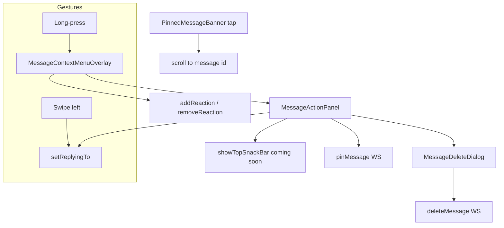

# Chat Message Actions — Zangi-Style Panel — Design Spec

**Date:** 2026-05-23  
**Status:** Approved — implementation plan locked (2026-05-23)  
**Reference UI:** Zangi messenger (user screenshot)

---

## Problem Statement

Fireplace chat message interactions today mix **swipe-to-delete**, a **bottom-sheet emoji picker on long-press**, and no unified action panel. Swiping right on a message immediately deletes it (for own messages: delete for everyone; for others: delete for me) with **no confirmation dialog**, which is easy to trigger accidentally. Long-press does not expose Reply, Pin, or Delete — only reactions. There is no **pin message in chat** feature. Reply preview in the composer does not handle E2E plaintext resolution consistently, and **media sends** (image, voice, GIF, file) omit `replyToMessageId` even when the user had an active reply context.

---

## Goal

Replace the current swipe/long-press UX with a **Zangi-style floating mini panel** anchored to the message bubble:

- **Swipe left** → Reply (unchanged intent).
- **Swipe right** → Nothing (remove delete-on-swipe).
- **Long-press** → Floating overlay: emoji quick row + action panel (Reply, Edit stub, Pin, Delete).
- **Delete** → Confirmation dialog with **Delete for me** / **Delete for everyone** (own messages only for the latter); use existing WebSocket delete flow — instant removal for both users on delete-for-everyone, **no time limit**.
- **Pin** → One pinned message per conversation; banner under AppBar; tap scrolls to message; X unpins.
- **Edit** → Phase 2 placeholder (greyed + snackbar).
- **Reactions** → Move from bottom sheet into the overlay emoji row above the bubble.

---

## Product Decisions (Locked)

| Decision | Choice |
|----------|--------|
| Swipe left | Reply |
| Swipe right | Nothing (remove delete-on-swipe) |
| Long-press | Zangi-style floating mini panel anchored to message bubble |
| Panel actions | Reply, Edit (disabled / coming soon), Pin, Delete |
| Skip | Copy, Forward, Share via, Select |
| Delete for everyone | Instant removal for **both** users via existing WS; **no time limit**; **own messages only** |
| Delete for me | Any message (yours or theirs) — hide locally only (`hiddenByUserIds`) |
| Delete UX | Panel + dialog (Delete for me / Delete for everyone), **not** swipe |
| Pin scope | Pin **message in chat** (option A), **not** pin conversation on list |
| Pin limit | **1 message per conversation** — new pin replaces old |
| Pin UI | Banner under AppBar in `ChatDetailScreen`; tap scrolls to message; X unpin |
| Edit | Phase 2 placeholder only (greyed + snackbar) |
| Reactions | Emoji quick row above bubble in same overlay (replace current long-press bottom sheet) |

---

## Locked Pre-Implementation Decisions (from Plan Review)

These were open in the initial Plan Review; **locked for implementation** as of 2026-05-23.

| Topic | Locked choice | Rationale |
|-------|---------------|-----------|
| **Delete for me on pinned message** | **Client hides banner** for the user who hid the message; **no server unpin** | Pin remains shared for the other participant; server `hiddenByUserIds` does not auto-clear pin column. |
| **Pin preview payload** | **`conversationsList` + pin WS events** include a **`pinnedMessage` snapshot** (sender + preview text/type via `MessageMapper` rules), not only `pinnedMessageId` | Banner works after reconnect and before opening chat; client merges with local decrypt when chat is open. |
| **Reaction from overlay** | **Dismiss overlay after emoji tap** (same as current bottom sheet) | One action per gesture; avoids stale overlay. |
| **Pin + disappearing messages** | **Client hides banner** when pinned message is expired; **lazy server clear** of `pinnedMessageId` on next `pinMessage`, `getConversations`, or delete-for-everyone — no daily cron in Phase 1b | Keeps 1b scope small; banner never shows dead content. |
| **GlobalKey strategy** | **On-demand key** for scroll target only — do not attach `GlobalKey` to every list row | Avoids performance cost on long chats. |
| **Optimistic / temp messages** | **Delete for everyone** and **Pin** disabled until `message.id > 0` (real server id) | Backend requires persisted row; temp ids are negative. |
| **Overlay positioning** | Panel **above bubble by default**; **flip above composer** when near bottom; clamp to `MediaQuery.padding`; **dismiss on scroll start** and when keyboard inset changes | Prevents clip under composer / off-screen (High risk from review). |
| **Swipe drag clamp** | Horizontal drag clamped to **`dx ≤ 0` only** (left / reply direction) | Right swipe does nothing visually or functionally. |
| **Context menu entry point** | Single **`openMessageContextMenu(context, message, renderBox)`** used by text bubble and voice bubble | Avoid duplicate overlay code paths. |
| **Implementation gate** | **Scroll-to-pinned spike** must pass before shipping Phase 1b banner | Highest technical risk (`ListView.reverse` + pagination). |

**Backend delete semantics:** unchanged — no TTL, instant dual emit on delete-for-everyone (Phase 1a is UI only).

---

## Current State (Codebase Baseline)

### `MessageSwipeWrapper` (`frontend/lib/widgets/message_swipe_wrapper.dart`)

- Swipe left (offset ≤ −60 px) → `onSwipeReply`.
- Swipe right (offset ≥ +60 px) → `onSwipeDelete`.
- Long-press → `onLongPress`.

### `ChatMessageBubble` / `VoiceMessageContent`

- Wire swipe delete as: `messaging.deleteMessage(message.id, forEveryone: isMine)` — **no dialog**.
- Long-press → `_showReactionOptions` → `showModalBottomSheet` with six emoji.

### Backend delete (`chat-message.service.ts` → `handleDeleteMessage`)

- `mode: 'for_me'` → `hideMessageForUser`; emits `messageDeleted` **to caller only** (`forEveryone: false`).
- `mode: 'for_everyone'` → sender-only hard delete + media cleanup; emits `messageDeleted` to **both** users (`forEveryone: true`).
- **No time limit** on delete-for-everyone (already matches product decision).

### Reply

- Text `sendMessage` supports `replyToMessageId` and builds optimistic `ReplyToPreview`.
- `sendImageMessage`, `sendVoiceMessage`, `sendGif`, `sendFileMessage` do **not** read `_replyingToMessage` or pass `effectiveReplyToId` to `_encryptAndSend`.
- Server `MessageMapper.toPayload` sets reply preview to `'Encrypted message'` when `replyTo.encryptedContent != null`.
- `ReplyPreviewBar` uses hardcoded English type labels and raw `message.content` (shows `[encrypted]` for E2E).

### Pin

- **Not implemented.** `Conversation` entity has only `disappearingTimer`; no `pinnedMessageId`.

### Scroll

- `ChatDetailScreen` uses `ListView.builder(reverse: true)`; `pixels = 0` is newest (see `2026-03-25-chat-scroll-reverse-design.md`). Scroll-to-message must account for index flip and lazy build.

---

## Approaches Considered

### 1. Extend bottom sheet (rejected)

Add Reply / Pin / Delete to the existing `showModalBottomSheet` reaction picker.

- **Pros:** Minimal new UI code.
- **Cons:** Not Zangi-style; sheet covers composer; poor anchor-to-bubble UX; fights chat scroll.

### 2. Floating overlay + refactor swipe wrapper (recommended — chosen)

New `MessageContextMenuOverlay` (OverlayEntry) positioned from bubble `RenderBox` global bounds. Refactor `MessageSwipeWrapper` to reply-only swipe. Long-press opens overlay; tap outside dismisses.

- **Pros:** Matches reference UI; keeps reactions + actions in one gesture; delete confirmation natural fit; swipe simplified.
- **Cons:** Manual positioning/clamping; must handle reverse ListView and keyboard; overlay lifecycle tied to `ChatDetailScreen`.

### 3. Context menu at AppBar level (rejected)

Global menu not tied to bubble position.

- **Pros:** Simple state.
- **Cons:** Does not match Zangi; loses spatial context.

---

## Architecture

### Frontend components

| Component | Responsibility |
|-----------|----------------|
| **`MessageSwipeWrapper`** (refactor) | Swipe left → reply only; remove delete zone and `onSwipeDelete`; keep long-press callback (or delegate to parent). Optionally clamp drag to left half only. |
| **`MessageContextMenuOverlay`** (new) | OverlayEntry: dimmed scrim, emoji row above bubble, vertical action panel beside/near bubble, dismiss on outside tap. Uses `RenderBox.localToGlobal` + edge clamping. |
| **`MessageActionPanel`** (new) | Panel rows: Reply, Edit (disabled), Pin, Delete — icons + localized labels. |
| **`MessageDeleteDialog`** (new) | AlertDialog / simple dialog: **Delete for me** (always), **Delete for everyone** (only if `isMine`), Cancel. |
| **`PinnedMessageBanner`** (new) | Under AppBar in `ChatDetailScreen`; shows truncated preview + sender; tap → scroll to pinned id; X → unpin. |
| **`ChatMessageBubble` / `VoiceMessageContent`** | Replace `_showReactionOptions` bottom sheet with overlay opener; remove direct `deleteMessage` from swipe. |
| **`MessagingProvider`** | `pinMessage` / `unpinMessage` emit + state; extend media send methods for reply; optional `scrollToMessageId` notifier for banner tap. |
| **`ConversationsProvider`** | Hold `pinnedMessageId` (+ optional preview fields) on conversation model from WS/list payload. |
| **`ReplyPreviewBar`** (1c) | Use l10n; resolve E2E preview via decrypted cache / type label (mirror bubble quote logic). |

### Backend components

| Component | Responsibility |
|-----------|----------------|
| **`Conversation` entity** | Add `pinnedMessageId` (nullable FK/int), optional `pinnedAt`, `pinnedByUserId`. |
| **`ConversationsService`** | `setPinnedMessage(convId, messageId, userId)`, `clearPinnedMessage(convId)`; validate membership + message belongs to conv. |
| **`ChatConversationService`** (or extend message service) | WS handlers `pinMessage`, `unpinMessage`. |
| **`ConversationMapper`** | Include pin fields + embedded pinned message preview in `conversationsList` / `openConversation` payloads. |
| **`ChatMessageService.handleDeleteMessage`** | On `for_everyone`, if deleted id === `conversation.pinnedMessageId`, clear pin and emit pin update. |

### Integration flow



---

## Data Model (Pin)

### Database — `conversations` table

| Column | Type | Notes |
|--------|------|-------|
| `pinnedMessageId` | `integer NULL` | FK → `messages.id`; null = no pin |
| `pinnedAt` | `timestamp NULL` | Optional; useful for ordering/debug |
| `pinnedByUserId` | `integer NULL` | Optional; who last pinned |

**Rules:**

- At most one pin per conversation (single column, not a join table).
- Pinning message B while A is pinned **replaces** A (update column + emit).
- Unpin sets all three to null.
- **Production:** manual `ALTER TABLE` when `synchronize: false`; dev auto-sync on restart.

### Frontend — `ConversationModel`

Extend with:

```dart
final int? pinnedMessageId;
final MessageModel? pinnedMessagePreview; // optional snapshot from server
```

Update `copyWith`, `fromJson` (all fields).

### Pin validity

- If pinned message expired (disappearing), deleted for everyone, or hidden for me → banner hidden + client clears local pin state; server should clear on delete-for-everyone and optionally on expiry cron (see Risks).

---

## WebSocket Events

### Client → server

| Event | Payload | Notes |
|-------|---------|-------|
| `pinMessage` | `{ conversationId, messageId }` | Both users must be conversation members; message must belong to conv |
| `unpinMessage` | `{ conversationId }` | Clears pin |

Apply `@UseGuards(WsThrottlerGuard)` + reasonable `@Throttle` (e.g. 60/15m).

### Server → client

| Event | Payload | Recipients |
|-------|---------|------------|
| `messagePinned` | `{ conversationId, pinnedMessageId, pinnedMessage?, pinnedByUserId?, pinnedAt? }` | Both conversation members |
| `messageUnpinned` | `{ conversationId }` | Both conversation members |

Also include pin fields on existing **`conversationsList`** / conversation payloads so reconnect restores banner.

### Existing (unchanged contract)

| Event | Usage |
|-------|-------|
| `deleteMessage` | `{ messageId, mode: 'for_me' \| 'for_everyone' }` |
| `messageDeleted` | `{ messageId, conversationId, forEveryone }` |

---

## UI Flows

### Long-press overlay

1. User long-presses bubble → haptic (native only).
2. Capture bubble `RenderBox` → global rect.
3. Insert `OverlayEntry`: semi-transparent scrim (tap dismiss).
4. **Emoji row** (`👍 ❤️ 😂 😮 😢 🔥`) positioned above bubble; tap toggles reaction (same as today), dismiss overlay after selection (or keep open — **implementer choice: dismiss after reaction** to match current bottom sheet).
5. **Action panel** adjacent to bubble (prefer outward from center: own messages → panel left of bubble; theirs → panel right), clamped to safe area.
6. Actions:
   - **Reply** → `setReplyingTo(message)`, dismiss, focus composer.
   - **Edit** → disabled styling; tap → `showTopSnackBar` “Coming soon” (l10n key).
   - **Pin** → if already pinned this message, optional unpin or no-op; else `pinMessage` WS; dismiss.
   - **Delete** → open delete dialog; dismiss overlay first.

### Swipe left (reply)

Unchanged behavior: `MessagingProvider.setReplyingTo(message)` + composer reply bar.

### Swipe right

No action; optionally disable right-drag visual (remove delete zone UI from wrapper).

---

## Delete Flows

### Dialog

| Option | Visible when | Action |
|--------|--------------|--------|
| Delete for me | Always | `deleteMessage(id, forEveryone: false)` |
| Delete for everyone | `isMine && message.id > 0` (not optimistic temp) | `deleteMessage(id, forEveryone: true)` |
| Cancel | Always | Close dialog |

Use `showTopSnackBar` + l10n for errors from server (`Only the sender can delete for everyone`).

### Backend behavior (existing — document, do not change in Phase 1)

- **for_me:** `hiddenByUserIds`; only requesting client gets `messageDeleted`.
- **for_everyone:** hard delete row + media file; both clients get `messageDeleted`; sender-only authorization.

### Pin interaction

On **delete for everyone**, if deleted message was pinned → server clears `pinnedMessageId` **in the same handler** (atomic with hard delete) and emits `messageUnpinned` (or `messagePinned` with null).

On **delete for me** on the pinned message → server does **not** unpin; client **hides banner** when the pinned id is no longer visible in the user's message list (hidden via `hiddenByUserIds`).

---

## Pin Flows

### Pin from panel

1. User taps Pin on message M.
2. Client emits `pinMessage`.
3. Server sets `conversations.pinnedMessageId = M.id`, optional metadata; emits `messagePinned` to both users.
4. Both clients show `PinnedMessageBanner` under AppBar.

### Replace pin

Pinning message N while M pinned → server overwrites column; single `messagePinned` event with N.

### Unpin

- Banner **X** → `unpinMessage`.
- Server nulls column; emits `messageUnpinned`.

### Scroll to pinned

1. User taps banner.
2. Find index of `pinnedMessageId` in `MessagingProvider.messages` (oldest-first list).
3. If not loaded → `loadOlderMessages` until found or `hasMoreMessages == false` (then show snackbar “Message unavailable”).
4. Scroll: with `reverse: true`, convert to list index `listIndex = messages.length - 1 - msgIndex`; use **`Scrollable.ensureVisible`** with an **on-demand `GlobalKey`** attached only to the scroll target (see Locked Decisions).
5. Optional brief highlight animation on target bubble.

**Gate (before Phase 1b ships):** Implement steps 2–4 as a **spike** in `ChatDetailScreen` (or dedicated test harness) and verify: pinned message in first page, pinned message requiring pagination, message not found → snackbar.

---

## Reply Improvements (Phase 1c)

### Problems to fix

1. **E2E reply preview in composer:** `ReplyPreviewBar` shows `[encrypted]` instead of decrypted text or “Encrypted message” l10n.
2. **Media sends ignore reply context:** Image/voice/GIF/file paths must read `_replyingToMessage`, set optimistic `replyTo` / `replyToMessageId`, pass `effectiveReplyToId` into `_encryptAndSend`, clear reply after send (mirror text path).
3. **Optimistic reply preview for E2E:** When replying to encrypted message, build preview from `EncryptionProvider.getDecryptedContent(messageId)` if available; else l10n `encryptedMessage` + type label for media.

### Client-side E2E resolution (recommended)

- **Do not** change server to expose plaintext in reply preview (security).
- Composer + bubble quote already partially handle `[encrypted]` via l10n in `_replyDisplayContent`; align `ReplyPreviewBar` with `ChatMessageBubble._replyDisplayContent` + decryption cache lookup.

### Shared helper (optional)

Extract `replyPreviewForMessage(MessageModel msg, BuildContext)` used by bubble, composer bar, and optimistic send paths.

---

## Edit — Phase 2 Stub

- Panel row visible but **greyed** (`onTap: null` or disabled opacity).
- Tap → `showTopSnackBar(context, l10n.messageEditComingSoon)`.
- Full E2E edit (re-encrypt, WS `editMessage`, history update) **out of scope** for this spec iteration.

---

## Files Touched (Implementation Checklist)

### Frontend — new

| File | Purpose |
|------|---------|
| `frontend/lib/widgets/message/message_context_menu_overlay.dart` | Overlay + positioning |
| `frontend/lib/widgets/message/message_action_panel.dart` | Action rows |
| `frontend/lib/widgets/dialogs/message_delete_dialog.dart` | Delete confirmation |
| `frontend/lib/widgets/message/pinned_message_banner.dart` | Pin banner UI |
| `frontend/lib/utils/reply_preview_helper.dart` | Optional shared reply preview (1c) |

### Frontend — modify

| File | Changes |
|------|---------|
| `frontend/lib/widgets/message_swipe_wrapper.dart` | Remove delete swipe; optional right-drag disable |
| `frontend/lib/widgets/message/chat_message_bubble.dart` | Overlay entry; remove bottom sheet; remove swipe delete |
| `frontend/lib/widgets/message/voice_message_content.dart` | Same as bubble |
| `frontend/lib/screens/chat_detail_screen.dart` | Pinned banner; scroll-to-message; overlay host if needed |
| `frontend/lib/providers/messaging_provider.dart` | Pin/unpin handlers; media reply; pin cleared on delete |
| `frontend/lib/providers/conversations_provider.dart` | Pin state on conversation |
| `frontend/lib/providers/connection_provider.dart` | Register `messagePinned` / `messageUnpinned` |
| `frontend/lib/services/socket_service.dart` | Emit pin/unpin |
| `frontend/lib/models/conversation_model.dart` | Pin fields + copyWith |
| `frontend/lib/models/message_model.dart` | Verify copyWith if pin preview embedded |
| `frontend/lib/widgets/input/reply_preview_bar.dart` | l10n + E2E preview (1c) |
| `frontend/lib/l10n/app_en.arb`, `app_pl.arb` | New strings |
| `CLAUDE.md` | Message actions UX, pin model, delete dialog |

### Backend — new/modify

| File | Changes |
|------|---------|
| `backend/src/conversations/conversation.entity.ts` | Pin columns |
| `backend/src/conversations/conversations.service.ts` | Pin/unpin methods |
| `backend/src/chat/dto/pin-message.dto.ts` | DTOs |
| `backend/src/chat/services/chat-conversation.service.ts` | Pin/unpin handlers |
| `backend/src/chat/chat.gateway.ts` | Subscribe messages |
| `backend/src/chat/mappers/conversation.mapper.ts` | Pin in payload |
| `backend/src/chat/services/chat-message.service.ts` | Clear pin on delete-for-everyone |
| `backend/src/messages/message.mapper.ts` | No plaintext change; optional pinned message embed |

### Tests

| File | Coverage |
|------|----------|
| `frontend/test/widgets/message/message_swipe_wrapper_test.dart` | Swipe left reply only; no right delete |
| `frontend/test/widgets/message/message_context_menu_overlay_test.dart` | Panel actions visible; edit disabled |
| `frontend/test/widgets/dialogs/message_delete_dialog_test.dart` | for_everyone hidden for theirs |
| `frontend/test/widgets/message/pinned_message_banner_test.dart` | Tap callback |
| `frontend/test/providers/messaging_provider_reply_media_test.dart` | Media send with replyToMessageId (1c) |
| `backend/src/chat/services/chat-conversation.service.spec.ts` | Pin replace, auth, delete clears pin |

---

## Testing Plan

| Area | Tests |
|------|-------|
| Swipe | Left triggers reply callback once; right does not delete |
| Overlay | Long-press shows emoji + 4 actions; scrim dismiss |
| Delete dialog | Own message: both options; other's: for_me only; calls correct WS mode |
| Delete WS | Existing backend tests still pass; add pin-clear on for_everyone |
| Pin | Pin replaces previous; both clients receive event; banner tap scrolls |
| Reply 1c | Image send with active reply includes `replyToMessageId`; E2E preview uses l10n |
| Regression | Reactions still work from overlay; voice bubble parity |
| Manual | Long-press near top/bottom of list; notched phone; desktop embedded chat; pin then delete for everyone; pin then delete for me (banner behavior) |

Run: `cd frontend && flutter test`, `flutter analyze`; `cd backend && npm test`.

---

## Implementation Plan

### Order and gates

```
Phase 1a (overlay + dialog + swipe)
    ↓
Scroll-to-pinned SPIKE (gate — required before 1b banner ships)
    ↓
Phase 1b (pin backend + banner)  ─┬─ may land in same PR as 1c
Phase 1c (reply preview + media)  ─┘
    ↓
Phase 2 (Edit E2E) — separate spec
```

- **Do not ship** `PinnedMessageBanner` until scroll spike passes.
- **1c** may run in parallel with **1b** in one PR; do not release reply-heavy UX without 1c if reply context is part of the same release.
- **Version bump:** PATCH increment on production-worthy implementation commit per `.cursor/rules/version-bump.mdc`.

---

### Phase 1a — Swipe + overlay + delete dialog

**Goal:** Zangi-style panel; no accidental delete via swipe.

| # | Task | Done when |
|---|------|-----------|
| 1 | Refactor `MessageSwipeWrapper`: remove delete zone, `onSwipeDelete`, right-drag UI; **clamp `_dragOffset` to `≤ 0`** | Swipe right has no visual/action; left still triggers reply |
| 2 | Add `openMessageContextMenu(context, message, renderBox)` — single entry from bubble + voice | No duplicate overlay wiring |
| 3 | Implement `MessageContextMenuOverlay`: scrim, emoji row, `MessageActionPanel` | Long-press opens panel; tap outside dismisses |
| 4 | Overlay rules: default above bubble; flip near bottom; clamp to safe area; dismiss on scroll / keyboard inset | Manual check on notched phone + bottom messages |
| 5 | Emoji row: reuse reaction WS; **dismiss overlay after tap** | Reactions work; panel closes |
| 6 | `MessageDeleteDialog`: for_me always; for_everyone only if `isMine && id > 0` | Widget test: other's message hides for_everyone |
| 7 | Wire Delete from panel; remove `onSwipeDelete` from bubble/voice | No code path deletes without dialog |
| 8 | Edit row: disabled + `messageEditComingSoon` snackbar | Tap shows stub only |
| 9 | l10n (`app_en.arb` / `app_pl.arb`) for panel, dialog, edit stub | No hardcoded English in new UI |
| 10 | Tests: `message_swipe_wrapper_test.dart`, `message_context_menu_overlay_test.dart`, `message_delete_dialog_test.dart` | `flutter test` green for new files |
| 11 | Update `CLAUDE.md`: delete via panel+dialog; long-press = actions+reactions; swipe left = reply only | Docs match new UX |

**Out of scope for 1a:** Pin backend, reply 1c fixes, Edit implementation.

---

### Scroll-to-pinned spike (gate before 1b)

**Goal:** Prove scroll-to-message works before building pin banner UX.

| # | Task | Done when |
|---|------|-----------|
| 1 | On-demand `GlobalKey` + `Scrollable.ensureVisible` for a known message id | Message in loaded window scrolls into view |
| 2 | `loadOlderMessages` loop until pinned id found or `hasMoreMessages == false` | Old pinned message reachable |
| 3 | Snackbar when message unavailable / expired | No infinite load loop |
| 4 | Document index math for `ListView(reverse: true)` in code comment or helper | Future maintainers have reference |

Spike may live temporarily in `ChatDetailScreen` or `test/` harness; extract to production helper during 1b.

---

### Phase 1b — Pin message backend + banner + scroll

**Goal:** One pin per conversation; both users see banner; tap scrolls.

| # | Task | Done when |
|---|------|-----------|
| 1 | DB: `conversations.pinnedMessageId` (+ optional `pinnedAt`, `pinnedByUserId`); dev sync + **production SQL note** in CLAUDE.md | Column exists in dev/prod docs |
| 2 | `pinMessage` / `unpinMessage` DTOs + `chat-conversation.service` handlers | Auth: user in conversation; message not expired |
| 3 | Replace semantics: new pin overwrites previous | Unit test: pin A then pin B |
| 4 | **`ConversationMapper.toPayload`**: include `pinnedMessageId` + **`pinnedMessage` snapshot** when set | `conversationsList` carries banner data |
| 5 | WS events `messagePinned` / `messageUnpinned` to **both** participants with snapshot | Reconnect sync works |
| 6 | **`handleDeleteMessage` for_everyone:** clear pin **atomically** when deleted id matches pin | No orphan `pinnedMessageId` |
| 7 | Lazy clear stale pin when pinned message expired (on pin/getConversations) | Optional server cleanup path documented |
| 8 | Frontend: model, `ConnectionProvider` listeners, `MessagingProvider` pin/unpin emit | State updates on events |
| 9 | `PinnedMessageBanner` under AppBar; preview via snapshot + local decrypt merge | Banner shows sensible text for E2E |
| 10 | Banner hidden if pinned message expired or **hidden for me** (client) | Delete-for-me on pinned case covered |
| 11 | Banner tap → scroll helper from spike; X → unpin | End-to-end pin + scroll manual pass |
| 12 | Pin disabled for temp/optimistic messages (`id ≤ 0`) | Panel Pin greyed or snackbar |
| 13 | Backend tests: pin replace, auth, delete clears pin | `npm test` green |
| 14 | Widget test: `pinned_message_banner_test.dart` | Tap invokes scroll callback |
| 15 | Update `CLAUDE.md`: pin WS, banner, scroll caveat | Docs complete for 1b |

---

### Phase 1c — Reply preview + media reply

**Goal:** Reply context works for all send types; E2E previews readable.

| # | Task | Done when |
|---|------|-----------|
| 1 | Extract or align `replyPreviewForMessage` with `ChatMessageBubble._replyDisplayContent` + decrypt cache | Single preview logic |
| 2 | Fix `ReplyPreviewBar`: l10n, no raw `[encrypted]`, type labels for media | Widget/manual check |
| 3 | Thread `_replyingToMessage` / `replyToMessageId` through `sendImageMessage`, `sendVoiceMessage`, `sendGif`, `sendFileMessage` | Media sends include reply id in WS payload |
| 4 | Optimistic `replyTo` on media sends (mirror text path) | Quote visible before ack |
| 5 | Client-side quote enrichment on incoming/history messages where server sent `"Encrypted message"` | Bubble quotes show voice/image labels when decrypted locally |
| 6 | Tests: `messaging_provider_reply_media_test.dart` (or extend existing) | `flutter test` green |

**Recommended:** Same PR as 1b if release includes reply UX improvements.

---

### Phase 2 — Edit (E2E)

- Full edit message flow — **separate spec** (`editMessage` WS, re-encrypt, edited label, time limit TBD).
- Phase 1 only ships greyed Edit row + coming-soon snackbar.

---

## Out of Scope

- Copy, Forward, Share, Select message.
- Pin conversation on chat list.
- Multiple pinned messages.
- Message edit implementation (Phase 2).
- Changing delete-for-everyone authorization or time limits.
- Server-side plaintext reply preview for E2E.

---

## Risks & Gotchas

| Risk | Mitigation |
|------|------------|
| **ListView `reverse: true` scroll-to-message** | Use per-message `GlobalKey` + `Scrollable.ensureVisible` after layout; or load-until-found + index math (`msgIndex` → `listIndex = n - 1 - msgIndex`). |
| **Pinned message not in loaded page** | Paginate until found; snackbar if exhausted. |
| **E2E reply preview** | Client-only: decryption cache → else l10n encrypted label; never widen server preview. |
| **Overlay vs scroll** | Dismiss overlay on scroll start; single active overlay entry. |
| **Gesture competition** | One `GestureDetector` for horizontal drag; long-press on same node (existing pattern). |
| **Delete for me on pinned message** | **Locked:** client hides banner when pinned id not in visible list; no server unpin on for_me. |
| **Optimistic temp ids** | Disable delete-for-everyone until real id; pin requires persisted id. |
| **Existing CLAUDE.md delete table** | Update docs: delete via panel+dialog, not swipe. |
| **Production migration** | Document SQL for `pinnedMessageId` columns. |
| **Expired disappearing pinned msg** | Banner should hide; optional server cron to clear stale pin. |

---

## Documentation

- Update `CLAUDE.md` § Frontend widgets + § Delete actions table + new Pin subsection.
- Cross-link from this spec in session summary when implementation starts.

---

## Success Criteria

1. Swipe right never deletes a message.
2. Long-press opens Zangi-style panel with reactions + four actions.
3. Delete always goes through dialog with correct options per ownership.
4. One pin per conversation with banner + scroll + unpin.
5. Media sends honor reply context (1c).
6. `flutter test`, `flutter analyze`, `npm test` pass.

---

## Plan Review

*Self-review against codebase (`message_swipe_wrapper.dart`, `chat_message_bubble.dart`, `chat-message.service.ts`, `message.mapper.ts`, `conversation.entity.ts`, `CLAUDE.md`) — 2026-05-23.*

### Strengths

- **Backend delete already matches product:** `handleDeleteMessage` supports `for_me` / `for_everyone`, sender-only hard delete, dual emit on for_everyone, no TTL — Phase 1a is mostly UX wiring, not protocol design.
- **Approach 2 fits existing patterns:** OverlayEntry precedent in `top_snackbar.dart` and `chat_action_tiles.dart`; Provider + WS event map in `ConnectionProvider` is established.
- **Pin on `conversations` table** is the right granularity for 1:1 MVP (single column, replace semantics).
- **Phase split is sensible:** 1a delivers visible UX win without blocking on backend; 1b/1c can ship in same PR if desired.
- **Reply 1c addresses real gaps verified in code:** media send methods omit `_replyingToMessage`; `ReplyPreviewBar` lacks l10n and E2E handling.

### Gaps / Ambiguities

**Resolved** — see [Locked Pre-Implementation Decisions](#locked-pre-implementation-decisions-from-plan-review): items 1–6 from original review (overlay rules, pin payload, delete-for-me + pin, disappearing pin, reaction dismiss, GlobalKey strategy).

**Remaining (non-blocking):**

7. **No widget tests today for swipe wrapper** — addressed in Phase 1a checklist (prioritize swipe + dialog tests).
8. **Version bump** — addressed in Implementation Plan order section.

### Risks (ranked)

#### High

- **Scroll-to-pinned in reverse ListView with pagination:** Easy to get wrong offset or fail when message not loaded; needs explicit implementation spike (GlobalKey + load-until-found).
- **Overlay positioning near list edges / keyboard:** Long-press on bottom messages may clip panel under composer or off-screen — must clamp to `MediaQuery.padding` and dismiss on inset changes.

#### Medium

- **E2E reply preview correctness:** Cache miss shows generic encrypted label — acceptable but must not leak `[encrypted]` raw string in composer (align with bubble).
- **Pin state sync on reconnect:** Must include pin fields in `conversationsList` payload or banner desyncs until reopen.
- **Delete-for-everyone clearing pin:** Must be atomic in backend handler to avoid orphan `pinnedMessageId` FK.
- **Gesture regression:** Removing right swipe while keeping horizontal drag may still feel loose — consider `clamp` drag to `(-∞, 0]` only.

#### Low

- **Edit stub snackbar noise** — trivial.
- **WS throttle defaults** for pin — copy reaction limits.
- **Production SQL migration** — manual step documented in CLAUDE.md pattern for disappearing timer.

### Recommendations Before Implementation

**Incorporated into [Implementation Plan](#implementation-plan) and [Locked Pre-Implementation Decisions](#locked-pre-implementation-decisions-from-plan-review).**

Additional reminders:

- **Conflict check:** CLAUDE.md § Delete actions table — long-press is reactions-only today; implementation **intentionally** changes to panel + delete dialog.
- **Do not** reintroduce swipe-delete threshold in wrapper tests.

### Verdict

**Ready for implementation.**

Product decisions and review caveats are locked in the Implementation Plan. Phase 1a has no backend blocker. Phase 1b requires schema + WS + scroll spike gate. Phase 1c should ship with or immediately after 1b if reply UX is in the same release.
