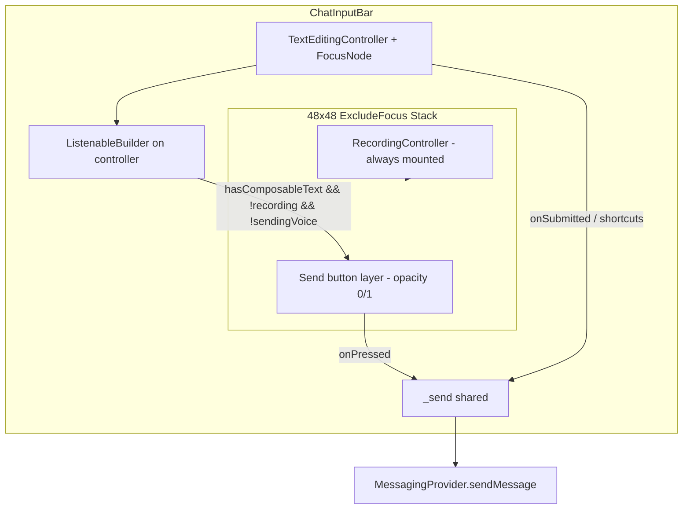

# Chat Composer — Trailing Send Button — Product & Technical Spec

**Date:** 2026-05-24  
**Status:** Approved for implementation  
**App version at spec time:** `0.0.11` (`frontend/pubspec.yaml`)  
**Related:** `2026-05-23-chat-composer-viewport-design.md`, session `2026-03-23` (keyboard jump root cause), `2026-05-24-session-ios-pwa-composer-fix.md`

---

## 1. Goals & non-goals

### Goals

| # | Goal |
|---|------|
| G1 | **WhatsApp / Telegram / Signal pattern:** When the user has composable text, the trailing control shows **Send** instead of the idle **mic**; when the field is empty (and not recording), show **mic** for hold-to-record. |
| G2 | **Keyboard stability:** After send (trailing tap, IME send, or Ctrl/Cmd+Enter), the soft keyboard **stays open** so the user can send multiple messages without re-tapping the field. |
| G3 | **No keyboard flicker on iOS PWA:** Reintroduce a visible send control **without** repeating the March 2026 bug where swapping mic/send siblings unmounted widgets beside `TextField` and dismissed the keyboard. |
| G4 | **Single send pipeline:** Trailing send, IME `onSubmitted`, and desktop shortcuts all call the same `_send()` in `ChatInputBar`. |
| G5 | **Preserve voice UX (Phase 0 scope):** Hold-to-record, slide-to-cancel, recording bar, and `RecordingController` lifecycle unchanged in **0.0.12**. |
| G6 | **Preserve performance guardrails:** Do not regress `context.select` slices or Android native “keyboard dismiss while typing” fixes. |

### Non-goals

| Item | Notes |
|------|--------|
| Action-panel reorganization (mic inside panel, remove trash) | Explicitly out of scope per product request. |
| Removing IME send or Ctrl/Cmd+Enter | Trailing send is **additive**; IME remains primary on mobile keyboards with a Send action. |
| Newline / dedicated “new line” button | Removed previously; not restored. |
| `visualViewport`-based keyboard inset in `ChatComposerViewport` | Follow-up only if manual QA still shows jump after this feature. |
| Changing tap-to-dismiss keyboard behavior | Document and preserve **current** implicit behavior (see §3). |
| Web-only global scroll-lock stack (May 2026 reverts) | Do not reintroduce wholesale. |
| Version bump in spec-only work | Bump PATCH to **0.0.12** when implementation ships (production-worthy UX). |
| Voice lock-up (slide up to lock) | **Phase 1** — see `2026-05-24-voice-lock-up-spec.md` (**0.0.13**). Phase 0 must still ship the trailing **Stack** so voice Send can reuse the same 48×48 slot without unmounting `RecordingController`. |

### G5 — Voice interaction cross-reference

Phase 0 keeps today’s hold-to-record and slide-left cancel exactly. **Direction A** (Telegram/WhatsApp **slide-up lock**, locked mode with explicit voice **Send**, short unhold still auto-sends) is specified separately in [`2026-05-24-voice-lock-up-spec.md`](2026-05-24-voice-lock-up-spec.md) for **0.0.13**. When implementing Phase 0, design the trailing stack (mic underlay + text Send fade) so Phase 1 can add a **voice Send** layer when `_isLocked` without restructuring the composer row.

---

## 2. User-visible behavior (state table)

**Composable text** = `_controller.text` contains at least one non-whitespace character after `trim()` (same rule as `_send()`).

| # | State | Text field | Trailing slot (48×48) | Action panel chevron | Reply / Hearth banner | Send paths |
|---|--------|------------|------------------------|----------------------|------------------------|------------|
| S0 | Idle, empty field | Visible, unfocused or focused | **Mic** (hold-to-record) | Visible (unless recording) | Either | — |
| S1 | Typing, has composable text | Visible, focused typical | **Send** (tap) | Visible | Either | Tap send, IME send, Ctrl/Cmd+Enter |
| S2 | Typing, only whitespace | Visible | **Mic** (whitespace does not switch to send) | Visible | Either | IME send / shortcut no-op (same as today) |
| S3 | After successful text send | Cleared, focus retained | **Mic** (field empty) | Visible | Either | Same as S0; keyboard stays up (§3) |
| S4 | Hold-to-record active | **Recording bar** replaces field | **Mic** (red, draggable) — not send | Hidden | Either | — |
| S5 | Recording start in flight | Field or bar per controller | Mic gesture active | Hidden | Either | — |
| S6 | Voice upload in progress | Field visible | **Spinner** (replaces mic hit target; send hidden) | Visible | Either | — |
| S7 | Action panel open | Field visible | Mic or Send per S0–S2 | Chevron up | Either | Unchanged |
| S8 | Reply set (gesture / overlay) | Focus + keyboard per iOS fix | Mic or Send per text | Visible | Reply bar shown | `setComposerFocusRequest` unchanged |
| S9 | Disappearing banner visible | Field visible | Mic or Send per text | Visible | Banner read-only | Unchanged |
| S10 | Blocked conversation | N/A (banner, not this widget) | N/A | N/A | N/A | Out of scope |

**Transitions (animated):**

- S0 ↔ S1: **Crossfade** mic ↔ send over **150–200 ms** (`Curves.easeInOut`). No slide that changes hit-target position (only opacity + `IgnorePointer`).
- S1 → S3: On send, text clears; crossfade send → mic after controller clear (same frame batch as today’s `_controller.clear()`).
- S4/S5: Recording UI takes precedence; send never shown while `_isRecording == true`.

**E2E:** No user-visible change. Text send still goes through `MessagingProvider.sendMessage` → encrypt path when session exists. Send button does not bypass encryption.

---

## 3. Keyboard policy (explicit)

### 3.1 Must stay open (locked)

After any **successful** text send:

| Trigger | Required behavior |
|---------|-------------------|
| Trailing **Send** tap | Do **not** call `FocusScope.unfocus`, `FocusManager.instance.primaryFocus?.unfocus()`, or `SystemChannels.textInput` hide. |
| IME **Send** (`TextInputAction.send` → `onSubmitted`) | Keep `onEditingComplete: () {}` (empty). Do **not** restore Flutter’s default `onEditingComplete` that unfocuses. |
| `_controller.clear()` after send | Field may briefly show empty; focus node should remain focused or be restored. |
| Ctrl/Cmd+Enter (web/desktop) | Same `_send()` post-focus policy. |

**Post-send focus repair (retain current pattern in `chat_input_bar.dart`):**

```dart
WidgetsBinding.instance.addPostFrameCallback((_) {
  if (!mounted || !_focusNode.canRequestFocus) return;
  if (!_focusNode.hasFocus) {
    _focusNode.requestFocus();
  }
  showSoftKeyboardIfHidden(context: context, hasFocus: true);
});
```

- **Do not** call synchronous `requestFocus()` on every send when `hasFocus` is already true (avoids redundant IME churn on Android).
- **Do** keep iOS WebKit `showSoftKeyboardIfHidden` when insets are zero but focus is true (PWA quirk).

### 3.2 Must dismiss (unchanged — document only)

The codebase has **no** explicit `unfocus()` in chat screens. Keyboard dismissal today is **framework-default** and incidental side effects. Implementation **must not** add new global tap handlers that change this.

| User action | Current behavior (preserve) |
|-------------|----------------------------|
| Tap message list / empty chat area | Flutter unfocuses primary focus when tap hits a non-focusable region (standard `TextField` behavior). No custom `GestureDetector` on `ChatDetailScreen` body. |
| Scroll message list | Does **not** call unfocus in code; keyboard may remain open while scrolling (Telegram-like). **Do not** add `unfocus` on `ScrollStartNotification`. |
| Open long-press context menu | Overlay scrim tap dismisses menu only; does not change composer focus policy. |
| Scroll start while context menu open | `dismissMessageContextMenu()` only (`chat_detail_screen.dart`). |
| Navigate back / leave chat | Route pop; focus disposed with widget. |
| Toggle action panel | Chevron uses `Focus(canRequestFocus: false)`; on iOS WebKit, post-frame refocus if composer had focus (existing). |
| Swipe-reply / context Reply | **Focus composer** via `MessagingProvider.setComposerFocusRequest` → `_requestComposerFocus()` (keyboard should appear, not dismiss). |

**Explicit regression guard:** Adding trailing Send must **not** introduce a parent `GestureDetector` with `onTap: unfocus` on the message stack or viewport.

### 3.3 iOS Safari PWA (0.0.11 baseline)

Keep these mechanisms when adding send (already in tree):

| Mechanism | File | Role |
|-----------|------|------|
| `interactive-widget=overlays-content` | `frontend/web/index.html` | Reduce viewport jump when keyboard overlays content. |
| `setIOSWebViewportScrollLocked(true)` on composer focus | `chat_input_bar.dart` + `web_viewport_scroll_web.dart` | Lock host scroll while typing. |
| `resetWebDocumentScroll()` on focus | Same | Clear accidental `html/body` scroll. |
| `showSoftKeyboardIfHidden` after reply/send | `soft_keyboard_web.dart` | `TextInput.show` when focus without inset. |

**Known limitation (unchanged):** Android Chrome web composer jump may still exist; not fixed by this spec.

---

## 4. Visual design

### 4.1 Trailing slot geometry (locked)

| Property | Value | Source |
|----------|--------|--------|
| Hit target | `48×48` `SizedBox` | `recording_controller.dart` |
| Horizontal nudge | `Transform.translate(offset: Offset(-6, 0))` | `_kMicRestingOffsetX` — **same for send** |
| Gap before slot | `SizedBox(width: 2)` | `chat_input_bar.dart` |
| Compact right padding | `+14 dp` on trailing edge | `trailingGestureBufferDp` — applies to entire composer row |

Send and mic share the **same outer box** so crossfade does not shift layout or composer measured height in `ChatComposerViewport`.

### 4.2 Send icon & colors

| Element | Spec |
|---------|------|
| Icon | `Icons.send_rounded` (or `Icons.send` if theme already uses filled variants elsewhere — pick one and lock in tests) |
| Size | `22` logical px inside `12` padding (match mic visual) |
| Enabled color | `RpgTheme.primaryColor(context)` |
| Disabled | N/A when hidden; when visible, send is only shown if composable text exists (always enabled) |
| Dark / teal / blue themes | Use theme primary; no per-theme one-off unless contrast fails WCAG on `surface` (then use `colorScheme.primary`) |

### 4.3 Mic icon (unchanged)

Idle: `Icons.mic_none`, muted secondary. Recording: `Icons.mic`, red, scale 1.15.

### 4.4 Animation

| Parameter | Value |
|-----------|--------|
| Duration | `175 ms` (within 150–200 ms product band) |
| Curve | `Curves.easeInOut` |
| Implementation | `AnimatedOpacity` **or** `FadeTransition` on mic and send layers; paired `IgnorePointer` on hidden layer |
| Forbidden | `AnimatedSwitcher` with different child **types** as direct swap sibling of `TextField`; conditional `if (hasText) Send else RecordingController` at row level |

### 4.5 Voice-sending spinner

Unchanged: `CircularProgressIndicator` `22×22` inside `12` padding when `isSendingVoice == true`. Send layer hidden during upload.

---

## 5. Technical architecture

### 5.1 Component diagram



### 5.2 `ChatInputBar` changes

| Area | Requirement |
|------|-------------|
| Trailing structure | `Row` ends with `ListenableBuilder(listenable: _controller, builder: …)` wrapping **only** the trailing stack (not the whole `Column`). |
| Stack order | **Child 1 (bottom):** `RecordingController` (always). **Child 2 (top):** send `IconButton` or `Material`+`InkWell` with fade. |
| `hasComposableText` | `final t = _controller.text; t.trim().isNotEmpty` — evaluated in trailing builder only. |
| Recording mirror | Keep `_isRecording` from `onRecordingStateChanged`; when true, force send opacity `0` + `IgnorePointer`. |
| `_send()` | No change to business logic: trim, `sendMessage`, `clear`, post-frame focus. |
| `TextField` | Keep `textInputAction: TextInputAction.send`, `onEditingComplete: () {}`, `onSubmitted: (_) => _send()`. |
| `context.select` | **Do not** add `hasText` to `context.select` or `setState` on every keystroke for the full bar. |
| Typing indicator | Existing `_controller.addListener` for typing debounce unchanged. |

### 5.3 `RecordingController` changes

**Preferred:** None — send lives in parent stack above mic.

**Alternative (only if parent stack is insufficient):** Optional `showSendOverlay` parameter — **rejected** unless QA proves parent-only stack breaks long-press hit testing. Keep mic gestures in `RecordingController` only.

### 5.4 `ChatComposerViewport` / `ChatDetailScreen`

No layout changes required. Measured composer height may differ by ±0 if send/mic share 48×48 box.

### 5.5 `MessagingProvider`

No API changes. `setComposerFocusRequest` / `setReplyingTo` unchanged.

### 5.6 Send implementation sketch (reference)

```dart
// Trailing only — inside ListenableBuilder
final showSend = !_isRecording &&
    !widget.isSendingVoice &&
    _controller.text.trim().isNotEmpty;

return ExcludeFocus(
  child: SizedBox(
    width: 48,
    height: 48,
    child: Stack(
      alignment: Alignment.center,
      children: [
        RecordingController(...), // always
        Positioned.fill(
          child: IgnorePointer(
            ignoring: !showSend,
            child: AnimatedOpacity(
              opacity: showSend ? 1 : 0,
              duration: const Duration(milliseconds: 175),
              curve: Curves.easeInOut,
              child: Transform.translate(
                offset: const Offset(-6, 0),
                child: IconButton(
                  onPressed: showSend ? _send : null,
                  icon: Icon(Icons.send_rounded, size: 22,
                      color: RpgTheme.primaryColor(context)),
                  // tooltip + semantics from l10n
                ),
              ),
            ),
          ),
        ),
      ],
    ),
  ),
);
```

Use `widget.isSendingVoice` from parent state passed into trailing builder (already `_isSendingVoice` in `ChatInputBar`).

---

## 6. Anti-regression requirements

### 6.1 Keyboard / focus (P0)

| ID | Requirement | Origin |
|----|-------------|--------|
| K1 | `RecordingController` **never** unmounted when switching empty ↔ text | `2026-03-23-session` |
| K2 | Send control **never** replaces mic as a **sibling** swap in `Row` children list | Same |
| K3 | `onEditingComplete: () {}` remains on `TextField` | `CLAUDE.md` §1 |
| K4 | Post-frame refocus + `showSoftKeyboardIfHidden` after `_send()` | iOS PWA fix |
| K5 | Trailing control wrapped in `ExcludeFocus` | `recording_controller.dart` |
| K6 | No new `unfocus` on send tap | This spec |

### 6.2 Android native (P0)

| ID | Requirement |
|----|-------------|
| A1 | Full `ChatInputBar` must **not** `context.watch<MessagingProvider>()` |
| A2 | Keep `context.select` for reply, timer, theme only |
| A3 | Trailing `ListenableBuilder` on `_controller` only — no `setState((){})` per character on parent |
| A4 | `ChatComposerViewport` + `resizeToAvoidBottomInset: false` unchanged on native chat path |

### 6.3 iOS PWA 0.0.11 (P0)

| ID | Requirement |
|----|-------------|
| I1 | Manual matrix in §9.2 must pass before merge |
| I2 | Composer focus listener for viewport lock unchanged |
| I3 | Reply → keyboard visible without extra tap |

### 6.4 Voice (P0)

| ID | Requirement |
|----|-------------|
| V1 | Single `GestureDetector` for long-press lifecycle |
| V2 | `Listener` `onPointerUp` / `onPointerCancel` for PWA release |
| V3 | Recording bar via `buildRecordingBar` when `_isRecording` |

### 6.5 Web desktop (P1)

| ID | Requirement |
|----|-------------|
| W1 | Ctrl/Cmd+Enter still sends via `CallbackShortcuts` |
| W2 | Plain Enter still inserts newline in multiline field |

---

## 7. Edge cases

| Case | Expected behavior |
|------|-------------------|
| Whitespace only | Trailing shows **mic**; `_send()` returns early on trim empty |
| Send tap with empty trim | No-op (button not visible) |
| Paste spaces then send | No-op until non-whitespace |
| Fast type → send → type | Keyboard stable; mic↔send crossfade only on trailing |
| Send while `sendMessage` in flight | No duplicate-send guard today — **optional** ignore rapid double-tap on send (recommended: disable send `onPressed` while `messaging.isSending` if such flag exists; else document as known limitation) |
| Recording + user had text | Field becomes recording bar; send hidden; draft text **preserved** in controller (today’s behavior when recording starts — verify in QA) |
| Release recording without send | Return to field with prior draft; trailing send if text still composable |
| `isSendingVoice` | Spinner; send hidden |
| Reply bar visible | Send works; **`sendMessage` clears reply** (`_replyingToMessage = null` after optimistic send start) — unchanged |
| Action panel open + send | Panel stays open; message sends |
| Disappearing timer active | `expiresIn` passed in `_send()` as today |
| Blocked user | Composer not shown — unchanged |
| Embedded desktop chat | Same `ChatInputBar` — trailing send applies |
| E2E offline / session failure | Existing optimistic + failed state; send button does not change error UX |
| Accessibility large text | 48×48 min touch target; icon scales inside padding |
| Theme switch while typing | `context.select` theme slice rebuilds bar; trailing colors update |

**Reply clear on send:** `MessagingProvider.sendMessage` already clears `_replyingToMessage` when non-null; trailing send must not change this.

---

## 8. Accessibility

| Item | Spec |
|------|------|
| Send semantics | `Semantics(button: true, label: l10n.chatComposerSendSemantics)` |
| Send tooltip | `Tooltip(message: l10n.chatComposerSendTooltip)` on web/desktop hover |
| Mic semantics | Unchanged (`voiceRecordingSemanticsLabel` during record only) |
| Focus order | Trailing excluded from tab order (`ExcludeFocus`) — field first |
| Screen reader | When send visible, announce “Send message” (localized); mic hidden from tree when `IgnorePointer` + opacity 0 (use `ExcludeSemantics` on hidden layer if OS still explores faded children) |

### 8.1 New ARB keys (`app_en.arb` / `app_pl.arb`)

| Key | EN (example) | PL (example) |
|-----|--------------|--------------|
| `chatComposerSendTooltip` | Send | Wyślij |
| `chatComposerSendSemantics` | Send message | Wyślij wiadomość |

Run `flutter gen-l10n` after adding keys.

---

## 9. Test plan

### 9.1 Automated widget tests (new file recommended)

**File:** `frontend/test/widgets/input/chat_input_bar_trailing_send_test.dart`

| Test | Assertion |
|------|-----------|
| Empty field | Finds mic (`Icons.mic_none`); no send |
| Type `"hi"` | Send visible; mic faded/not hit-testable |
| Tap send | `sendMessage` called (mock provider); field cleared |
| After send | `FocusNode.hasFocus` true (or refocused post-frame) |
| Whitespace `"   "` | Send not shown |
| Widget tree | `RecordingController` present in tree in all states |
| Recording | Pump recording state → send absent |
| `isSendingVoice` | Spinner shown |

Use `AppLocalizations` delegates per project convention.

**Extend:** `chat_input_bar_disappearing_banner_test.dart` only if banner tests conflict with new trailing structure.

### 9.2 Regression suite (CI)

```bash
cd frontend && flutter analyze
cd frontend && flutter test test/widgets/input/chat_input_bar_trailing_send_test.dart
cd frontend && flutter test test/providers/messaging_provider_composer_focus_test.dart
cd frontend && flutter test test/utils/web_viewport_scroll_test.dart
```

### 9.3 Manual QA matrix

| Platform | Scenario | Pass criteria |
|----------|----------|---------------|
| iPhone Safari **PWA** | Type → trailing send ×5 | Keyboard never flickers closed/open between sends |
| iPhone Safari **PWA** | IME send ×5 | Same |
| iPhone Safari **PWA** | Reply from context menu | Keyboard appears; send works |
| iPhone Safari **PWA** | Tap message list | Keyboard dismisses (unchanged) |
| Android **native** | Type → send ×5 | Keyboard stays; list does not dismiss IME |
| Android **native** | Long-press mic | Record / cancel / send voice unchanged |
| Android Chrome **web** | Send ×3 | Note jump status; no new regression vs baseline |
| Desktop web | Ctrl+Enter | Sends; Enter alone adds newline |
| Desktop web | Trailing send | Works with mouse |
| Compact width | Send tap | Not blocked by edge back gesture (14 dp buffer) |

---

## 10. `CLAUDE.md` updates (on implementation)

Update **§1 Frontend** composer bullet and **§7 Widget gotchas** `ChatInputBar` entry:

| Topic | New text (summary) |
|-------|---------------------|
| Trailing control | Mic when empty; **send** when `trim().isNotEmpty`; crossfade 175 ms; **Stack** — never unmount `RecordingController` |
| Send paths | Trailing tap + IME + Ctrl/Cmd+Enter → shared `_send()` |
| Keyboard | Keep `onEditingComplete: () {}` + post-frame refocus / `showSoftKeyboardIfHidden` |
| Anti-pattern | Do not `if (hasText) Send else RecordingController` as `Row` siblings |
| Tests | Point to `chat_input_bar_trailing_send_test.dart` |
| Version | Note **0.0.12** when shipped |

Remove or soften “mic-only when idle (no trailing send icon)” where it appears.

---

## 11. Polish summary (for product owner)

### Co dostajesz

- **Przycisk wyślij** po prawej stronie pola, gdy jest tekst — tak jak WhatsApp, Telegram czy Signal.
- **Mikrofon** wraca, gdy pole jest puste — nadal przytrzymaj, aby nagrać głosówkę.
- **Klawiatura zostaje otwarta** po wysłaniu wiadomości (dotykowy przycisk wyślij, przycisk wyślij na klawiaturze lub skrót), żeby można było wysłać kilka wiadomości z rzędu bez ponownego klikania w pole.

### Czego nie robimy w tym zadaniu

- Nie przenosimy mikrofonu do panelu akcji i nie usuwamy kosza przy nagrywaniu.
- Nie zmieniamy sposobu chowania klawiatury po tapnięciu w listę wiadomości.

### Ryzyko, które adresujemy

W marcu 2026 przycisk wyślij powodował **miganie klawiatury**, bo Flutter podmieniał widget obok pola. Spec wymaga **nakładki** (fade) na stałym miejscu 48×48, z **zawsze zamontowanym** `RecordingController` — to jest klucz techniczny stabilności na iOS PWA.

### Weryfikacja

Przed wdrożeniem na produkcję: test na **iPhone PWA** (wysyłka przyciskiem i z klawiatury) oraz **Android native** (klawiatura nie znika podczas pisania).

---

## Appendix A — Current codebase baseline (2026-05-24)

| File | Relevant facts |
|------|----------------|
| `chat_input_bar.dart` | Mic-only trailing; `_send()` + IME; `context.select`; iOS viewport lock on focus |
| `recording_controller.dart` | 48×48, `_kMicRestingOffsetX = -6`, `ExcludeFocus`, hold-to-record |
| `chat_composer_viewport.dart` | Stack + measured composer height |
| `chat_detail_screen.dart` | `dismissMessageContextMenu` on scroll; **no** explicit keyboard unfocus |
| `soft_keyboard.dart` | iOS WebKit `TextInput.show` helper |
| `messaging_provider.dart` | `setComposerFocusRequest` for reply focus |
| `CLAUDE.md` | Documents mic-only + keyboard stability patterns |

## Appendix B — Historical bug (must not repeat)

From `2026-03-23-session.md`:

> Tapping the app Send button cleared the field → `hasText` became false → idle UI swapped the send `IconButton` for the mic widget in the same frame, **unmounting a sibling of the TextField** and dismissing the soft keyboard.

**Fix pattern (required):** `Stack` + `Opacity`/`IgnorePointer`, not conditional `Row` children.

---

**Approval:** Ready for implementation plan (`docs/superpowers/plans/`) and PATCH **0.0.12** on merge.
