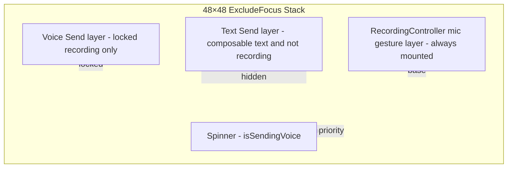

# Chat Composer — Voice Lock-Up (Hold + Slide-Up Lock) — Product & Technical Spec

**Date:** 2026-05-24  
**Status:** Approved for implementation (Direction A)  
**App version at spec time:** `0.0.12` (`frontend/pubspec.yaml`)  
**Depends on:** `2026-05-24-trailing-send-button-spec.md` (Phase 0 — trailing text send)  
**Related:** `2026-05-16-session-voice-recording-ux.md`, `2026-05-15-session-voice-recording-gesture-fix.md`, `2026-05-23-chat-composer-viewport-design.md`

---

## 1. Goals & non-goals

### Goals

| # | Goal |
|---|------|
| G1 | **Evolve hold-to-record** (do not replace): long-press mic still starts voice capture immediately — same entry point users know today. |
| G2 | **Telegram / WhatsApp lock-up:** While holding, slide **up** past a threshold to **lock** recording; finger may release; recording continues until explicit **Send** or **Cancel**. |
| G3 | **Preserve slide-left cancel** during **unlocked** hold: drag left → trash hint → release over threshold discards clip (existing behavior). |
| G4 | **Short unhold auto-send:** If the user releases without locking and without canceling, clip sends on release (today’s behavior) — including min-duration (500 ms) and max-duration (120 s) rules. |
| G5 | **Explicit Send in locked mode:** Locked recording shows a dedicated **Send** control (trailing slot); no reliance on “release to send” while locked. |
| G6 | **Trailing send stack compatibility:** Text **Send** overlay (Phase 0) and voice **Send** (Phase 1 locked) share the 48×48 trailing slot without unmounting `RecordingController`. |
| G7 | **Draft text preserved:** Starting / locking / sending / canceling voice must not clear `_controller` draft text. |
| G8 | **Peer `recordingVoice` socket:** Emit `true` when capture actually starts; emit `false` on cancel, send complete, or unmount — unchanged contract; locked mode keeps `true` until stop. |

### Non-goals

| Item | Notes |
|------|--------|
| Move mic into action panel / remove panel chevron | Product explicitly rejected (same as trailing-send spec). |
| **Tap-to-toggle** recording as primary mode | No “tap mic once to start, tap again to stop” as the default path; hold remains required to begin. (Tap may exist only on locked-mode **Send** / **Cancel** buttons.) |
| Tap mic when idle to start recording | Idle mic stays **long-press only**. |
| Pause / resume recording | Out of scope; locked recording is continuous until send or cancel. |
| Waveform scrubber / playback preview before send | Out of scope. |
| Backend / WS protocol changes | Reuse existing `recordingVoice` event and voice upload pipeline. |
| Changing keyboard tap-to-dismiss on message list | Document and preserve current implicit behavior (see §6). |
| Replacing `Listener` + single `GestureDetector` architecture | Extend in place; do not split detectors by lock state. |

---

## 2. Gesture map

All coordinates use **global** pointer positions (same as today’s slide-left cancel). Horizontal mic **visual** translate (`_kMicRestingOffsetX`, drag clamp) must not break threshold math.

### 2.1 Idle → recording (unchanged entry)

| Input | Condition | Result |
|-------|-----------|--------|
| **Long-press down** on mic | Field empty **or** field has draft text; not `isSendingVoice` | Begin async `_startRecording(startX, startY)`; `_isStartingRecording = true` |
| Long-press on mic | `isSendingVoice == true` | Ignored (spinner shown) |
| Long-press on mic | Trailing **text Send** visible (`trim().isNotEmpty`) | **Send layer** has `IgnorePointer`; gesture hits **mic underlay** — long-press still starts voice (WhatsApp/Telegram: voice wins on hold even with draft — **draft preserved**, recording bar replaces field) |

### 2.2 Unlocked recording (finger still down after capture started)

| Input | Condition | Result |
|-------|-----------|--------|
| **Move left** | `_isRecording && !_isLocked` | Update `_cancelDragOffset`; show trash hint past 20 px; mic translates left (clamped). |
| **Move up** | `_isRecording && !_isLocked` && `(startY - currentY) >= _lockUpThresholdPx` | Enter **locked** state: `_isLocked = true`; snap mic to rest position; haptic (native); show lock affordance feedback; **stop treating release as send trigger**. |
| **Release** (pointer up / long-press end) | Unlocked, not canceled, not over trash | **`_stopRecording()`** → auto-send path (min 500 ms, upload). |
| **Release** | Unlocked, `_isOverTrash` | **`_cancelRecording()`** → snackbar canceled. |
| **Release** | During `_isStartingRecording` only | `_pendingStopAfterStart` → stop once active (existing). |
| **Long-press cancel** | During `_isStartingRecording` | `_abortInFlightStart` (existing). |
| **Long-press cancel** | Recording unlocked | Finish gesture (send or cancel per position). |

### 2.3 Locked recording (finger released)

| Input | Condition | Result |
|-------|-----------|--------|
| **Release** | Already locked | **No-op** for send/cancel (finger already up). |
| **Tap Send** (trailing) | Locked | **`_stopRecording()`** — same pipeline as unlocked release send. |
| **Tap Cancel** (recording bar) | Locked | **`_cancelRecording()`**. |
| **Tap trash** (recording bar) | Locked | Same as Cancel. |
| **New long-press on mic** | Locked | Ignored until current session ends (no stacked recordings). |
| **120 s timer** | Locked or unlocked | Auto **`_stopRecording()`** (existing). |

### 2.4 Constants (recommended defaults — tune in QA)

| Constant | Value | Notes |
|----------|--------|--------|
| `_lockUpThresholdPx` | `72` | Upward drag from long-press start; Telegram-like |
| `_lockUpHintShowPx` | `36` | Show chevron/lock hint (opacity) |
| `_trashOpenThresholdPx` | `60` | **Existing** — trash scale |
| Cancel threshold | `50%` screen width left | **Existing** — `_getCancelThreshold` |
| `kMinVoiceRecordingMs` | `500` | **Existing** |
| Max duration | `120 s` | **Existing** timer |

---

## 3. UI states & composer layout

### 3.1 State table

**Composable text** = `_controller.text.trim().isNotEmpty` (unchanged from trailing-send spec).

| ID | State | Text field area | Trailing 48×48 | Action panel chevron | Send paths |
|----|--------|-----------------|----------------|----------------------|------------|
| V0 | **Idle, empty** | `TextField` | Mic (hold) | Visible | — |
| V1 | **Idle, has draft text** | `TextField` | **Text Send** overlay + mic underlay (Phase 0 stack) | Visible | Tap send / IME / shortcut |
| V2 | **Starting mic** | Field or empty bar | Mic (gesture active) | Hidden | — |
| V3 | **Recording unlocked** | **Recording bar** | Mic red, **draggable** (H + V) | Hidden | Release → auto-send |
| V4 | **Recording locked** | **Recording bar (locked variant)** | **Voice Send** button (primary color) | Hidden | Tap Send |
| V5 | **Sending voice** | `TextField` (draft restored) | **Spinner** | Visible | — |

**State precedence:** `V5` > `V4` > `V3` > `V2` > `V1` > `V0`.

### 3.2 Recording bar — unlocked (`buildRecordingBar`)

Keep current structure with additions:

| Element | Spec |
|---------|------|
| Left | Trash icon when `_showTrashIcon` (slide left) — **existing** |
| Center | Pulsing red dot + elapsed `M:SS` — **existing** |
| Right hint | `voiceRecordingSlideToCancel` — **existing** |
| **New hint row** (optional second line or replace hint when `_lockUpProgress > 0`) | Show `voiceRecordingSlideUpToLock` with ↑ chevron; fade in as user drags up |

Mic icon (trailing) moves with horizontal drag only while unlocked; vertical drag drives lock progress feedback (chevron above mic or lock icon overlay).

### 3.3 Recording bar — locked (`buildRecordingBarLocked` or branch)

| Element | Spec |
|---------|------|
| Left | **Cancel** — `Icons.close` or `Icons.delete_outline` (red), min 44×44 tap target |
| Center | Lock icon (small) + pulsing dot + timer |
| Right label | `voiceRecordingLocked` (e.g. “Locked — tap Send when done”) — single line, ellipsis |
| Trailing slot | **Voice Send** (`Icons.send_rounded`, primary) — **not** text send |

### 3.4 Trailing slot stack (Phase 0 + Phase 1 combined)



**Visibility rules:**

| Layer | Visible when |
|-------|----------------|
| Spinner | `isSendingVoice` |
| Voice Send | `_isRecording && _isLocked` |
| Text Send | `!isSendingVoice && !_isRecording && trim().isNotEmpty` |
| Mic gesture | Always mounted; visible icon when `!isSendingVoice && (!_isLocked)` |

During **V3 unlocked**, text Send hidden, voice Send hidden, mic draggable.

During **V4 locked**, voice Send visible; mic at rest (not draggable); text Send hidden.

### 3.5 Composer row layout (unchanged geometry)

| Property | Value |
|----------|--------|
| Recording replaces `Expanded` child | **Yes** — same as today (`_isRecording` → `buildRecordingBar`) |
| `RecordingController` mount point | **Always** last child of composer `Row` |
| Horizontal padding / `+14 dp` compact buffer | **Unchanged** |
| Action panel hidden while `_isRecording` | **Unchanged** (any recording, locked or not) |

---

## 4. Integration with trailing send (Phase 0)

Phase 0 ships in **0.0.12** per `2026-05-24-trailing-send-button-spec.md`. Phase 1 lock-up extends the stack:

| Topic | Requirement |
|-------|-------------|
| Mount order | Bottom: `RecordingController`. Middle: text Send fade. Top: voice Send fade (Phase 1). Spinner replaces/intercepts all when sending. |
| `hasComposableText` during recording | Draft may be non-empty but recording bar is shown; **text Send must be hidden** while `_isRecording`. |
| After voice send/cancel | Return to V0 or V1 based on draft; text Send crossfades back if draft exists. |
| `_send()` vs voice send | **Separate handlers** — text `_send()` must not run from voice Send button. |
| Keyboard | Starting voice recording does **not** focus/unfocus field intentionally; draft stays in controller while bar shown. |

---

## 5. Technical architecture

### 5.1 `RecordingController` — new state

| Field | Type | Purpose |
|-------|------|---------|
| `_isLocked` | `bool` | Locked mode flag |
| `_lockDragOffset` | `double` | Vertical progress (positive = up) |
| `_dragStartY` | `double` | Lock threshold reference |
| `isLocked` | getter | Parent trailing stack reads for voice Send visibility |

**Callbacks:** Extend `onRecordingStateChanged` **or** add optional `onRecordingLockChanged(bool)` if parent needs rebuild without conflating “recording” vs “locked”. Preferred: parent already `setState` on recording; add `onRecordingLockChanged` for lock transitions only (avoids re-hiding action panel).

### 5.2 Gesture handling changes

| Area | Change |
|------|--------|
| `onLongPressStart` | Capture `globalPosition.dy` → `_dragStartY` |
| `onLongPressMoveUpdate` | If `!_isLocked`: compute horizontal (existing) **and** vertical delta; if vertical wins past threshold → `_enterLockedMode()` |
| `_finishRecordingGesture` / `_onLongPressFinished` | If `_isLocked`, **return early** (no auto-send) |
| `_onPointerRelease` | Same guard when locked |
| `_enterLockedMode()` | Set `_isLocked = true`; reset `_cancelDragOffset` to 0; animate mic to rest; optional `HapticFeedback.mediumImpact()` native |
| `_stopRecording` / `_cancelRecording` | Reset `_isLocked = false` in finally |
| `build()` | Single `GestureDetector` + `Listener` **preserved** |

### 5.3 `ChatInputBar` changes

| Area | Change |
|------|--------|
| `_isLocked` mirror | From `onRecordingLockChanged` or `RecordingControllerState.isLocked` via key |
| Trailing stack | Add voice Send layer per §3.4 |
| `buildRecordingBar` | Delegate locked variant when `_isLocked` |
| Voice Send `onPressed` | `_recordingKey.currentState?.sendLockedRecording()` public method → `_stopRecording()` |

### 5.4 `MessagingProvider` / socket

| Event | When |
|-------|------|
| `setIsRecordingVoice(true)` | Recorder actually started — **unchanged** |
| `emitRecordingVoice(..., true)` | Same — **unchanged** |
| `setIsRecordingVoice(false)` + emit false | Cancel, send complete, dispose — **unchanged** |
| Locked | Stays `true` for entire locked session |

Peer header “Recording voice…” in `ChatDetailScreen` — **unchanged** (already uses `isRecordingVoice` / `isPartnerRecordingVoice`).

### 5.5 Public API sketch (reference)

```dart
// recording_controller.dart
bool get isLocked => _isLocked;

void sendLockedRecording() {
  if (_isRecording && _isLocked && !_isStopping) {
    _stopRecording();
  }
}

void cancelLockedRecording() {
  if (_isRecording && _isLocked) {
    _cancelRecording();
  }
}
```

---

## 6. Keyboard policy

**Unchanged from trailing-send spec §3.** Lock-up must not add composer/message-list tap handlers.

| Scenario | Policy |
|----------|--------|
| Tap message list while idle | Framework unfocus — **preserve** |
| Tap message list while recording locked | Same; recording continues |
| Reply → composer focus | **Unchanged** (`setComposerFocusRequest`) |
| After text send | Keyboard stays open — **unchanged** |
| Voice recording | Does not require keyboard; no `TextInput.show` on lock |

---

## 7. Platform risks & anti-regression

### 7.1 P0 — Gesture architecture (from 2026-05-15 session)

| ID | Requirement |
|----|-------------|
| R1 | **Single** `GestureDetector` for entire press–move–release lifecycle — never swap idle vs recording detectors. |
| R2 | **`Listener`** on mic subtree: `onPointerUp` / `onPointerCancel` → `_finishRecordingGesture` with dedupe — **keep**. |
| R3 | **`RecordingController` always mounted** in composer `Row` — never conditional `Row` child swap (same as trailing-send K1). |
| R4 | **`ExcludeFocus`** on trailing slot — **keep**. |
| R5 | `_isStartingRecording` / `_pendingStopAfterStart` / `_abortInFlightStart` — **keep** for async permission/start races. |
| R6 | `_gestureFinishHandled` dedupe — **keep**; extend so locked release does not double-fire. |
| R7 | Lock transition must not dispose long-press recognizer mid-gesture. |

### 7.2 iOS PWA

| Risk | Mitigation |
|------|------------|
| Pointer up lost after lock | Locked mode must not depend on further pointer events for **send** — explicit Send button. |
| Vertical drag confused with scroll | Long-press on mic only; vertical threshold ≥ 72 px; test on iPhone PWA. |
| `TextInput` / viewport jump | Do not focus field on lock; no new scroll-lock CSS. |

### 7.3 Android native

| Risk | Mitigation |
|------|------------|
| Keyboard dismiss via `setState` | Lock callbacks should not trigger full-bar `watch`; use targeted mirrors + trailing `ListenableBuilder` only. |
| Edge back gesture vs slide-left cancel | Existing `+14 dp` buffer; locked mode reduces horizontal drag — less conflict. |

### 7.4 Trailing send regression (Phase 0)

| ID | Requirement |
|----|-------------|
| T1 | Text Send crossfade still 175 ms; voice Send uses same duration. |
| T2 | `if (hasText) Send else RecordingController` as **Row siblings** — **still forbidden**. |
| T3 | Widget tests from trailing-send spec must pass after Phase 1. |

---

## 8. Edge cases

| Case | Expected behavior |
|------|-------------------|
| Permission denied (async) | Snackbar; no recording; no lock UI — **existing** |
| Secure context fail (web) | Snackbar; no recording — **existing** |
| Release during `_isStartingRecording` | `_pendingStopAfterStart` — **existing** |
| Lock then Cancel | Clip discarded; draft text restored; peer `recordingVoice: false` |
| Lock then Send under 500 ms | `snackbarHoldLongerForVoiceMessage`; not sent |
| Lock then Send at 120 s | Auto-stop already fired; normal send |
| Unlocked release under 500 ms | Hold longer snackbar — **existing** |
| Draft text + record + cancel | Field shows draft again |
| Draft text + record + send | Voice sends; draft **still present** in field |
| `isSendingVoice` during locked | Cannot start new recording; spinner |
| Double tap voice Send | `_isStopping` guard prevents parallel stop — **existing** |
| Navigate away / dispose while locked | `dispose()` → cancel or silent stop + emit false (implement: `_cancelRecording` or `_releaseRecorderSilently` in dispose path if recording) |
| Peer recording indicator | Unaffected — receiver sees “Recording voice…” while we are locked |
| E2E voice | Same encrypt/upload path via `_handleVoiceSent` |
| Action panel was open | Recording start hides chevron; panel state preserved in `_showActionPanel` |
| Blocked conversation | Composer not shown — N/A |

---

## 9. Accessibility & ARB keys

### 9.1 New / updated keys (`app_en.arb` / `app_pl.arb`)

| Key | EN (example) | PL (example) |
|-----|--------------|--------------|
| `voiceRecordingSlideUpToLock` | ↑ Slide up to lock | ↑ Przesuń w górę, aby zablokować |
| `voiceRecordingLocked` | Locked — tap Send when done | Zablokowano — dotknij Wyślij, gdy skończysz |
| `voiceRecordingCancelLocked` | Cancel recording | Anuluj nagrywanie |
| `voiceRecordingSendVoiceTooltip` | Send voice message | Wyślij wiadomość głosową |
| `voiceRecordingSendVoiceSemantics` | Send voice message | Wyślij wiadomość głosową |
| `voiceRecordingLockedSemantics` | Locked voice recording, {time}. Tap Send to send or Cancel to discard. | Zablokowane nagrywanie, {time}. Dotknij Wyślij, aby wysłać, lub Anuluj, aby odrzucić. |

**Update existing:**

| Key | Change |
|-----|--------|
| `voiceRecordingSemanticsLabel` | Unlocked: keep current. Locked: use `voiceRecordingLockedSemantics`. |
| `voiceRecordingSlideToCancel` | Unlocked only; hidden or `ExcludeSemantics` when locked. |

Run `flutter gen-l10n` after edits.

### 9.2 Semantics

| Control | Label |
|---------|--------|
| Voice Send (locked) | `voiceRecordingSendVoiceSemantics` |
| Cancel (locked bar) | `voiceRecordingCancelLocked` |
| Mic (idle) | Generic “Record voice message” (optional new key) or tooltip from existing patterns |

---

## 10. Phased implementation & version

| Phase | Version | Scope | Ship criteria |
|-------|---------|--------|---------------|
| **Phase 0** | **0.0.12** | Trailing **text** Send stack (`2026-05-24-trailing-send-button-spec.md`) | Trailing send tests + iOS PWA keyboard matrix green |
| **Phase 1** | **0.0.13** (recommended PATCH) | Voice **lock-up** (this spec) | Lock gesture QA + widget tests + no Phase 0 regression |

**Rule:** Do not combine Phase 1 with Phase 0 in the same PR unless Phase 0 is already merged and verified — reduces keyboard regression bisection difficulty.

---

## 11. Test plan

### 11.1 Widget tests (new / extended)

**File:** `frontend/test/widgets/input/recording_controller_lock_test.dart` (recommended)

| Test | Assertion |
|------|-----------|
| Lock threshold | After simulated vertical drag ≥ 72 px, `isLocked == true` |
| Locked release no send | Pointer up while locked does not call `onVoiceSent` |
| Locked Send | `sendLockedRecording()` invokes stop/send path (mock recorder) |
| Locked Cancel | `cancelLockedRecording()` discards |
| Unlocked release still sends | Without lock, release triggers send (mock) |
| Min duration | Locked send under 500 ms → snackbar, no upload |
| Single GestureDetector | Widget tree count stable across idle → recording → locked |

**Extend:** `chat_input_bar_trailing_send_test.dart`

| Test | Assertion |
|------|-----------|
| Locked recording | Voice Send visible; text Send hidden even if draft exists |
| After voice send with draft | Text Send returns if draft non-empty |

**Extend:** `recording_controller_test.dart` — export `_lockUpThresholdPx` or test via public API only.

Use `AppLocalizations` delegates in all widget tests.

### 11.2 CI commands

```bash
cd frontend && flutter analyze
cd frontend && flutter test test/widgets/input/recording_controller_lock_test.dart
cd frontend && flutter test test/widgets/input/chat_input_bar_trailing_send_test.dart
cd frontend && flutter test test/widgets/input/recording_controller_test.dart
```

### 11.3 Manual QA matrix

| Platform | Scenario | Pass |
|----------|----------|------|
| iPhone **PWA** | Hold → slide up → lock → Send | Voice sends; keyboard/draft unchanged |
| iPhone **PWA** | Hold → slide up → lock → Cancel | Canceled snackbar; no send |
| iPhone **PWA** | Hold → release (no lock) | Auto-send |
| iPhone **PWA** | Hold → slide left → release | Cancel |
| Android **native** | Lock → Send | Sends; IME stable if draft exists |
| Android **native** | Short hold release (<500 ms) | Hold longer snackbar |
| Android **native** | 120 s locked | Auto-send at cap |
| Desktop web | Hold → lock → Send | Works with mouse (long-press emulation) |
| All | Draft text + voice send | Draft remains after send |
| All | Text Send (Phase 0) after cancel voice | Text Send still works |
| Compact width | Lock gestures | No accidental OS back swipe |

---

## 12. `CLAUDE.md` updates (on Phase 1 implementation)

Update **§1 Frontend** hold-to-record bullet and **§7 Widget gotchas** `ChatInputBar` / `RecordingController`:

| Topic | Summary text |
|-------|----------------|
| Voice lock-up | Hold mic → record; **slide up** to lock; locked → explicit **Send** / **Cancel**; short unhold without lock → auto-send |
| Slide left | Unlocked only — cancel — **unchanged** |
| Trailing stack | Mic always mounted; text Send when composable text; **voice Send when locked**; spinner when uploading |
| Gesture | Single `GestureDetector` + `Listener`; locked release must not auto-send |
| Draft | Recording does not clear `_controller` text |
| Tests | `recording_controller_lock_test.dart`, trailing send regression |
| Version | **0.0.13** when Phase 1 ships |

---

## 13. Polish summary (for product owner)

### Co dostajesz

- **Przytrzymaj mikrofon** — jak dotąd — żeby zacząć nagrywać.
- **Przesuń w górę**, żeby **zablokować** nagrywanie (Telegram/WhatsApp): możesz puścić palec, a nagrywanie trwa dalej.
- W trybie zablokowanym **Wyślij** wysyła głosówkę, **Anuluj** ją odrzuca.
- **Przesuń w lewo**, żeby anulować — nadal działa, gdy trzymasz palec (przed blokadą).
- **Krótkie puszczenie** bez blokady — jak dziś — **automatycznie wysyła** (min. pół sekundy nagrania).
- **Szkic tekstu** w polu zostaje, gdy nagrywasz lub wysyłasz głos.

### Czego nie robimy

- Nie przenosimy mikrofonu do panelu akcji.
- Nie zamieniamy nagrywania na “tapnij raz, tapnij drugi” jako główny sposób.

### Kolejność wdrożenia

1. **0.0.12** — przycisk wyślij tekst (osobna specyfikacja).  
2. **0.0.13** — blokada nagrywania w górę.

### Ryzyko

Największe ryzyko to **regresja gestów** (puszczenie nie wysyła / wysyła podwójnie) i **miganie klawiatury** na iOS PWA. Spec wymaga **jednego** detektora gestów i **jawnym** Wyślij po blokadzie — to ogranicza oba problemy.

---

## Appendix A — Current baseline (2026-05-24)

| File | Facts |
|------|--------|
| `recording_controller.dart` | Hold; slide-left cancel; 500 ms min; 120 s max; single `GestureDetector` + `Listener`; `_kMicRestingOffsetX = -6` |
| `chat_input_bar.dart` | Recording bar replaces field; `_recordingKey`; mic always in tree; Phase 0 trailing send pending/planned |
| `2026-05-24-trailing-send-button-spec.md` | Text send overlay; G5 “preserve voice UX” — superseded for lock-up by cross-ref |
| `messaging_provider.dart` | `setIsRecordingVoice`, partner map |
| `socket_service.dart` | `emitRecordingVoice` |

## Appendix B — Direction A (product choice)

**Direction A** = evolve hold-to-record with slide-up lock (this document).  
Rejected alternatives (not spec’d): panel-only mic, tap-to-toggle primary, full composer redesign.

---

**Approval:** Ready for implementation plan (`docs/superpowers/plans/`) and PATCH **0.0.13** on Phase 1 merge.
