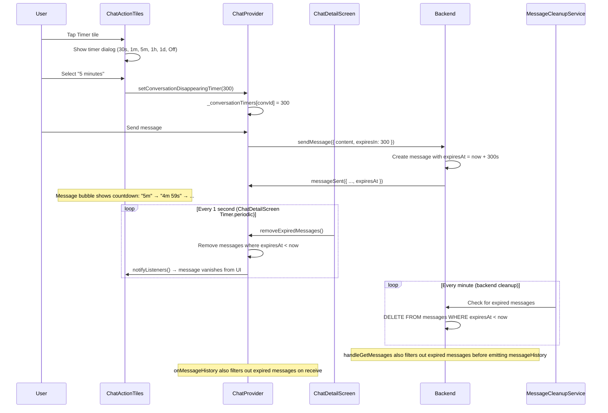
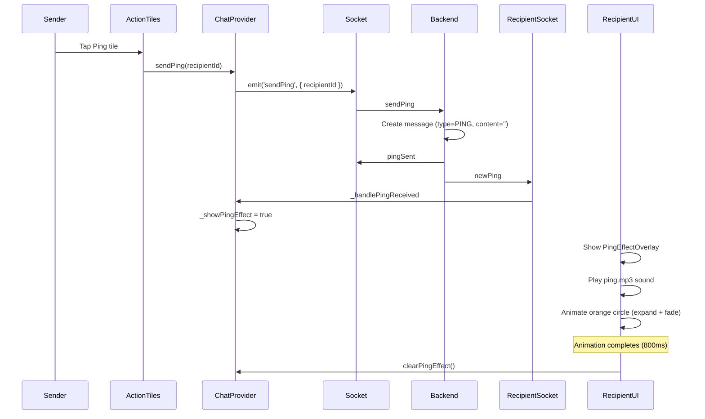

# Chat Screen Architecture - Source of Truth

**Last updated:** 2026-02-06
**Status:** Implemented — Disappearing messages bug fixes applied (three-layer expiration)
**Related Plan:** `futures/plans/2026-02-04-chat-screen-redesign.md`

---

## Overview

Complete redesign of chat screen inspired by Telegram and Wire, featuring delivery indicators, disappearing messages, ping notifications, rich input controls, and action tiles for camera/drawing/GIF.

---

## Architecture Diagrams

### Chat Screen Layout

```
┌─────────────────────────────────────┐
│ AppBar                              │
│ [←] Username              [Avatar]  │
│                                   ⋮ │
├─────────────────────────────────────┤
│                                     │
│ Message List (scrollable)           │
│                                     │
│ ┌─────────────────────┐             │
│ │ Their message       │             │
│ │ 14:32               │             │
│ └─────────────────────┘             │
│                                     │
│             ┌─────────────────────┐ │
│             │ My message          │ │
│             │ 14:33 ✓✓ [⏱ 5m]    │ │
│             └─────────────────────┘ │
│                                     │
├─────────────────────────────────────┤
│ Action Tiles (horizontal scroll)    │
│ [Timer] [Ping] [Cam] [Draw] [GIF]  │
├─────────────────────────────────────┤
│ Input Bar                           │
│ [📎] [Text field...] [😊] [🎤/📤]   │
└─────────────────────────────────────┘
```

### Message Model Data Flow

```mermaid
graph LR
  User[User types message] --> InputBar[ChatInputBar]
  InputBar --> Provider[ChatProvider.sendMessage]
  Provider --> |Optimistic UI| LocalMsg[Add to _messages with SENDING]
  Provider --> Socket[SocketService.emit('sendMessage')]
  Socket --> Backend[NestJS Backend]
  Backend --> DB[(PostgreSQL)]
  Backend --> |messageSent| Sender[Sender socket]
  Backend --> |newMessage| Recipient[Recipient socket]
  Sender --> UpdateLocal[Update message: SENDING → SENT]
  Recipient --> DeliveryAck[Emit messageDelivered]
  DeliveryAck --> Backend
  Backend --> |messageDelivered| Sender
  Sender --> UpdateStatus[Update message: SENT → DELIVERED]
```

### Disappearing Messages Flow



#### Disappearing Messages — Three-Layer Expiration

Messages expire through three complementary mechanisms:

1. **Frontend real-time removal (ChatDetailScreen):** `Timer.periodic(1s)` calls `ChatProvider.removeExpiredMessages()` which removes messages where `expiresAt < now` from `_messages` list. This makes messages vanish instantly when the countdown reaches zero.

2. **Backend cron cleanup (MessageCleanupService):** `@Cron(EVERY_MINUTE)` deletes expired messages from PostgreSQL. This is the authoritative cleanup.

3. **Backend response filtering (handleGetMessages):** When serving `messageHistory`, expired messages are filtered out before emitting. This prevents showing stale messages when re-entering a chat between cron runs.

4. **Frontend receive filtering (onMessageHistory):** When receiving `messageHistory`, ChatProvider filters out messages where `expiresAt < now`. Belt-and-suspenders safety.

### Ping Feature Flow



---

## Database Schema Changes

### Message Entity (Extended)

```sql
CREATE TABLE messages (
  id SERIAL PRIMARY KEY,
  content TEXT NOT NULL,

  -- NEW FIELDS --
  delivery_status VARCHAR(20) DEFAULT 'SENT',
    -- Enum: 'SENDING', 'SENT', 'DELIVERED'

  expires_at TIMESTAMP NULL,
    -- When message should be deleted (NULL = never expires)

  message_type VARCHAR(20) DEFAULT 'TEXT',
    -- Enum: 'TEXT', 'PING', 'IMAGE', 'DRAWING'

  media_url VARCHAR(500) NULL,
    -- Cloudinary URL for IMAGE/DRAWING messages

  sender_id INT NOT NULL REFERENCES users(id),
  conversation_id INT NOT NULL REFERENCES conversations(id),
  created_at TIMESTAMP DEFAULT NOW()
);

CREATE INDEX idx_messages_expires_at ON messages(expires_at);
```

**TypeORM Entity:**
```typescript
@Entity('messages')
export class Message {
  @PrimaryGeneratedColumn()
  id: number;

  @Column({ type: 'text' })
  content: string;

  @Column({
    type: 'enum',
    enum: MessageDeliveryStatus,
    default: MessageDeliveryStatus.SENT,
  })
  deliveryStatus: MessageDeliveryStatus;

  @Column({ type: 'timestamp', nullable: true })
  expiresAt: Date | null;

  @Column({
    type: 'enum',
    enum: MessageType,
    default: MessageType.TEXT,
  })
  messageType: MessageType;

  @Column({ type: 'text', nullable: true })
  mediaUrl: string | null;

  @ManyToOne(() => User)
  @JoinColumn({ name: 'sender_id' })
  sender: User;

  @ManyToOne(() => Conversation)
  @JoinColumn({ name: 'conversation_id' })
  conversation: Conversation;

  @CreateDateColumn()
  createdAt: Date;
}
```

---

## WebSocket Events Reference

### Client → Server

| Event | Payload | Description |
|-------|---------|-------------|
| `sendMessage` | `{ recipientId: int, content: string, expiresIn?: int }` | Send text message (expiresIn in seconds) |
| `messageDelivered` | `{ messageId: int }` | Notify sender that message was delivered |
| `sendPing` | `{ recipientId: int }` | Send ping notification |

### Server → Client

| Event | Payload | Description |
|-------|---------|-------------|
| `messageSent` | `{ id, content, senderId, conversationId, createdAt, deliveryStatus, expiresAt, messageType, mediaUrl }` | Confirm message sent |
| `newMessage` | Same as messageSent | New message from other user |
| `messageDelivered` | `{ messageId: int, deliveryStatus: 'DELIVERED' }` | Message delivery status update |
| `pingSent` | Same as messageSent (type=PING) | Confirm ping sent |
| `newPing` | Same as messageSent (type=PING) | Incoming ping notification |

---

## Frontend Components Map

### Widget Hierarchy

```
ChatDetailScreen
├── AppBar
│   ├── IconButton (back)
│   ├── Text (username - title)
│   └── actions
│       ├── AvatarCircle (18px radius)
│       └── PopupMenuButton (three dots)
├── Stack
│   ├── Column (body)
│   │   ├── Expanded
│   │   │   └── ListView.builder
│   │   │       └── ChatMessageBubble (per message)
│   │   │           ├── Text (content) OR Icon+Text (ping) OR Image.network (image)
│   │   │           └── Row (time + delivery icon + timer)
│   │   └── ChatInputBar
│   │       ├── ChatActionTiles (always visible)
│   │       │   └── _ActionTile × 6 (Timer, Ping, Camera, Draw, GIF, More)
│   │       ├── Container (input row)
│   │       │   ├── IconButton (attach - gallery)
│   │       │   ├── TextField (rounded, multiline)
│   │       │   ├── IconButton (emoji picker toggle)
│   │       │   └── IconButton (mic/send toggle)
│   │       └── EmojiPicker (if _showEmojiPicker)
│   └── PingEffectOverlay (if showPingEffect)
│       └── AnimatedBuilder (scale + opacity)
│           └── Container (orange circle + campaign icon)
```

### File Structure

```
frontend/lib/
├── screens/
│   ├── chat_detail_screen.dart
│   │   - AppBar with avatar on right
│   │   - Stack with body + PingEffectOverlay
│   │   - Timer for countdown refresh (1s interval)
│   └── drawing_canvas_screen.dart
│       - White canvas with CustomPainter
│       - Draw/eraser toggle, clear button
│       - Send button (captures canvas as PNG)
├── widgets/
│   ├── chat_input_bar.dart
│   │   - Includes ChatActionTiles
│   │   - Attachment, TextField, Emoji, Mic/Send
│   │   - EmojiPicker panel (250px height)
│   ├── chat_message_bubble.dart
│   │   - Delivery icon helper (_buildDeliveryIcon)
│   │   - Timer countdown helper (_getTimerText)
│   │   - Display text/ping/image based on messageType
│   ├── chat_action_tiles.dart
│   │   - Horizontal ListView with 6 tiles
│   │   - Timer dialog (_TimerDialog)
│   │   - Ping, Camera, Draw, GIF, More handlers
│   └── ping_effect_overlay.dart
│       - AnimationController (800ms)
│       - AudioPlayer for ping.mp3
│       - Scale (0.5 → 2.0) + Opacity (1.0 → 0.0)
├── providers/
│   └── chat_provider.dart
│       - conversationDisappearingTimer (Map<int, int?>)
│       - sendMessage(content, expiresIn)
│       - sendPing(recipientId)
│       - sendImageMessage(XFile, recipientId)
│       - _handleMessageDelivered, _handlePingReceived
│       - _showPingEffect flag
├── models/
│   └── message_model.dart
│       - MessageDeliveryStatus enum
│       - MessageType enum
│       - expiresAt, deliveryStatus, messageType, mediaUrl fields
└── services/
    ├── socket_service.dart
    │   - messageDelivered listener
    │   - newPing listener
    └── api_service.dart
        - uploadImageMessage(token, XFile, recipientId, expiresIn)
```

---

## Backend Service Architecture

### Message Flow Layers

```
ChatGateway (@SubscribeMessage)
    ↓
ChatMessageService (handle* methods)
    ↓
MessagesService (repository logic)
    ↓
TypeORM Repository
    ↓
PostgreSQL
```

### File Structure

```
backend/src/
├── messages/
│   ├── message.entity.ts
│   │   - MessageDeliveryStatus enum
│   │   - MessageType enum
│   │   - deliveryStatus, expiresAt, messageType, mediaUrl columns
│   │   - @JoinColumn for sender_id and conversation_id
│   ├── dto/
│   │   └── (inherited from chat/dto/)
│   ├── messages.service.ts
│   │   - createImageMessage({ senderId, recipientId, mediaUrl, expiresIn })
│   ├── messages.controller.ts
│   │   - POST /messages/image (multipart upload)
│   │   - Uses CloudinaryService.uploadImage
│   ├── message-cleanup.service.ts
│   │   - @Cron(CronExpression.EVERY_MINUTE)
│   │   - DELETE messages WHERE expiresAt < now
│   └── messages.module.ts
│       - Providers: MessagesService, MessageCleanupService
│       - Controllers: MessagesController
│       - Imports: CloudinaryModule
├── chat/
│   ├── dto/
│   │   ├── chat.dto.ts
│   │   │   - SendMessageDto (recipientId, content, expiresIn?)
│   │   └── send-ping.dto.ts
│   │       - SendPingDto (recipientId)
│   ├── services/
│   │   └── chat-message.service.ts
│   │       - handleSendMessage (updated with expiresIn)
│   │       - handleMessageDelivered
│   │       - handleSendPing
│   └── chat.gateway.ts
│       - @SubscribeMessage('sendMessage')
│       - @SubscribeMessage('messageDelivered')
│       - @SubscribeMessage('sendPing')
└── app.module.ts
    - ScheduleModule.forRoot() (for cron jobs)
```

---

## Theme & Styling Guide

### Colors (RpgTheme)

| Element | Dark Mode | Light Mode |
|---------|-----------|------------|
| **Message Bubbles** | | |
| Mine background | `#1A1A50` | `#4A154B` |
| Theirs background | `#121240` | `#E8E4EC` |
| Mine border (left) | `#FF6666` (accentDark) | `#4A154B` (primaryLight) |
| **Input Area** | | |
| Background | `#0A0A24` | `#EEEEF2` |
| Border | `#2A2A5A` (tabBorderDark) | `#DCDCE0` (tabBorderLight) |
| **Text** | | |
| Primary | `#EAEAEA` (textColor) | `#1A1A1A` (textColorLight) |
| Secondary (time) | `#9A7A7A` (timeColorDark) | `#616061` (textSecondaryLight) |
| Muted (icons) | `#7A7A9A` (mutedDark) | `#616061` (textSecondaryLight) |
| **Action Tiles** | | |
| Background | `#0A0A24` (inputBg) | `#EEEEF2` (inputBgLight) |
| Icon color | `#FF6666` (accentDark) | `#4A154B` (primaryLight) |

### Typography

- **Body font:** Google Inter (via `RpgTheme.bodyFont()`)
  - Message content: 14px
  - Timestamp: 10px
  - Tile labels: 10px
- **Title font:** Press Start 2P (via `RpgTheme.pressStart2P()`)
  - Not used in chat screen (reserved for headers)

### Spacing & Sizing

- Message bubble max width: 75% of screen
- Message bubble padding: 12px (H) × 8px (V top) × 12px (H) × 6px (V bottom)
- Message bubble border radius: 16px (top), 4px (bottom asymmetric)
- Message bubble border: 3px left
- Input field border radius: 24px
- Action tile size: 70px (W) × 44px (H)
- Action tile border radius: 12px
- Avatar radius: 18px (AppBar), 16px (title - removed), 22px (default)
- Emoji picker height: 250px
- Ping effect circle: 100px diameter

---

## Dependencies Reference

### Backend

```json
{
  "@nestjs/schedule": "^4.0.0",
  "@nestjs/platform-express": "existing",
  "typeorm": "existing",
  "cloudinary": "existing"
}
```

### Frontend

```yaml
dependencies:
  emoji_picker_flutter: ^2.0.0
  just_audio: ^0.9.36
  path_provider: ^2.1.1
  image_picker: ^1.1.2  # existing
  provider: ^6.1.2  # existing
  socket_io_client: ^2.0.3+1  # existing

flutter:
  assets:
    - assets/sounds/
```

---

## Key Constraints & Design Decisions

### 1. Delivery Status: 4 States

- **SENDING:** Optimistic UI - shows immediately when user hits send
- **SENT:** Confirmed by server (message persisted in DB)
- **DELIVERED:** Recipient's socket received the message (they're online) — shown as single grey check (✓)
- **READ:** Recipient opened the conversation — shown as double blue checks (✓✓). Triggered by `markConversationRead` event.

### 2. Disappearing Timer: Why Global Per Conversation?

- **Simplicity:** User sets once, all messages inherit
- **UX consistency:** Matches Signal/Wire behavior
- **Implementation:** Single `_conversationTimers` map in ChatProvider
- **Alternative (rejected):** Per-message timer requires UI for every send

### 3. Ping: Why One-Shot Impulse?

- **Immediate feedback:** No mode switching, instant action
- **Discoverability:** Clear purpose (get attention)
- **UX:** Tap tile → sends ping → overlay shows on recipient
- **Alternative (rejected):** Toggle mode adds complexity

### 4. Drawing: Why Basic MVP?

- **Scope control:** Full paint app is complex
- **Core features:** Brush + eraser + clear = functional
- **Future expansion:** Easy to add color picker, stroke width, undo/redo
- **Alternative (rejected):** Advanced features delay shipping

### 5. Action Tiles: Why Always Visible?

- **Discoverability:** Users see all available actions
- **Wire pattern:** Matches reference design (screenshot 2)
- **Trade-off:** Takes vertical space, but scrollable
- **Alternative (rejected):** Hidden behind "+" button reduces discoverability

### 6. Mic/Send Toggle: Why Not Separate?

- **Telegram pattern:** Matches reference design (screenshots 1 & 3)
- **Space efficient:** Single button adapts to context
- **Clear UX:** Empty = mic, text = send
- **Alternative (rejected):** Always-visible send wastes space when empty

### 7. Emoji Picker: Why Below Input?

- **Keyboard replacement:** Same vertical position as keyboard
- **Height:** 250px matches typical keyboard height
- **Toggle:** Emoji ↔ Keyboard button switches context
- **Alternative (rejected):** Popup overlay obscures messages

### 8. Image Upload: Why HTTP Not Socket.IO?

- **Large files:** Multipart form-data is standard
- **Progress:** HTTP supports upload progress natively
- **Cloudinary:** Existing pattern (avatar upload)
- **Socket.IO:** Better for real-time events, not file transfers
- **Trade-off:** After upload, emit socket event for real-time notification

---

## Migration Strategy

### Phase 1: Backend Schema + Events (Tasks 1.1-1.2)
- Add deliveryStatus, expiresAt, messageType, mediaUrl to Message entity
- TypeORM auto-sync (dev) or manual migration (prod)
- Add messageDelivered, sendPing WebSocket events
- **Risk:** Existing messages get default values (deliveryStatus=SENT, messageType=TEXT)

### Phase 2: Frontend Model (Task 2.1-2.2)
- Extend MessageModel with new fields
- Update ChatProvider with delivery tracking
- **Backward compat:** fromJson defaults to SENT/TEXT if missing

### Phase 3: UI Components (Tasks 3.1-3.6)
- Update ChatMessageBubble (delivery icon + timer)
- Redesign ChatInputBar (emoji + mic/send toggle)
- Add ChatActionTiles
- Add PingEffectOverlay
- Redesign AppBar
- Add DrawingCanvasScreen
- **Testing:** Manual QA for each component

### Phase 4: Expiration Cleanup (Tasks 4.1-4.2)
- Add MessageCleanupService cron job
- Add live countdown in ChatDetailScreen
- **Testing:** Send message with 1-minute timer, verify deletion

### Phase 5: Image Upload (Tasks 5.1-5.2)
- Backend: POST /messages/image endpoint
- Frontend: Camera + drawing upload
- **Testing:** End-to-end image flow (camera → upload → display)

### Phase 6: Verification (Task 6.1)
- Manual E2E testing all features
- Document test results

### Phase 7: Documentation (Task 7.1)
- Update CLAUDE.md with new features

---

## Testing Strategy

### Unit Tests (Future)

**Backend:**
- MessageCleanupService.deleteExpiredMessages()
  - Should delete messages where expiresAt < now
  - Should not delete messages with expiresAt = null
- ChatMessageService.handleSendPing()
  - Should create ping message with type=PING, content=''
  - Should emit pingSent to sender, newPing to recipient

**Frontend:**
- MessageModel.fromJson()
  - Should parse deliveryStatus from string
  - Should default to SENT if deliveryStatus missing
  - Should parse expiresAt as DateTime or null
- ChatProvider.sendMessage()
  - Should add optimistic message with SENDING status
  - Should emit sendMessage event with expiresIn if timer set
- ChatProvider._handleMessageDelivered()
  - Should update message deliveryStatus to DELIVERED

### Integration Tests (Future)

- E2E: Send message → delivery tracking → expiration
  1. User A sends message with 1-minute timer
  2. User B receives message (status: SENT → DELIVERED)
  3. Countdown updates every second
  4. After 1 minute, cron job deletes message
  5. Both users see message disappear

- E2E: Ping flow
  1. User A taps Ping tile
  2. Backend creates ping message
  3. User B sees orange circle animation + hears sound
  4. Ping message appears in chat

### Manual Testing Checklist

See `docs/testing/2026-02-04-chat-redesign-manual-tests.md` (created in Task 6.1)

---

## Known Limitations & Future Enhancements

### Current Limitations

1. **No message edit/delete:** Users cannot modify sent messages
2. **No read receipts:** Privacy-focused (intentional)
3. **No typing indicators:** Not in scope for this redesign
4. **No voice messages:** Mic button shows "coming soon"
5. **No GIF picker:** GIF tile shows "coming soon"
6. **No message reactions:** Future feature
7. **Drawing canvas limitations:**
   - Single color (black)
   - Fixed stroke width (3px brush, 20px eraser)
   - No undo/redo
   - No background color picker
8. **Timer granularity:** 1-minute minimum (30s option may delete before cron runs)

### Future Enhancements

1. **Voice messages:**
   - Add `flutter_sound` or `record` package
   - Record audio → upload to Cloudinary
   - Play with waveform visualization

2. **GIF picker:**
   - Integrate Giphy API or Tenor API
   - Search + preview → send as IMAGE message

3. **Advanced drawing:**
   - Color palette (ColorPicker)
   - Stroke width slider
   - Undo/redo stack
   - Background color/image

4. **Message reactions:**
   - Add `reactions` JSON column to Message
   - Emoji reactions (👍 ❤️ 😂 etc.)
   - Real-time updates via Socket.IO

5. **Typing indicators:**
   - Add `userTyping` / `userStoppedTyping` events
   - Show "User is typing..." in AppBar

6. **Read receipts (opt-in):**
   - Add READ status (blue ✓✓)
   - Privacy setting to enable/disable

7. **Message search:**
   - Full-text search in messages
   - Filter by sender, date, message type

8. **Media gallery:**
   - View all images/drawings in conversation
   - Grid layout with full-screen preview

---

## Performance Considerations

### Message List

- **Pagination:** Currently loads all messages
- **Recommendation:** Implement lazy loading (50 messages per page)
- **Impact:** Large conversations (1000+ messages) may lag

### Live Countdown

- **Current:** Timer.periodic(1 second) rebuilds entire ChatDetailScreen + calls `removeExpiredMessages()`
- **Dual purpose:** Updates countdown text AND removes expired messages from `_messages`
- **Optimization:** Only rebuild ChatMessageBubble with active timer
- **Trade-off:** Adds complexity, current approach is simpler

### Image Loading

- **Network images:** Use `cached_network_image` for caching
- **Placeholder:** Show thumbnail while loading full image
- **Cloudinary:** Use transformations for responsive sizes

### Ping Sound

- **Preload:** Load ping.mp3 on app start to avoid delay
- **Audio player:** Dispose properly to prevent memory leaks

---

## Security Considerations

### Image Upload

- **Validation:** Backend checks MIME type (JPEG/PNG only)
- **Size limit:** Cloudinary enforces 10MB max (configurable)
- **Authentication:** JWT required for /messages/image endpoint
- **Friendship check:** Only friends can send image messages

### Disappearing Messages

- **Server-side deletion:** Client cannot prevent expiration
- **Screenshots:** Users can still screenshot before expiration (no technical prevention)
- **Backup consideration:** Ensure backups respect expiresAt

### Ping Spam

- **Rate limiting:** Consider adding rate limit for sendPing (e.g., 1 per 5 seconds)
- **Friendship check:** Only friends can ping each other

---

## Deployment Checklist

**Backend:**
- [ ] Add `@nestjs/schedule` to package.json
- [ ] Run database migration (or rely on TypeORM sync in dev)
- [ ] Verify MessageCleanupService cron job starts
- [ ] Test /messages/image endpoint with Cloudinary credentials
- [ ] Monitor cron job logs for expired message deletion

**Frontend:**
- [ ] Add emoji_picker_flutter, just_audio, path_provider to pubspec.yaml
- [ ] Add assets/sounds/ping.mp3 to pubspec.yaml assets
- [ ] Run `flutter pub get`
- [ ] Test on iOS (check permissions for camera/photo in Info.plist)
- [ ] Test on Android (check permissions in AndroidManifest.xml)
- [ ] Verify emoji picker theme matches app theme

**Production:**
- [ ] Replace ping.mp3 placeholder with actual sound file
- [ ] Set Cloudinary upload preset (if not using default)
- [ ] Add monitoring for message cleanup job
- [ ] Add analytics events (ping sent, drawing sent, timer set)

---

## Troubleshooting Guide

### Delivery Indicators Not Updating

**Symptom:** Message stuck at clock icon (SENDING)
**Cause:** Socket.IO connection issue
**Fix:**
1. Check backend logs: `docker logs mvp-chat-app-backend-1`
2. Verify Socket.IO connection: `chat.isConnected` in ChatProvider
3. Check network tab for WebSocket connection

### Countdown Not Live Updating

**Symptom:** Timer shows "5m" and never decreases
**Cause:** Timer.periodic not running
**Fix:**
1. Verify `_timerCountdownRefresh` is initialized in ChatDetailScreen.initState
2. Check if `mounted` check passes
3. Ensure timer is not cancelled prematurely

### Ping Sound Not Playing

**Symptom:** Visual effect works, but no sound
**Cause:** Asset not found or just_audio not initialized
**Fix:**
1. Check `assets/sounds/ping.mp3` exists
2. Verify pubspec.yaml lists `assets/sounds/` in flutter.assets
3. Run `flutter clean && flutter pub get`
4. Check console for "Error playing ping sound" debug message

### Drawing Upload Fails

**Symptom:** "Failed to send drawing" error
**Cause:** Canvas rendering or file write issue
**Fix:**
1. Check `_canvasKey.currentContext` is not null
2. Verify `path_provider` permissions (iOS: Info.plist, Android: Manifest)
3. Check backend logs for Cloudinary upload errors
4. Verify Cloudinary credentials in .env

### Messages Not Expiring

**Symptom:** Message stays visible after timer reaches zero
**Cause:** Frontend `removeExpiredMessages()` not running, or cron job not running
**Fix:**
1. Verify ChatDetailScreen has `Timer.periodic(1s)` calling `chat.removeExpiredMessages()`
2. Check backend logs for "Deleted N expired messages"
3. Verify ScheduleModule.forRoot() in AppModule
4. Check DB: `SELECT * FROM messages WHERE expires_at < NOW()`
5. Restart backend to re-initialize cron

---

## Related Documentation

- **Implementation Plan:** `futures/plans/2026-02-04-chat-screen-redesign.md`
- **CLAUDE.md:** `docs/CLAUDE.md` (updated in Task 7.1)
- **E2E Tests:** `docs/testing/2026-02-04-chat-redesign-manual-tests.md` (Task 6.1)
- **Backend API:** See `backend/src/messages/messages.controller.ts` for REST endpoints
- **WebSocket Events:** See `backend/src/chat/chat.gateway.ts` for Socket.IO events
- **Frontend Models:** See `frontend/lib/models/message_model.dart` for data structures

---

## Glossary

- **Delivery Status:** Message lifecycle state (SENDING → SENT → DELIVERED)
- **Disappearing Message:** Message that auto-deletes after timer expires
- **Ping:** Notification message with visual + audio effect
- **Action Tile:** Button in horizontal scrollable row below input
- **Message Type:** Category of message (TEXT, PING, IMAGE, DRAWING)
- **Optimistic UI:** Show message immediately before server confirms
- **Cron Job:** Scheduled background task (MessageCleanupService runs every minute)
- **Multipart Upload:** HTTP form-data for file upload (used for images)

---

**End of Source of Truth Document**

For implementation details, see `futures/plans/2026-02-04-chat-screen-redesign.md`.
