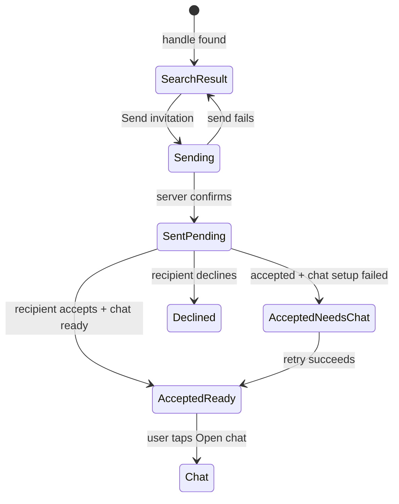

# Invitation Flow Rework — Brainstorm and Recommendation

**Date:** 2026-07-28  
**Status:** design proposal; no application behavior changed

## Verdict

The current flow mixes three separate concerns: finding a person, managing a relationship request, and opening a conversation. That is why it feels like a different app and why acceptance teleports the user.

Recommended direction: one compact **Invitations** screen with visible `Waiting for you` and `Sent` sections. Sending stays on-screen and creates a durable pending row. Acceptance confirms the relationship, creates/finds the conversation, then shows **Invitation accepted · Chat ready** with an explicit **Open chat** action. It never navigates without a tap.

## What is wrong today

The backend and provider already support outbound pending invitations, but the main invitation screen does not render them. `FriendsProvider.sentRequests` is fed by `sentRequestsList`; Contacts only represents recipients as muted, non-interactive ghost terminals.

The visible flow has four concrete defects:

1. **Send is a dead end.** An exact search result auto-sends, shows a green snackbar, then closes the screen. The sender cannot review the pending invitation there.
2. **Accept lies early.** The accept button shows `Friend added` before the server confirms success.
3. **Relationship state controls navigation.** The backend emits `openConversation` after acceptance, the invitation screen consumes it, and Contacts pushes chat. A background state transition is masquerading as a user navigation command.
4. **The visual grammar is generic.** Large opaque pseudo-cards, equal-weight green/red Material buttons, a large empty-state icon, and a bulky tab header do not match the sharper Contacts/Chats identity.

There is also a partial-success state the UI currently hides: friendship acceptance is critical, while conversation creation is explicitly non-critical. A user can become a friend even if chat setup fails.

## Recommended experience

### Information architecture

Use one pushed utility screen titled **Invitations**.

- Floating Fireplace utility header: back control, title, optional compact add/invite action.
- Compact invite-by-handle control at the top of the content.
- `Waiting for you` section for inbound invitations.
- `Sent` section for outbound pending invitations.
- No second-level tabs. Invitation volume is low; tabs create empty screens and hide the exact state the sender needs to see.

The Contacts honeycomb stays the ambient relationship map. Its outbound ghost nodes remain useful, but they become a summary, not the only durable evidence that an invitation exists.

### Send flow

1. User enters `username#tag`.
2. Search returns an identity row with avatar/hex, full handle, and **Send invitation**.
3. User deliberately taps send. Do not auto-send because a search happened to return one row.
4. Only after the server success event, the result transforms into a pending row at the top of `Sent`.
5. Keep the screen open. Clear/collapse the search field and bring the new row into view.
6. Row copy: **Waiting for response**. The recipient is not presented as a contact and cannot open chat yet.

This gives the sender durable proof, prevents accidental invitations to a mistyped exact match, and keeps the state where the action occurred.

### Receive and accept flow

Inbound row anatomy:

- Real avatar in the same hex identity language as Contacts.
- Full display handle.
- Quiet supporting line: **Wants to connect**.
- Primary accent action: **Accept**.
- Secondary quiet action: **Decline**.

On Accept:

1. Keep the row in place and disable both actions.
2. Show progress inside the Accept action only.
3. Wait for an authoritative server result.
4. Backend accepts the relationship and creates/finds the conversation.
5. The row transforms to:
   - **Invitation accepted**
   - **Chat ready**
   - Primary action: **Open chat**
   - Secondary action: **Done**
6. Stay on the Invitations screen until the user chooses.

If friendship succeeds but conversation creation fails, the honest state is:

- **Invitation accepted**
- **Chat setup needs retry**
- Action: **Create chat**

Do not display `Chat ready` from friendship state alone.

### What the original sender sees

When the recipient accepts:

- The pending row disappears from `Sent` and the user becomes a real contact.
- If the Invitations screen is open, the row may transform to the same accepted confirmation.
- Elsewhere, show a top notification: **Alex accepted your invitation** with an optional **Open chat** action.
- The authoritative accepted payload, including nullable `conversationId`, must go to both sender and accepter. Otherwise the sender cannot offer a correct Open Chat action.
- The new/found conversation appears in Chats.
- Never auto-open it.

### Reciprocal invitations

The backend currently auto-accepts when both users invite each other. Keep that useful behavior, but remove the automatic chat redirect. The caller receives the same accepted outcome with an explicit **Open chat** action.

## State flow



The important invariant: only the final arrow is navigation, and it always starts with a user tap.

## Visual direction: sharp, not decorative

The screen should look like the Contacts relationship layer, not a stock Material settings page.

- **Glass only for floating chrome.** Invitation/search/result rows are opaque content surfaces.
- **Identity shape continuity.** Inbound uses a real hex/avatar. Outbound uses the existing dashed/ghost hex with a small send glyph.
- **Compact hierarchy.** Section label, count, identity, one status line, actions. No oversized cards inside cards.
- **Status mini-pills.** `Pending`, `Accepted`, and `Chat ready` use solid theme-token surfaces, never glass.
- **Action hierarchy.** Accept is primary. Decline is quiet. Current equal-weight green/red buttons make a routine choice look like a destructive alert.
- **Theme tokens only.** Use `RpgTheme`, `FireplaceColors`, `GlassTheme`, and established radii/spacing. No hardcoded green/red screen colors.
- **No giant empty-state illustration.** Use a compact section line such as `Nothing waiting for you` or `No sent invitations`.
- **Motion:** one 180–220 ms row state transition, once, with `MediaQuery.disableAnimationsOf(context)` respected. Chat entry remains the existing zero-duration opaque route.
- **Loading:** compact skeleton rows on first fetch; no screen-level spinner.
- **Accessibility:** every row announces direction, person, and state, for example `Cora, sent invitation, waiting for response`; action progress remains labeled.

Desktop should use the same module in a centered/max-width content column. **Open chat** closes the invitation surface and selects the desktop conversation pane. Mobile closes the invitation surface and uses the existing instant opaque chat route. The invitation module itself does not call Navigator.

## Three directions considered

### A. Relationship inbox — recommended

One screen containing invite control, inbound requests, and sent requests. It minimizes navigation, makes every state visible, and maps cleanly to the current backend/provider data. It is the deepest design: one small relationship interface hides socket timing, action progress, partial success, and realtime updates.

### B. Search-first transforming profile

Keep Add User as the dominant screen and let the search result transform through `Send` → `Pending` → `Accepted`. This makes a single invitation feel polished, but older sent requests and inbound work become secondary or require another drawer/tab. It solves the immediate send moment but not relationship management as cleanly.

### C. Request-as-chat

Show inbound invitations as guarded chat previews, similar to privacy-first message-request products. This works when a message already exists before acceptance. Fireplace does not allow pre-friend messages, so a chat-shaped request would imply content or a room that does not yet exist. Borrow the identity/safety cues, not the faux chat screen.

## Module and wire seam

Navigation must be removed from the invitation lifecycle. Keep the invitation module interface small:

```dart
InvitationSnapshot get invitations;
void sendInvitation(int userId);
void decideInvitation(int requestId, InvitationDecision decision);
void clearInvitationOutcome();
```

`InvitationSnapshot` hides:

- incoming and outgoing lists;
- in-flight action state by request id;
- the latest accepted/declined/send outcome;
- `conversationId` when chat is ready;
- recoverable failure when friendship succeeded but chat setup did not.

Recommended backend/client contract:

- Remove `openConversation` from normal accept and reciprocal-auto-accept flows.
- Reserve `openConversation` for explicit `startConversation` requests.
- Emit the accepted relationship result to **both sender and accepter** only after the create/find attempt, with `conversationId` nullable.
- Add a scoped failure result (`requestId`, action, stable reason) or a Socket.IO acknowledgement. A generic global error cannot safely clear the correct row when more than one action is in flight.
- Continue emitting refreshed friends, conversations, inbound requests, outbound requests, and counts. Do not add client refetches that reintroduce stale-list races.

A compatible accepted payload could conceptually carry:

```text
{
  request: <friend request payload>,
  conversationId: 123 | null,
  chatReady: true | false
}
```

The exact field shape should reuse the existing mapper and DTO conventions during implementation.

## Implementation slices

1. **Wire behavior:** stop acceptance-driven `openConversation`; include conversation readiness in the accepted outcome sent to both users; add scoped failure handling.
2. **Frontend state:** model send/accept/decline progress and server-confirmed outcomes in the existing Friends module; keep navigation outside it.
3. **Invitation UI:** replace tabs with the one-screen inbox, render sent rows, stop popping after send, and add the explicit chat action.
4. **Shell navigation:** consume only explicit Open Chat intent; preserve desktop selection and mobile instant-opaque route behavior.
5. **Verification:** socket tests for both normal and reciprocal acceptance, provider tests for state/outcomes, widget tests for no automatic navigation, then render all four themes at phone and desktop widths and inspect screenshots.

## Optional follow-up, not core scope

A **Withdraw invitation** action is a sensible outbound-management feature, but it does not exist in the backend today. Do not smuggle it into the core rework. If selected later, it needs sender authorization, pending-only validation, realtime list refresh for both users, and clear resend semantics.

## Acceptance criteria for implementation

- Sending a valid invitation leaves the user on the screen and shows the recipient under `Sent`.
- Refresh/reconnect restores pending outbound invitations.
- Accept/decline success appears only after server confirmation.
- Accepting creates/finds a conversation but does not navigate.
- Reciprocal invitations do not navigate.
- **Open chat** opens the correct conversation on mobile and desktop.
- Both sender and accepter receive the conversation id or an honest not-ready result.
- The sender receives accepted feedback without navigation.
- Partial friendship/chat-setup failure is communicated honestly and can recover.
- Screen visuals use Fireplace chrome/content grammar in blue, dark, light, and teal themes.
- Reduce-motion users get no row entrance/state travel.

## Research evidence

Primary-source research is captured in [`2026-07-28-invitation-flow-research.md`](2026-07-28-invitation-flow-research.md).

- Signal shows identity and locally detected shared-group context before consent; acceptance changes durable communication permissions and adds the person to contacts. It does not document automatic navigation. [Signal Support](https://support.signal.org/hc/en-us/articles/360007459591-Signal-Profiles-and-Message-Requests)
- Discord and Session separate untrusted requests from normal conversations, then let acceptance enable/move the contact into the normal messaging area. Neither examined source establishes that acceptance should force-open chat. [Discord Support](https://support.discord.com/hc/en-us/articles/7924992471191-Message-Requests), [Session Support](https://sessionapp.zendesk.com/hc/en-us/articles/9347841807897-How-do-I-find-my-message-requests)
- Matrix/Element room invites are not the right domain precedent: joining a room changes membership, while Fireplace invitations create a bilateral relationship. [Matrix Client-Server API](https://spec.matrix.org/latest/client-server-api/#post_matrixclientv3roomsroomidjoin)

The cross-product pattern is durable permission/state change first; navigation is not a documented universal consequence. That supports explicit **Open chat**, not acceptance-driven teleportation.
