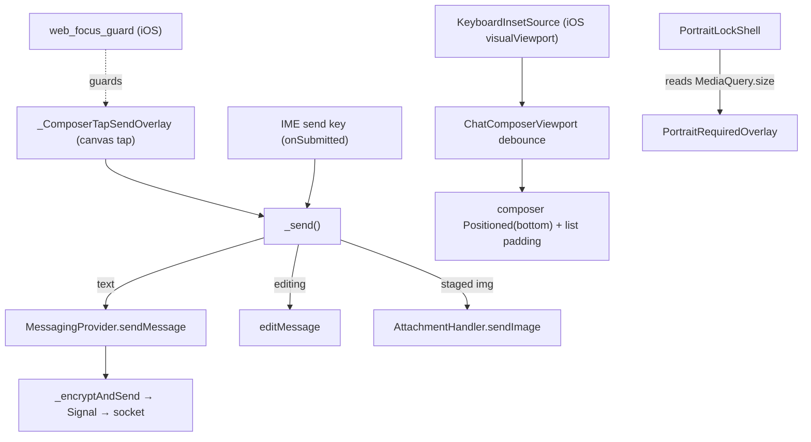

# Composer · Keyboard · Focus · Viewport — Consolidated Audit

**Status:** READ-ONLY audit / report-first. No code changed this pass.
**Scope:** chat composer input + keyboard/focus/viewport handling ONLY. E2E send path is a *trust boundary*, audited only to mark what a fix must not break.
**Provenance:** every code claim below was verified against a file opened this run; `file:line` cited. Runtime/platform behaviors that cannot be proven from source are marked `[INFERENCE]` with confidence.
**Tree:** branch `review/frontend-prod-readiness` @ `814c820`.

**Implementation status (2026-06-24, this branch, v0.0.63):** A2, B, C **implemented + unit-tested + analyze-clean (62 affected tests green)**; A1 = **observability widened only** (diag overlay now `kIsWeb`, probe reports `innerHeight`/orientation) — no blind `interactive-widget` change. All require **on-device verification** (iOS Safari + Chrome PWA, Android Chrome PWA) before trusted. Code: `utils/portrait_lock_policy.dart`, `widgets/portrait_lock_shell.dart`, `utils/focus_guard_geometry.dart` (new), `utils/web_focus_guard_web.dart`, `widgets/input/composer_keyboard_signals.dart` (new), `chat_composer_viewport.dart`, `chat_input_bar.dart`, `composer_diagnostics_overlay.dart`, `utils/composer_probe_web.dart`. Tests: `focus_guard_geometry_test.dart` (new), `chat_input_bar_send_test.dart` (new), `chat_composer_viewport_test.dart`, `portrait_lock_policy_test.dart`.

---

## 0. TL;DR verdicts

| # | Symptom | Verdict | Lever |
|---|---------|---------|-------|
| A1 | Android Chrome PWA: white void fills lower half after keyboard, heals on tap/scroll | **Mostly PLATFORM** (Flutter-web/Chrome repaint) + **config contributes** | `interactive-widget` value + force-repaint on hide |
| A2 | Portrait-lock overlay falsely fires in portrait after keyboard | **FIXABLE (code bug)** | `shouldShowRotateOverlay` reads keyboard-perturbable `MediaQuery.size`; no physical-orientation source |
| B | iOS+Android: ~0.5s dark/black gap on keyboard *hide*; show is smooth | **FIXABLE (code bug)** on iOS = the 450 ms debounce; Android likely shares A1's repaint cause | the 450 ms collapse debounce in `ChatComposerViewport` |
| C | In-app Send button bounces the keyboard; IME send/enter key does NOT | **FIXABLE focus-steal — §9 "OS limit / do not iterate" is OVERTURNED** | focus guard does not reliably cover the canvas-tap send; refocus machinery papers over the lost focus → visible bounce |

**Do X first:** fix **C** (the focus-steal). It is the upstream cause that the 450 ms debounce (**B**) exists to mask. Killing the bounce lets the debounce shrink/disappear → fixes B *and* removes the flash it guards, satisfying "solve lag AND flash together." A is a separate, mostly-platform track.

---

## 1. Subsystem map (verified)

### Widget / layout
- `frontend/lib/screens/chat_detail_screen.dart` — host. Non-embedded build returns `Scaffold(resizeToAvoidBottomInset: false)` (`:883`), body `Column[ pinnedBanner?, Expanded(ChatComposerViewport(...)) ]` (`:812-828`). Embedded path uses a plain `Column` and `listBottomPadding: 0` (`:795-810`). `didChangeMetrics` (`:359-380`) schedules a one-shot scroll-to-bottom 300 ms after `View.of(context).viewInsets.bottom` first goes >0.
- `frontend/lib/widgets/input/chat_composer_viewport.dart` — owns layout. `Stack[ Positioned.fill(list), Positioned(bottom:_keyboardInset, composer) ]` (`:126-146`). The 450 ms collapse debounce lives in `build()` (`:93-124`). Inset source created in `initState` (`:53`).
- `frontend/lib/widgets/input/chat_input_bar.dart` — the composer. `TextField` with `focusNode:_focusNode` (`:851`), `textInputAction: TextInputAction.send` (`:887`), `onEditingComplete: () {}` (`:890`, IME-blur guard), `onSubmitted: (_) => _send()` (`:891`). In-app send = `_ComposerTapSendOverlay(onTap:_send)` (`:570-575`), defined `:936-1000`. Trailing slot wrapped by `FocusGuardArea(id:'composer_trailing')` (`:909-912`); action toggle by `FocusGuardArea(id:'composer_action_toggle')` (`:802-803`).
- `frontend/lib/widgets/input/focus_guard_area.dart` — measures child global rect post-frame, registers it with the focus guard (`:28-40`).
- `frontend/lib/widgets/portrait_lock_shell.dart` — wraps whole app via `MaterialApp.builder` (`main.dart:86`); reads root `MediaQuery.orientation`+`.size` (`:13-17`).
- `frontend/lib/widgets/portrait_required_overlay.dart` — the "Obróć urządzenie / Fireplace działa tylko w trybie pionowym" UI (`rotateDeviceTitle`/`rotateDeviceMessage`, `:28/:34`), `AbsorbPointer`-wrapped (`portrait_lock_shell.dart:24`).
- `frontend/lib/widgets/input/composer_diagnostics_overlay.dart` — on-device readout; **gated `kIsWeb && isIOSWebKit()`** (`:42`) → no Android visibility.

### Web shims / platform glue
- `frontend/lib/utils/web_keyboard_inset_web.dart` — `visualViewport`-derived inset; **active only on iOS WebKit** (`createKeyboardInsetSource`, `:13-16`); inset = `innerHeight − vv.height − vv.offsetTop`, floored at 80 px (`:53-62`).
- `frontend/lib/utils/web_focus_guard_web.dart` — capture-phase `touchstart`/`mousedown`/`touchend` window listeners; `preventDefault()`s the focus-steal when an editable is active and the point hits a registered rect (`:39-67`); refocuses saved element on `touchend` (`:59-67`).
- `frontend/lib/utils/web_viewport_scroll_web.dart` — `resetWebDocumentScroll()` (`:5-16`) and `setIOSWebViewportScrollLocked()` (iOS-only `html/body overflow:hidden`, `:18-33`).
- `frontend/lib/utils/web_ios_webkit_web.dart` — UA sniff (`:4-13`).
- `frontend/lib/utils/soft_keyboard_web.dart` — `showSoftKeyboardIfHidden` → `TextInput.show` (`:6-18`), iOS-only.
- `frontend/lib/services/web_orientation_lock_web.dart` — best-effort `screen.orientation.lock('portrait-primary')`, silently swallows failure (`:6-16`).
- `frontend/web/index.html:21` — `<meta name="viewport" content="…, interactive-widget=overlays-content">`.

### Send-path handoff (TRUST BOUNDARY — must not break)
- In-app send: `_ComposerTapSendOverlay.onTap` → `_send()` (`chat_input_bar.dart:280`) → `context.read<MessagingProvider>().sendMessage(text, expiresIn:)` (`:309`), or `editMessage(...)` (`:291`), or `_sendStaged()` → `AttachmentHandler.sendImage` (`:347`).
- `MessagingSend.sendMessage` (`messaging/messaging_provider.send.dart:11-68`) takes only `content`/`expiresIn`/`replyToMessageId`, does optimistic add (`:50`) then `_encryptAndSend` (`:61`). **It reads NO focus/keyboard/viewport state.**

> **Boundary statement:** the entire focus/keyboard/viewport apparatus is widget-layer only. The only coupling to E2E send is the four call sites in `_send()`/`_sendStaged()` that hand a `String` to `sendMessage`/`editMessage`/`sendImage`, plus the empty-text guard (`:286`) and image-then-caption ordering (`:354-361`). Any fix in this audit's scope cannot reach the encryption/socket path **as long as those dispatch calls, the trim/empty guard, and the staged-image ordering are preserved.**

---

## 2. Per-symptom root cause + verdict

### A1 — Android Chrome PWA white void (severe, persistent)
**What the code does.** Android is **not** iOS WebKit, so `createKeyboardInsetSource()` returns the **inactive** source (`web_keyboard_inset_web.dart:14-15`); in `ChatComposerViewport.build` `raw = flutterInset = MediaQuery.viewInsets.bottom` (`chat_composer_viewport.dart:98-100`). The app's *only* Android keyboard strategy is the meta `interactive-widget=overlays-content` (`index.html:21`). The structural Android attempt (`android_chrome_web.dart`, `keyboard_inset_math.dart`, capped insets, `resizeToAvoidBottomInset` toggle) was added 2026-05-18 in `fa73526` and **reverted** (`50afc0e`); only the meta survived (`index_html_viewport_test.dart` asserts it).

**Root cause `[INFERENCE — confidence MEDIUM]`.** The "white region that does not repaint until tap/scroll" is the signature of Flutter-web's keyboard-driven viewport bug (refs flutter/flutter #179208, #178431, #50382) and/or a Chrome-PWA stale-composited-layer. With `overlays-content`, neither viewport should resize — yet the void persists, which means either (a) Android Chrome is still delivering a viewport/inset change Flutter reacts to and fails to restore, or (b) the keyboard-vacated region is a stale composited layer Flutter never repaints. **Which one is true cannot be proven from source — it must be captured on-device** (see §4). The debounce does nothing here (inactive inset source on Android), so it neither causes nor cures A1.

**Verdict:** **Mostly PLATFORM**, with a config lever. Not a pure code bug, but two app-side levers exist (try `resizes-content` so Flutter owns a real inset it can restore, vs. an explicit repaint kick on hide). Honest call: do not claim "fixed" until device capture confirms the mechanism.

### A2 — Portrait-lock false trigger in portrait
**What the code does.** `PortraitLockShell.build` (`portrait_lock_shell.dart:13-17`) feeds `shouldShowRotateOverlay(orientation: mq.orientation, logicalSize: mq.size)`. The policy (`portrait_lock_policy.dart:9-10`): `orientation == landscape && shortestSide < 900`. `MediaQuery.orientation` is derived purely from `size.width > size.height`. The only "real" orientation source, `web_orientation_lock_web.dart`, is a best-effort `screen.orientation.lock` that is unsupported on iOS WebKit and frequently rejected on Android Chrome (`:11-15` swallows the failure) — so the overlay decision rests **entirely on `MediaQuery.size`'s aspect ratio.**

**Root cause `[confidence HIGH for the code path; MEDIUM for the exact size-flip]`.** When the soft keyboard perturbs the reported view geometry, `MediaQuery.size` height can momentarily drop to/below width → `orientation` flips to `landscape` → with phone `shortestSide < 900` the overlay fires *in physical portrait*. There is **no guard** excluding the keyboard (e.g. `viewInsets.bottom > 0`) and **no physical-orientation input**. This is a code bug independent of the platform repaint issue.

**Verdict:** **FIXABLE (code bug).** Lever: gate the overlay on a keyboard-independent signal — suppress while a keyboard inset is active and/or read physical orientation from the DOM (`screen.orientation.type` / a CSS `(orientation: landscape)` media query) instead of the keyboard-shrinkable `MediaQuery.size`.

### B — Laggy hide: ~0.5 s dark/black gap, then heals
**What the code does.** `ChatComposerViewport.build` (`:102-115`): on grow it applies `raw` immediately; on shrink it starts a `Timer(450ms)` and keeps `_keyboardInset` at the old large value until it fires (`:111-114`). Comment (`:38-41`) states the intent verbatim: grows immediately, shrinks after 450 ms, "Prevents layout jumping when the keyboard briefly dismisses and returns (e.g. iOS PWA send-button tap bounce)."

**Root cause `[iOS confidence HIGH; Android MEDIUM]`.** On a genuine hide, for 450 ms the composer stays `Positioned(bottom: _keyboardInset)` floating where it sat above the (now-gone) keyboard and `listBottomPadding` still reserves keyboard height (`:124`). The region the keyboard vacated shows the empty chat background — **on a dark theme that reads as a "black blank"** — until the timer collapses the inset and the composer snaps down. Show is smooth because grow is immediate. This is precisely the brief's prime suspect. On **Android** the inset source is inactive so the debounce never engages → the Android "black on hide" is most likely the **transient form of A1** (repaint lag), a *different* cause that merely looks the same. (Confirm on-device — same caveat as A1.)

**Verdict:** **FIXABLE (code bug)** on iOS = the 450 ms debounce. It is a band-aid for C. See remediation.

### C — Send-button bounce — **§9 re-examination**
**§9 claim (`frontend/CLAUDE.md:151`):** *"iOS PWA keyboard bounce (send button tap): OS-level `resignFirstResponder` fires on any non-input tap — cannot be prevented … Only fix is a native iOS app build. Do not iterate further."*

**Contradicting evidence in-tree.**
1. The focus guard (`frontend/CLAUDE.md:50`, `web_focus_guard_web.dart`) was **purpose-built to prevent exactly this focus-steal** and explicitly lists "text-send" among protected controls. Two CLAUDE.md entries directly contradict each other.
2. Git chronology: the bounce-fix cluster all landed **the same day, 2026-05-29** — `49d9ae4` (focus-guard listener), `c10e4f3` ("prevent iOS keyboard bounce — preventDefault on touchend"), `a4abcde` ("prevent iOS keyboard dismiss via blur-handler refocus"), `b9ce4d1` ("revert to v21 guard + debounce keyboard inset collapse"). §9's "do not iterate" was written *amid* active iteration, not after a proven-impossible result.
3. **The new user evidence is decisive:** the virtual keyboard's own send/enter key does **not** bounce, only the in-app button does. The IME path keeps focus because `TextField` has `onEditingComplete: () {}` (`chat_input_bar.dart:890`, the documented IME-blur guard) and routes via `onSubmitted` (`:891`) without a blur. The in-app button is a **canvas tap** that steals focus from the DOM textarea → keyboard hides → the refocus machinery re-shows it → **bounce**. A focus-steal that one input path triggers and another does not is **by definition not an intrinsic OS keyboard behavior.**
4. The code *already assumes focus is lost on send*: `_send()` arms `_sendJustFired` + a 500 ms timer (`:312-319`), `_onFocusLostAfterSend` refocuses in a microtask (`:268-278`), and a post-frame fallback refocuses again (`:323-327`). This whole apparatus only runs because the blur happens — and the refocus is what the user *sees* as the bounce.

**Why the guard doesn't fully stop it `[confidence MEDIUM]`.** Candidates, in order of likelihood:
- **Coordinate-space mismatch on iOS:** `FocusGuardArea` registers a rect from Flutter's `localToGlobal` (layout-viewport logical px, `focus_guard_area.dart:37`), but the guard tests it against `touch.clientX/clientY` (visual-viewport CSS px, `web_focus_guard_web.dart:79-90`). While the keyboard is up, iOS offsets the visual viewport (`vv.offsetTop > 0`, which the diag probe explicitly tracks, `composer_probe_web.dart:9-10/27`). If `point` is in visual-viewport coords and `rect` in layout coords, `rect.contains(point)` can be **false** → `preventDefault` never fires → blur proceeds.
- **The guard's own touchend refocus** (`web_focus_guard_web.dart:63-65`) calls `el.focus()`; if the blur already happened, this re-show *is* the bounce.

**Verdict:** **FIXABLE focus-steal. §9's "platform limit / do not iterate" is OVERTURNED** for the diagnosis. Caveat kept honest: *reliably* suppressing iOS-WebKit blur for a synthetic canvas tap is genuinely hard, so the remediation is "make the guard actually cover the send tap (coordinate space + avoid the redundant refocus)" and verify on-device — not "rewrite to a native app."

---

## 3. Remediation plan

Ordered. Each step is independently shippable on its own feature branch + PR (CLAUDE.md norm). **None of these touch `sendMessage`/`_encryptAndSend`** — keep the `_send()` dispatch + trim/empty guard + staged ordering intact (the boundary in §1).

### Step 1 (do first) — Kill the focus-steal (C), then shrink the debounce (B)
**Targeted fixes, in this order:**
1. **Align the focus-guard coordinate space.** Register/compare both rect and point in the same space. Concretely, translate the touch point by `visualViewport.offsetLeft/offsetTop` before `rect.contains`, or register rects in visual-viewport coords. Lever: `web_focus_guard_web.dart:_eventPoint` (`:79-90`) + `focus_guard_area.dart:37`.
2. **Make touchend refocus conditional.** Only `el.focus()` if focus was actually lost; if `preventDefault` on touchstart held focus, skip the re-show (`web_focus_guard_web.dart:59-67`). Removes the self-inflicted bounce.
3. **Once the bounce is gone, gate or remove the 450 ms debounce.** Cleanest: collapse the inset immediately and drop the timer (`chat_composer_viewport.dart:107-115`). If any residual bounce remains, gate the debounce on `_sendJustFired`-style intent (debounce only when a send just fired; collapse immediately on a user dismiss) so a genuine hide never eats 450 ms. This solves **lag (B) and flash together** — there is no flash to mask once C is fixed.

**Risk to E2E send:** **none** if the `_send()` dispatch is untouched (these edits are in the guard shim + viewport widget). The one trap: do not let "skip refocus" leave the field blurred after a legit send — verify the keyboard stays up post-send on-device.
**Effort:** ~0.5–1 day code; the gating cost is **device verification on real iOS Safari + iOS Chrome PWA** (cannot be unit-tested — DOM/visualViewport).

### Step 2 — Portrait-lock false trigger (A2)
**Targeted fix:** in `shouldShowRotateOverlay` (or its caller `portrait_lock_shell.dart:13-17`), suppress when a keyboard inset is active (`MediaQuery.viewInsetsOf(context).bottom > 0`, plus the iOS `visualViewport` inset) and/or decide orientation from a physical source (`screen.orientation.type`) rather than `MediaQuery.size`. Keep the existing `shortestSide < 900` product rule.
**Risk to E2E send:** none (orientation gate only).
**Effort:** ~0.5 day + a `portrait_lock_policy_test` case (keyboard-up portrait must not show overlay).

### Step 3 — Android white void (A1)
**Investigation-gated** (do not blind-fix). After §4 device capture:
- If Flutter is reacting to a real Android inset and failing to restore → trial `interactive-widget=resizes-content` (let Flutter own a true inset, drive the composer like native) and re-test the full matrix. This changes `index.html:21` and would update `index_html_viewport_test.dart`.
- If it is a stale composited region → an explicit repaint kick on keyboard hide (e.g. a one-frame layout nudge) rather than a viewport hack.
**Risk to E2E send:** none. **Risk elsewhere:** changing the meta touches *all* web keyboard behavior incl. iOS — must re-run the whole matrix.
**Effort:** ~1–2 days incl. device cycles.

### Targeted vs refactor — recommendation
**Recommend targeted fixes (Steps 1→2→3), NOT a refactor.** Rationale, evidence-based:
- The subsystem already has a clean structural core (`ChatComposerViewport` Stack-overlay, measured composer height, `resizeToAvoidBottomInset:false`) that matches the Telegram/WhatsApp pattern the spec chose. The band-aids (debounce, refocus machinery, scoped scroll-lock) are **leaves**, not the trunk.
- There **is** a shared root cause, but it is narrow: the iOS focus-steal (C) is what forces the debounce (B); the portrait policy (A2) and the Android void (A1) are independent. Fixing C structurally (the guard) collapses the B band-aid — that *is* the "refactor," scoped to two files.
- A broad rewrite would put the E2E-send dispatch and the hard-won lifecycle guards (`_isStopping`, IME `onEditingComplete`, optimistic-send call site) at risk for cosmetic gain. CLAUDE.md is explicit: do not rewrite on "it feels messy." The messiness is real but localized.

**One caveat worth a follow-up (not this pass):** after Step 1, audit whether the now-unused refocus machinery (`_sendJustFired`, `_onFocusLostAfterSend`, the triple post-frame refocus in `_send`/`_sendStaged`/edit) can be deleted — it is dead weight once the blur no longer happens. That cleanup is its own small PR, gated on Step 1 proving out on-device.

---

## 4. Test-coverage gaps (a fix should add these)
Existing (verified): `chat_composer_viewport_test.dart` covers only "list padding ≥ composer height" and "padding grows with composer" — **not the debounce**. `focus_guard_area_test.dart` covers rect register/unregister/re-measure — **not the preventDefault/refocus DOM logic**. `index_html_viewport_test.dart` asserts the meta string. `portrait_lock_policy_test.dart`, `portrait_required_overlay_test.dart`, `fireplace_app_portrait_lock_test.dart` exist. `messaging_provider_composer_focus_test.dart` covers reply→focus callback only.

Gaps to close:
1. **Debounce behavior** — unit/widget test on `ChatComposerViewport`: grow applies immediately; shrink defers; a shrink-then-grow within the window does not collapse (the bounce-self-correct invariant at `:117-123`). None today.
2. **Portrait policy with keyboard up** — `shouldShowRotateOverlay` must return `false` when a keyboard inset is active in portrait. Direct regression for A2.
3. **Send keeps focus** — a widget test asserting `_send()` does not leave the field blurred (model the focus-steal compensation) so a future change can't silently reintroduce the bounce.
4. **Coordinate-space contract** — a test (or documented invariant) that focus-guard rect and event point share a coordinate space; the core DOM logic is web-only and currently **untestable on the VM** — at minimum factor the `rect.contains(point)` decision into a pure function with a unit test.
5. **Send-path boundary guard** — a test that `_send()` still calls `sendMessage`/`editMessage` with the trimmed text and honors the empty-text no-op, so focus/viewport refactors can't regress the E2E dispatch.

---

## 5. True platform limits — accept, do not re-grind
- **iOS WebKit ignores `interactive-widget`** — the meta is a no-op on iOS; the `visualViewport` inset source (`web_keyboard_inset_web.dart`) is the *correct* and necessary approach there. Don't try to make the meta drive iOS.
- **`screen.orientation.lock` is unavailable on iOS WebKit and unreliable on Android Chrome** (`web_orientation_lock_web.dart` correctly swallows the failure) — a JS/Flutter-web hard orientation lock is not achievable; the overlay is the only enforcement, so it must be made keyboard-robust (A2) rather than expecting the lock to work.
- **Android Chrome PWA has no Badging API** (already documented, out of scope here) — unrelated, listed only so it isn't conflated with viewport work.
- **Flutter-web keyboard/viewport repaint bugs (#179208, #178431, #50382) are upstream** — the app can mitigate (meta value, repaint kick) but cannot *fix* them in Dart; treat A1's residual as platform-bounded once mitigated.
- **The banned "May 2026 global scroll-lock"** (`21d98d7`, reverted `c1adde0`) must NOT return. Note: the surviving `setIOSWebViewportScrollLocked` (`web_viewport_scroll_web.dart:18-33`) is a *different*, iOS-only, focus-scoped lock — keep it; do not confuse the two.

---

## Open questions for the FIX pass (not blocking this audit)
- **(a) Device matrix.** Which iOS (Safari + Chrome PWA) and Android (Chrome PWA) OS/browser versions to validate on? Steps 1 & 3 are device-gated; the fix is only as trustworthy as the matrix it's proven on.
- **(b) Portrait-lock intent.** Code intent (inferred): block landscape on `shortestSide < 900` (phones + small tablets) — i.e. force portrait on phones, overlay only in *true* landscape. The fix (A2) is the same regardless, but confirm the overlay is meant to appear on phones at all.
- **(c) Sequencing.** Recommend targeted **C → B → A2 → A1**. Confirm you want targeted-first (this plan) vs. opening the door to the scoped focus-guard "refactor" (Step 1.1–1.2) immediately.
