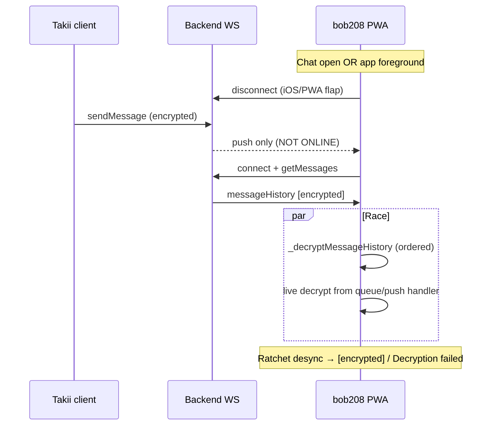

# Agent handoff: E2E decrypt core bug (P0)

**Date:** 2026-05-24  
**Severity:** P0 — product-breaking. Recipients see `[encrypted]` / `Decryption failed` instead of message text. Senders often see plaintext. Users will churn.

**Do not** tell users to “ask contact to send a new message”. **Do not** claim fixed until prod verification on iOS PWA Safari (bob208 scenario).

---

## Copy-paste prompt for next agent session

```
You are fixing Fireplace P0 E2E decryption failures.

READ FIRST:
- This file: docs/superpowers/specs/2026-05-24-e2e-decrypt-core-bug-agent-handoff.md
- CLAUDE.md §1 E2E / Decrypt ordering
- frontend/lib/providers/messaging_provider.dart (decrypt paths)
- frontend/lib/providers/connection_provider.dart (socketReady, connect)
- frontend/test/providers/messaging_provider_race_test.dart

CONTEXT:
- Production: https://fireplace.ignorelist.com, VM ~/fireplace, user bob208 = userId 37
- Primary client: iOS PWA Safari, single device, no browser tab
- Takii = userId 41

SYMPTOM:
- Sender (Takii) sees normal plaintext
- Recipient (bob208) sees "Encrypted message" or "Decryption failed" for 1–N messages
- Happens: (A) morning after push/offline, (B) during active chat ~22:14 local, NOT only 8h AFK

SERVER IS NOT THE BUG:
- sendMessage saves ciphertext + [encrypted] placeholder correctly
- Logs show: Recipient 37 NOT ONLINE → Web Push; then bob208 connect/disconnect burst
- Backend does not log decrypt errors (expected for E2E)

ROOT CAUSES (all must be addressed; partial fix = bug persists):

1) OFFLINE AT SEND INSTANT (operational trigger)
   - PWA socket drops; Takii sends while bob208 NOT ONLINE on WS
   - newMessage not emitted; push only
   - bob208 reconnects seconds later with double connect same second
   - VM pattern: subscriptions=2 on Web Push for userId=37

2) BACKGROUND LIVE DECRYPT (partially fixed on branch, may not be on master)
   - Branch fix/pwa-morning-e2e-decrypt @ 1871194:
     - Skip live decrypt when conversation not open (viewingConversationId)
     - retryDecryptActiveConversation after socketReady +900ms
     - Remove snackbarE2eAskSenderResend
     - History keeps [encrypted] until retry, then mark failed
   - master @ 44b0028 does NOT include this — verify prod deploy version via GET /version
   - This fix alone INSUFFICIENT for active open chat

3) LIVE + HISTORY DECRYPT RACE (active chat — main remaining bug)
   - User has ChatDetailScreen open (activeConversationId set)
   - Short reconnect → socketReady → getMessages(activeConvId) ALWAYS
   - onMessageHistory sets _decryptingHistory=true, runs _decryptMessageHistory oldest-first
   - In parallel: in-flight _decryptMessageAsyncQueued from newMessage NOT cancelled
   - Signal ratchet advanced out of order → Bad Mac / DuplicateMessageException
   - During history, failures often return msg unchanged → stays [encrypted]
   - Code: connection_provider.dart _onSocketReady getMessages; messaging_provider onMessageHistory ~756-768; _handleIncomingMessage ~868+

4) STUCK _decryptingHistory ON RECONNECT
   - onConnect: _decryptHistoryGeneration++ but does NOT set _decryptingHistory=false
   - _finishHistoryDecryptPass(oldGen) returns early if generation mismatch → flag stuck true
   - New newMessage while _decryptingHistory → only _incomingMessageQueue, no live decrypt
   - Code: onConnect ~2854; _finishHistoryDecryptPass ~417-422

5) RECONNECT CLEARS _pendingSendContent (sender-side edge)
   - onConnect reconnect path: _pendingSendContent.clear()
   - If messageSent not yet applied, sender can see [encrypted] on own bubble
   - Less common in Takii→bob report but fix anyway

6) REINSTALL / NEW KEYS (peer asymmetry)
   - One side reinstall → new identity keys uploaded
   - Other side keeps old Signal session until rebuild + new send
   - Password change does NOT fix decrypt of old ciphertexts

PRODUCTION LOG EVIDENCE (2026-05-24, bob208/Takii ~22:14 CEST = 20:14 UTC):

  20:14:33  sendMessage Recipient 37 NOT ONLINE (online [41])
  20:14:36  Web Push userId=37 subscriptions=2
  20:14:38-40 bob208 connect → disconnect → connect (same second)
  20:14:39 Takii also reconnecting

Earlier same window: multiple Recipient 37 NOT ONLINE + push while bob208 flapping.

DO NOT REVERT fix/pwa-morning-e2e-decrypt — merge it if missing, then add P0 below.

RECOMMENDED IMPLEMENTATION (new branch from master + merge morning fix if needed):

Branch name: fix/active-chat-e2e-decrypt-race

P0 (must ship together):
1. Single decrypt pipeline per conversation OR per senderId:
   - Before starting _decryptMessageHistory for conv C, await/drain _decryptChainBySender for peers in C
   - OR: on reconnect increment generation AND cancel/ignore in-flight live decrypt results for stale generation
2. onConnect(isReconnect): _decryptingHistory = false; flush _incomingMessageQueue after stable socket (careful ordering)
3. _finishHistoryDecryptPass: if generation stale but _decryptingHistory still true, force release hold
4. socketReady: debounce getMessages(activeConvId) — skip if messages for conv already loaded and last fetch < 30-60s
5. Keep morning fix: defer live decrypt when not viewing conversation

P1:
6. onConnect reconnect: do NOT clear entire _pendingSendContent — only entries older than N min or already messageSent
7. Web push: dedupe subscriptions on subscribe (remove stale endpoints for same user)
8. Optional UI: "Retry unlocking messages" button calling retryDecryptActiveConversation (NOT "ask sender to resend")

P2 (if still failing):
9. Extract ConversationDecryptCoordinator (queue: newMessage, messageHistory, retry)
10. iOS PWA socket: reduce connect() churn on AppLifecycleState.inactive

TESTS (add to messaging_provider_race_test.dart):
- defer live decrypt when conversation closed (from morning fix)
- reconnect during _decryptingHistory does not leave permanent [encrypted]
- newMessage + messageHistory same tick with open chat → plaintext after pass
- onConnect reconnect releases _decryptingHistory
- fakeAsync: socketReady getMessages debounced when recent history exists

VERIFICATION:
- flutter test test/providers/messaging_provider_race_test.dart
- flutter analyze
- Manual: bob208 PWA + Takii active chat, toggle app background 2s, send message, recipient must see plaintext
- Manual: morning push scenario still works
- Prod: curl https://fireplace.ignorelist.com/version after deploy

FILES TO TOUCH:
- frontend/lib/providers/messaging_provider.dart
- frontend/lib/providers/connection_provider.dart
- frontend/test/providers/messaging_provider_race_test.dart
- CLAUDE.md (decrypt ordering bullet)
- frontend/pubspec.yaml patch bump per .cursor/rules/version-bump.mdc

OUT OF SCOPE:
- Disabling E2E
- Server-side plaintext
- User workarounds (wait 15s, reinstall, password change)

SUCCESS CRITERIA:
- bob208 reads Takii messages sent during bob socket NOT ONLINE window
- No permanent [encrypted] after reconnect with open chat
- 3+ days prod without report from bob208
```

---

## Architecture diagram (failure mode)



---

## Key code locations (master baseline ~44b0028)

| Area | File | Notes |
|------|------|--------|
| Live incoming | `messaging_provider.dart` `_handleIncomingMessage` ~848 | Always live decrypt if needsDecryption; queues if `_decryptingHistory` |
| History decrypt | `messaging_provider.dart` `onMessageHistory` ~756-768 | Sets `_decryptingHistory`, `_decryptMessageHistory` |
| History finish | `messaging_provider.dart` `_finishHistoryDecryptPass` ~417 | Generation guard; releases hold |
| Decrypt async | `messaging_provider.dart` `_decryptMessageAsync` ~2553 | Bad Mac → failed or return msg during history |
| Reconnect | `messaging_provider.dart` `onConnect` ~2854 | Clears `_pendingSendContent` on reconnect |
| Socket ready | `connection_provider.dart` `_onSocketReady` ~200 | Always `getMessages(activeConvId)` |
| Resume | `main_shell.dart` | `ensureSessionReady` + `ensureReconnectIfNeeded` |
| Tests | `test/providers/messaging_provider_race_test.dart` | Existing race regressions |

---

## Branch / deploy state (2026-05-24)

| Branch | Commit | Contents |
|--------|--------|----------|
| `master` | `44b0028` | **No** morning E2E fix |
| `fix/pwa-morning-e2e-decrypt` | `1871194` | Morning defer, snackbar removed, 0.0.13 — **not merged to master** |
| Needed | `fix/active-chat-e2e-decrypt-race` | P0 race + reconnect fixes (not started) |

**Before coding:** On VM run `curl -sS https://fireplace.ignorelist.com/version` and confirm which build bob208 actually runs.

---

## VM log grep templates

```bash
cd ~/fireplace
# Replace window (UTC); Poland CEST = UTC+2
docker compose logs backend --since "2026-05-24T20:10:00" --until "2026-05-24T20:25:00" 2>&1 \
  | grep -v FIREBASE_SERVICE_ACCOUNT \
  | grep -iE 'bob208|Takii|userId=37|userId=41|sendMessage|NOT ONLINE|connected|disconnected|Key bundle|fetchPreKey|sessionRebuild'
```

Healthy send (both online): `newMessage emitted to recipient 37`  
Broken pattern: `Recipient 37 NOT ONLINE` + `Web Push` + connect burst within 5s

---

## User IDs (production)

| Username | userId | Role in incident |
|----------|--------|------------------|
| bob208 | 37 | Recipient, cannot decrypt |
| Takii | 41 | Sender, sees OK |
| maoi | 60 | Same NOT ONLINE pattern earlier |

---

## What failed before (lessons)

| Attempt | Why insufficient |
|---------|------------------|
| Morning defer fix only | Does not fix open-chat race |
| Password change / reinstall | JWT/session cleanup; does not fix client decrypt logic; can worsen Signal peer state |
| “Wait 15s after open PWA” | User still hits NOT ONLINE during chat; not acceptable UX |
| snackbar “ask resend” | Removed on fix branch; never ship again |

---

## Session references

- `.cursor/session-summaries/2026-05-17-session-e2e-deploy-log-diagnostics.md` — reconnect storm, dual push
- Investigation 2026-05-24: maoi 10:29, Jesus 15:59, Takii/bob208 22:14
- Subagent report: live-chat E2E race (task d02f1380)

---

## Agent rules reminder

- Read `CLAUDE.md` before/after code changes
- Work on **separate branch**; do not mix with `feature/composer-trailing-send-voice`
- Run `flutter test` + `graphify update .` after code edits
- No commit/push unless user asks
- English code only; bump patch in pubspec for production-worthy fix
