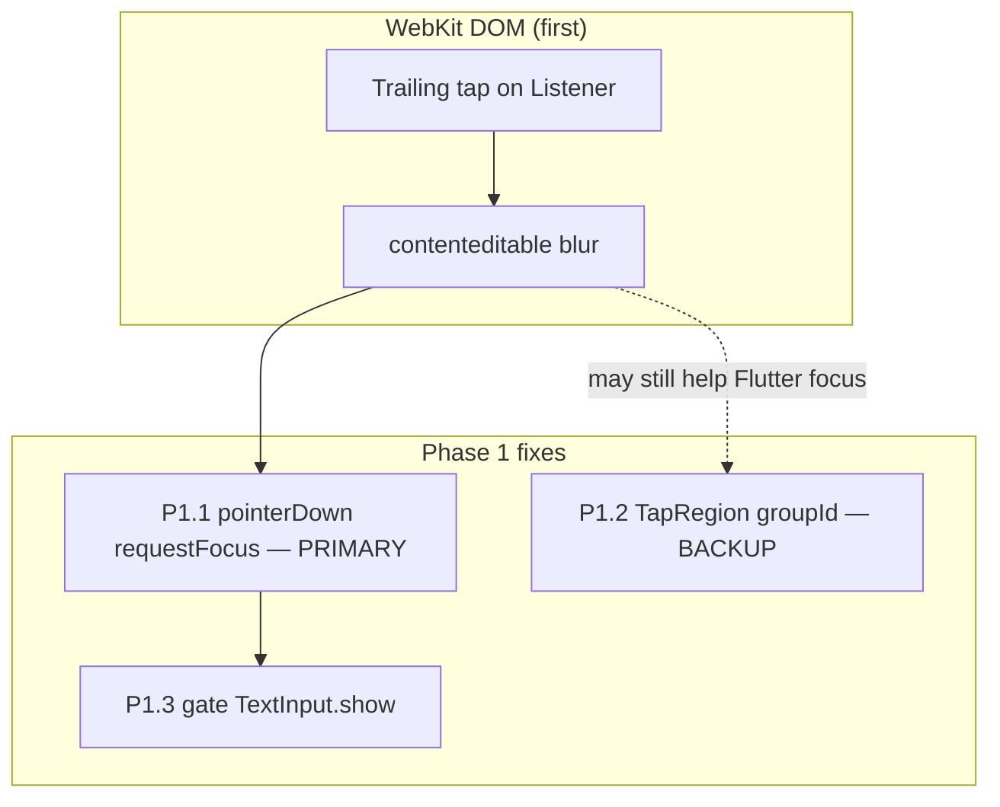

# iOS PWA — Composer Keyboard & Trailing Send Repair Plan

**Date:** 2026-05-25  
**Status:** Plan only (no implementation in this session)  
**App version at plan time:** `0.0.14` (`frontend/pubspec.yaml`)  
**Related specs:** [`docs/archive/superpowers/specs/2026-05-24-trailing-send-button-spec.md`](../archive/superpowers/specs/2026-05-24-trailing-send-button-spec.md) §3 keyboard policy, [`docs/superpowers/specs/2026-05-23-chat-composer-viewport-design.md`](2026-05-23-chat-composer-viewport-design.md), `CLAUDE.md` §9 Known Limitations (iOS Safari PWA composer)

---

## 1. Problem statement & reproduction matrix

### 1.1 Symptom (product)

On **iPhone Safari PWA** (Home Screen install, standalone), when the user types a message and taps the **trailing Send** icon (next to the mic):

- The **virtual keyboard dismisses** (or flickers closed then reopens).
- The **viewport jumps** (chat/composer shifts vertically — host scroll or `viewInsets` churn).
- The user cannot chain multiple messages with trailing send without re-tapping the field.

When the user sends via the **IME Send** key on the virtual keyboard, behavior is **acceptable**: keyboard stays up, no visible jump, messenger-style rapid send works.

**Messenger-standard target (Telegram / WhatsApp / Signal):**

| Behavior | Required |
|----------|----------|
| Keyboard while typing | Stable; no layout jump on each keystroke |
| After send (trailing or IME) | Keyboard **stays open**; field stays focused |
| Dismiss keyboard | Only when user taps **outside** composer (e.g. message list), navigates away, or OS dismiss — **not** on send |
| Scroll message list | Keyboard may remain open (no new `unfocus` on scroll) |

### 1.2 Reproduction matrix (verify on each platform before/after fix)

| ID | Platform | Install / runtime | Send path | Expected today (0.0.14) | Target after fix |
|----|----------|-------------------|-----------|-------------------------|------------------|
| R1 | iPhone | Safari **PWA** (standalone) | Trailing Send ×5 | **FAIL** — keyboard dismiss / jump | **PASS** |
| R2 | iPhone | Safari **PWA** | IME Send ×5 | **PASS** | **PASS** |
| R3 | iPhone | Safari **PWA** | Tap message list | Keyboard dismisses | Unchanged |
| R4 | iPhone | Safari **PWA** | Context Reply → send | Keyboard visible; send works | Unchanged / improved |
| R5 | iPhone | Safari **tab** (non-PWA) | Trailing ×3 | Likely same as R1 (WebKit) | **PASS** |
| R6 | Android | **native** app | Trailing ×5 | **PASS** | **PASS** (no regression) |
| R7 | Android | Chrome **PWA** / tab | Trailing ×3 | Separate jump issue (§9 CLAUDE) | No new regression |
| R8 | Desktop | Chrome / Edge | Trailing + Ctrl+Enter | **PASS** | **PASS** |

**Scope of this plan:** **R1–R5** (iOS WebKit, especially standalone PWA). R5 uses the same WebKit stack as R1; manual case **M9** is **required** (not optional) to confirm the fix in Safari tab as well as standalone PWA. R7 remains a follow-up unless `visualViewport` hardening (Phase 2) is bundled.

### 1.3 What is already shipped (0.0.14)

Trailing send + voice lock-up merged (`2026-05-25-session.md`). Stack architecture (mic always mounted, send overlay fade) matches [`2026-05-24-trailing-send-button-spec.md`](../archive/superpowers/specs/2026-05-24-trailing-send-button-spec.md). **iOS PWA trailing-send keyboard bug persists** — widget tests pass on VM; WebKit behavior is manual-only.

---

## 2. Root cause analysis (verified against source)

### 2.1 Shared send pipeline (both paths OK at logic level)

Both trailing tap and IME invoke the same `_send()`:

```161:179:frontend/lib/widgets/input/chat_input_bar.dart
  void _send() {
    final text = _controller.text.trim();
    if (text.isEmpty) return;
    // ... sendMessage, clear ...
    WidgetsBinding.instance.addPostFrameCallback((_) {
      if (!mounted || !_focusNode.canRequestFocus) return;
      if (!_focusNode.hasFocus) {
        _focusNode.requestFocus();
      }
      showSoftKeyboardIfHidden(context: context, hasFocus: true);
    });
  }
```

IME wiring keeps focus-friendly defaults:

```673:677:frontend/lib/widgets/input/chat_input_bar.dart
                              textInputAction: TextInputAction.send,
                              onEditingComplete: () {},
                              onSubmitted: (_) => _send(),
```

### 2.2 Why trailing Send differs from IME Send on iOS WebKit

| Factor | IME Send | Trailing Send |
|--------|----------|---------------|
| Target widget | `TextField` / platform text input | `_ComposerTapSendOverlay` → `Listener` **outside** `TextField` |
| Focus tree | Action originates on focused input | Hit target under `ExcludeFocus` trailing stack |
| WebKit | Submit action on active field; blur often deferred | Tap on non-input sibling → **blur contenteditable at DOM level** before Dart `onTap` |
| Flutter layer | `TapRegion` / focus scope may help **after** DOM retains focus | If DOM already blurred, post-frame `requestFocus` + `TextInput.show` runs too late |
| Post-send repair | Often unnecessary (`hasFocus` stays true) | `_send()` post-frame runs `requestFocus` + `TextInput.show` → **keyboard hide/show cycle** |

Trailing structure (send overlay is not a child of `TextField`):

```296:367:frontend/lib/widgets/input/chat_input_bar.dart
        return ExcludeFocus(
          child: SizedBox(
            width: 48,
            height: 48,
            child: Stack(
              // ...
              child: _ComposerTapSendOverlay(
                enabled: showTextSend,
                onTap: _send,
```

`_ComposerTapSendOverlay` uses pointer-up tap detection (not `IconButton` — intentional for mic long-press):

```735:749:frontend/lib/widgets/input/chat_input_bar.dart
  void _onPointerDown(PointerDownEvent event) { /* ... */ }

  void _onPointerUp(PointerUpEvent event) {
    // ...
    if (duration <= _kTapMaxDuration && moved <= _kTapMaxMovement) {
      widget.onTap();
    }
  }
```

**No `requestFocus()` on `pointerDown`** — focus retention is not asserted in the user-gesture turn, only **after** `pointerUp` → `_send()` → post-frame.

### 2.3 Amplifiers: iOS keyboard show + viewport lock

**Unconditional `TextInput.show` when insets are zero** (even if focus never left):

```6:17:frontend/lib/utils/soft_keyboard_web.dart
Future<void> showSoftKeyboardIfHidden({
  required BuildContext context,
  required bool hasFocus,
}) async {
  if (!hasFocus || !isIOSWebKit()) return;
  if (MediaQuery.viewInsetsOf(context).bottom > 0) return;
  try {
    await SystemChannels.textInput.invokeMethod<void>('TextInput.show');
```

After trailing tap, WebKit may briefly report `viewInsets.bottom == 0` while refocusing → `TextInput.show` runs → visible jump.

**Composer focus → host scroll lock** (iOS only):

```92:104:frontend/lib/widgets/input/chat_input_bar.dart
  void _onComposerFocusForWebViewport() {
    if (!kIsWeb) return;
    if (!_focusNode.hasFocus) {
      setIOSWebViewportScrollLocked(false);
      return;
    }
    if (!isIOSWebKit()) return;
    setIOSWebViewportScrollLocked(true);
    resetWebDocumentScroll();
```

Blur → lock off → refocus → lock on + `resetWebDocumentScroll()` in the same gesture frame sequence **amplifies** viewport shift.

**Viewport meta (keep):**

```21:21:frontend/web/index.html
  <meta name="viewport" content="width=device-width, initial-scale=1, viewport-fit=cover, interactive-widget=overlays-content">
```

**Layout:** `ChatDetailScreen` uses `ChatComposerViewport` (stacked composer + `viewInsets.bottom`); jump is not caused by `resizeToAvoidBottomInset` on web, but inset/scroll churn still moves the stack.

### 2.4 Root cause summary (one paragraph)

**Primary:** Trailing send is a `Listener` tap **outside** the `TextField` focus scope (`ExcludeFocus` trailing stack). iOS WebKit blurs the text input at the **DOM/contenteditable level** on that tap — often **before** Flutter’s focus system or `TapRegion` can prevent it. **Fix priority:** synchronous `requestFocus()` on **`pointerDown`** in the same user-activation turn (Phase 1.1). **Secondary:** `_send()` always schedules post-frame `showSoftKeyboardIfHidden`, which calls `TextInput.show` on iOS when keyboard inset is zero — repainting the keyboard after a self-inflicted blur; gate this when focus was held (Phase 1.3). **Tertiary:** Focus listener toggles `setIOSWebViewportScrollLocked` and `resetWebDocumentScroll`, moving the host document during the same interaction. **Defense-in-depth:** `TapRegion` with a stable `groupId` (Phase 1.2) helps Flutter treat trailing send as inside the composer group but **does not replace** pointerDown retention — WebKit may blur first.

### 2.5 Historical bugs (do not regress)

| Bug | Cause | Current guard |
|-----|--------|----------------|
| Mar 2026 keyboard flicker | Mic/send swapped as `Row` siblings → unmount beside `TextField` | `Stack` + `AnimatedOpacity`; `RecordingController` always mounted |
| Android keyboard dismiss while typing | `context.watch` + refocus churn | `context.select`; conditional `requestFocus` only when `!hasFocus` |
| Reply without keyboard (iOS) | Focus without user gesture | `setComposerFocusRequest` + `showSoftKeyboardIfHidden` on reply |

### 2.6 Fix layering (implementation mental model)



**Do not assume** `TapRegion` alone fixes iOS PWA trailing send; validate pointerDown + gated show first.

---

## 3. Goals / non-goals

### 3.1 Goals

| ID | Goal |
|----|------|
| G1 | iOS PWA: trailing Send ×5 — keyboard **stays open**, no viewport jump between sends |
| G2 | iOS PWA: IME Send ×5 — unchanged (regression guard) |
| G3 | Typing in composer — no new jump or dismiss |
| G4 | Tap message list / non-composer — keyboard still dismisses (framework default) |
| G5 | Reply, action panel chevron, voice lock send — no regression |
| G6 | Android native + desktop web — no regression on R6/R8 |
| G7 | iOS Safari **tab** (R5 / M9) — trailing send stable, same WebKit class as PWA |

### 3.2 Non-goals

| Item | Notes |
|------|--------|
| Android Chrome web composer jump | Separate limitation (`CLAUDE.md` §9); optional Phase 2 `visualViewport` |
| Global May 2026 web scroll-lock stack | Do not reintroduce wholesale |
| Replacing `_ComposerTapSendOverlay` with `IconButton` | Would break mic long-press hit testing |
| `unfocus()` on scroll | Telegram-like; keep absent |
| Changing `textInputAction` / removing `onEditingComplete: () {}` | Would break IME send stability |
| E2E / backend changes | Frontend-only |

---

## 4. Proposed solution (phased)

### Phase 1 — Minimal fix (target for next implementation session)

**Objective:** Retain focus in the WebKit user-gesture turn on trailing tap, stop unnecessary `TextInput.show` after a successful trailing send, and add Flutter-level tap grouping as backup.

**Implementation order (mandatory):** **P1.1 → P1.2 → P1.3 → P1.4 → P1.5** (pointerDown and `_send` gating before TapRegion backup; do not ship TapRegion-only and expect iOS PWA to pass M1–M3).

#### 4.1.1 `pointerDown` focus retention — **primary fix**

In `_ComposerTapSendOverlay._onPointerDown`, when `enabled`:

```dart
void _onPointerDown(PointerDownEvent event) {
  if (!widget.enabled) return;
  _downTime = DateTime.now();
  _downPosition = event.position;
  // Retain focus in the same user-gesture turn (before WebKit blur on pointerUp).
  widget.onPointerDownRetainFocus?.call();
}
```

Wire from `ChatInputBar`:

```dart
onPointerDownRetainFocus: () {
  if (_focusNode.canRequestFocus && !_focusNode.hasFocus) {
    _focusNode.requestFocus();
  }
  // Do NOT call showSoftKeyboardIfHidden here unless focus was already lost
  // and reply path needs it — trailing send should keep keyboard if already open.
},
```

**Important:** Use **synchronous** `requestFocus()` on `pointerDown`, not post-frame — WebKit ties keyboard visibility to the active user activation. `TapRegion` operates in Flutter’s focus system; it cannot reliably undo a DOM-level blur that already occurred.

#### 4.1.2 Narrow `_send()` post-frame repair

Split “focus restore” vs “keyboard show”:

```dart
void _send() {
  // ... existing send + clear ...
  final hadFocusBeforeSend = _focusNode.hasFocus;
  WidgetsBinding.instance.addPostFrameCallback((_) {
    if (!mounted || !_focusNode.canRequestFocus) return;
    if (!_focusNode.hasFocus) {
      _focusNode.requestFocus();
    }
    // Only invoke TextInput.show when focus was actually lost or keyboard truly hidden.
    if (!hadFocusBeforeSend || !_focusNode.hasFocus) {
      showSoftKeyboardIfHidden(context: context, hasFocus: true);
    }
  });
}
```

Extend `showSoftKeyboardIfHidden` API (Phase 1 small change to `soft_keyboard.dart` / `soft_keyboard_web.dart`):

```dart
Future<void> showSoftKeyboardIfHidden({
  required BuildContext context,
  required bool hasFocus,
  bool force = false, // when true, keep today behavior (reply gesture)
});
```

Use `force: true` from `_requestComposerFocus` / reply fallback; use default `force: false` from `_send()` so trailing send does not call `TextInput.show` if inset > 0 and focus held.

#### 4.1.3 `TapRegion` with stable `groupId` — **backup / defense-in-depth**

Wrap the **composer input row** (action chevron + `TextField` / recording bar + trailing slot) in a `TapRegion` sharing one **stable** group id.

| Widget | Inside `TapRegion`? |
|--------|---------------------|
| `TextField` | Yes |
| Trailing `ExcludeFocus` stack (mic + send overlay) | Yes |
| Action panel chevron | Yes (optional; reduces accidental unfocus when toggling panel) |
| Reply bar / disappearing banner | **No** (above row; separate tap targets) |
| `ChatActionTiles` | **No** |

**Rationale:** Flutter 3.7+ `TapRegion` marks descendants as part of the same tap/focus group so pointer events on trailing send are less likely to be treated as an “outside” dismiss tap **in Flutter**. This is **supplemental** to §4.1.1 — not a substitute. **No `TapRegion` usage exists in the repo today** (grep clean) — new pattern.

**Required: anchor `groupId` on `ChatInputBarState` (not in `build()`):**

```dart
class ChatInputBarState extends State<ChatInputBar> {
  /// Stable identity for TapRegion; must NOT be created in build().
  final Object _composerTapRegionGroup = Object();

  @override
  Widget build(BuildContext context) {
    // ...
    return TapRegion(
      groupId: _composerTapRegionGroup,
      child: Row(
        children: [
          // chevron, Expanded(TextField|recording bar), _buildTrailingSlot,
        ],
      ),
    );
  }
}
```

Creating `groupId: Object()` inside `build()` allocates a new identity every rebuild and **silently breaks** `TapRegion` grouping — treat as a hard implementation requirement.

#### 4.1.4 Preserve explicit “show keyboard” paths

| Call site | Keep behavior |
|-----------|----------------|
| `_requestComposerFocus` | `requestFocus` + `showSoftKeyboardIfHidden(..., force: true)` or always show when reply |
| `_onReplyTargetChanged` post-frame | Same as today (reply without gesture) |
| `_toggleActionPanel` iOS post-frame | Same as today |
| `_onComposerFocusForWebViewport` | **Do not remove** scroll lock + `resetWebDocumentScroll` in Phase 1 |
| `_send()` after IME | Narrow show — IME path often keeps `hadFocusBeforeSend == true` |

**Phase 1 optional add-on (promote from Phase 2 if jump persists):** Debounce or skip redundant `resetWebDocumentScroll()` when `scrollTop` is already 0 and lock state unchanged (see §4.2 P2.2) — implement in Phase 1 if M1–M3 still show vertical jump after P1.1–P1.3.

### Phase 2 — Hardening (escalation only)

**Promotion rule:** Start Phase 2 **only if** manual iPhone PWA QA **M1, M2, or M3** fail **after** Phase 1 is merged and deployed to a test build. If M1–M3 pass but M4–M8 fail, fix within Phase 1 scope first. Do not begin P2.1 `visualViewport` work without a failed M1–M3 record in PR or session summary.

| Item | Action |
|------|--------|
| P2.1 | `ChatComposerViewport`: cap/latch bottom inset using `visualViewport` on iOS WebKit (`dart:js_interop` / `package:web`) to reduce double-layout when inset flickers |
| P2.2 | Debounce `resetWebDocumentScroll` — skip if `scrollTop` already 0 and lock unchanged (**if not already pulled into Phase 1**) |
| P2.3 | Telemetry hook (debug-only): log `hasFocus`, `viewInsets.bottom` on trailing send in profile builds |
| P2.4 | Consider `TapRegion` on full composer column including reply bar if reply+send fails QA |

**Do not** remove or weaken these in Phase 1 or 2:

| Mechanism | File | Reason |
|-----------|------|--------|
| `onEditingComplete: () {}` | `chat_input_bar.dart` ~676 | Prevents IME send unfocus |
| `Stack` mic + send overlay | `chat_input_bar.dart` `_buildTrailingSlot` | Prevents unmount dismiss |
| `_ComposerTapSendOverlay` not `IconButton` | same file ~711 | Mic long-press |
| `ExcludeFocus` on trailing slot | ~299 | Tab order; does not block TapRegion group |
| iOS scroll lock on focus | `web_viewport_scroll_web.dart` | Prevents host scroll jump while typing |
| `interactive-widget=overlays-content` | `web/index.html` | Reduces VK overlay resize |
| `RecordingController` always mounted | trailing stack | Mar 2026 fix |

---

## 5. Implementation tasks

### Phase 1 checklist (order matters)

- [ ] **P1.1** **(PRIMARY)** Add `onPointerDownRetainFocus` to `_ComposerTapSendOverlay`; call synchronous retain from `_onPointerDown` — `frontend/lib/widgets/input/chat_input_bar.dart`
- [ ] **P1.2** Narrow `_send()` post-frame: track `hadFocusBeforeSend`; gate `showSoftKeyboardIfHidden` — `chat_input_bar.dart`
- [ ] **P1.3** Optional `force` param on `showSoftKeyboardIfHidden` — `soft_keyboard.dart`, `soft_keyboard_web.dart`, `soft_keyboard_stub.dart`
- [ ] **P1.4** Keep reply/action-panel call sites on `force: true` (or equivalent) — `chat_input_bar.dart` `_requestComposerFocus`, `_onReplyTargetChanged`, `_toggleActionPanel`
- [ ] **P1.5** **(BACKUP)** Add `final Object _composerTapRegionGroup = Object();` on **`ChatInputBarState`**; wrap composer `Row` in `TapRegion` using that field — **never** `Object()` in `build()` — `chat_input_bar.dart`
- [ ] **P1.6** Widget tests (§6.1) — extend `chat_input_bar_trailing_send_test.dart`
- [ ] **P1.7** Manual QA matrix (§6.2) on iPhone PWA — **gate for merge** (M1–M3 required; M9 required for R5)
- [ ] **P1.8** Update `CLAUDE.md` (§8)
- [ ] **P1.9** Bump `frontend/pubspec.yaml` PATCH → **0.0.15** only when shipping to prod (§9)
- [ ] **P1.10** *(Conditional)* If M1–M3 still jump after P1.1–P1.4: add P2.2-style `resetWebDocumentScroll` debounce before opening Phase 2

### Phase 2 checklist (conditional — see §4.2 promotion rule)

- [ ] **P2.0** Document failed M1/M2/M3 steps and `hasFocus` / inset observations in PR or session summary
- [ ] **P2.1** Spike `visualViewport` inset in `chat_composer_viewport.dart` + iOS detect
- [ ] **P2.2** Debounce `resetWebDocumentScroll` (if not done in P1.10)
- [ ] **P2.3** Manual QA R7 if Android Chrome in scope
- [ ] **P2.4** Document outcome in `CLAUDE.md` §9

### Files touched (expected)

| File | Change |
|------|--------|
| `frontend/lib/widgets/input/chat_input_bar.dart` | pointerDown focus (primary), `_send` gating, TapRegion + stable group field |
| `frontend/lib/utils/soft_keyboard.dart` | Optional `force` flag |
| `frontend/lib/utils/soft_keyboard_web.dart` | Respect `force` / stricter gate |
| `frontend/lib/utils/soft_keyboard_stub.dart` | Signature parity |
| `frontend/test/widgets/input/chat_input_bar_trailing_send_test.dart` | New cases |
| `CLAUDE.md` | iOS PWA composer limitation + fix note |
| `frontend/pubspec.yaml` | 0.0.15 on release only |

**No change expected:** `recording_controller.dart`, `chat_composer_viewport.dart` (Phase 1 unless P1.10/P2.1), `web/index.html` (keep meta), `web_viewport_scroll_web.dart` (keep lock; optional debounce in P1.10/P2.2).

---

## 6. Test plan

### 6.1 Automated widget tests

**File:** `frontend/test/widgets/input/chat_input_bar_trailing_send_test.dart`

| Test | Assertion |
|------|-----------|
| Existing: after tooltip Send, focus true post-frame | Keep passing |
| **NEW:** No `TextInput.show` when focus stays held after trailing send | See mock spec below |
| **NEW:** `TapRegion` wraps `TextField` and trailing stack | `find.byType(TapRegion)` ancestor of both |
| **NEW:** pointerDown on send overlay calls retain callback | `TestWidgetsFlutterBinding` + simulate pointer down on overlay before up |
| **NEW:** `_composerTapRegionGroup` is stable across rebuilds | Pump frame that triggers `setState`; same `TapRegion.groupId` identity (or test that group field exists on state via package test pattern) |
| IME send still sends | Existing test ~220 |
| `RecordingController` mounted | Existing |

**`TextInput.show` mock (required — no vague test doubles):**

In tests that pump `ChatInputBar` on web/iOS code paths (or force `showSoftKeyboardIfHidden` to run):

```dart
var textInputShowInvocationCount = 0;

TestDefaultBinaryMessengerBinding.ensureInitialized();
TestDefaultBinaryMessengerBinding.instance.defaultBinaryMessenger
    .setMockMethodCallHandler(SystemChannels.textInput, (MethodCall call) async {
  if (call.method == 'TextInput.show') {
    textInputShowInvocationCount++;
  }
  return null;
});

// ... tap trailing send while FocusNode already has focus ...

await tester.pumpAndSettle();
expect(textInputShowInvocationCount, 0);
```

Also assert `textInputShowInvocationCount` increments when simulating focus lost before send (negative control). Tear down handler in `tearDown` to avoid polluting other tests.

**Optional new file:** `frontend/test/widgets/input/chat_input_bar_ios_send_focus_test.dart` if mocks clutter trailing_send tests.

**CI:**

```bash
cd frontend && flutter analyze
cd frontend && flutter test test/widgets/input/chat_input_bar_trailing_send_test.dart
cd frontend && flutter test test/providers/messaging_provider_composer_focus_test.dart
cd frontend && flutter test test/utils/web_viewport_scroll_test.dart
```

**Limitation:** Flutter widget tests **do not execute iOS WebKit**; they guard regressions in focus/invoke logic only. **iPhone PWA manual QA is the release gate.**

### 6.2 Manual QA matrix (required)

Device: iPhone, iOS 17+ (or current test phone). **PWA cases M1–M8:** installed Home Screen app. **M9:** Safari tab (R5).

| # | Steps | Pass | Gate |
|---|--------|------|------|
| M1 | Open chat, focus composer, type → **trailing Send ×5** | Keyboard visible entire time; no vertical jump; field focused after each send | **Merge blocker** |
| M2 | Same thread → **IME Send ×5** | Same as M1 | **Merge blocker** |
| M3 | Type → trailing send → **continue typing** without tapping field | Next message types immediately | **Merge blocker** |
| M4 | **Tap message list** (not composer) | Keyboard dismisses | Required |
| M5 | Long-press → **Reply** → type → trailing send | Reply clears; keyboard stable | Required |
| M6 | Open **action panel** → close → type → trailing send | No jump; keyboard stable | Required |
| M7 | **Voice lock** send (if 0.0.14 voice lock enabled) | Unchanged voice UX | Required |
| M8 | Rotate / safe area | Composer not clipped; send tappable | Required |
| M9 | Safari **tab** (non-PWA): trailing Send ×3 | Same stability as M1 (R5 in scope) | **Required** |

Record pass/fail in PR description or session summary. **Phase 2** only if M1, M2, or M3 fail after Phase 1 merge.

---

## 7. Risks, gaps, and rollback

### 7.1 Risks

| Risk | Severity | Mitigation |
|------|----------|------------|
| Relying on `TapRegion` alone | **High** — will not fix iOS PWA if DOM blurs first | Implement **P1.1 pointerDown** first; treat TapRegion as backup only |
| `groupId` created in `build()` | **High** — silent TapRegion failure every rebuild | **`final Object _composerTapRegionGroup = Object();`** on `ChatInputBarState` only |
| `pointerDown` focus shows keyboard when user intended dismiss | Medium | Retain only when send overlay `enabled` and composer had focus |
| Reply path loses `TextInput.show` | Medium | Keep `force: true` on reply / `_requestComposerFocus` |
| Android native refocus loop | Medium | `hadFocusBeforeSend` gate; no sync `showSoftKeyboard` on every `_send` |
| Mic long-press broken | High | Do not replace overlay with `IconButton`; keep pointer-up send detection |
| `TapRegion` breaks tap-to-dismiss on list | Low | Only wrap composer row, not viewport |
| Scroll lock stuck on | Low | `dispose` still clears lock (`chat_input_bar.dart` ~143–146) |
| Viewport jump after P1.1–P1.3 | Medium | **P1.10:** debounce `resetWebDocumentScroll` before Phase 2 |

### 7.2 Gaps (known limitations of this plan)

| Gap | Impact | Plan response |
|-----|--------|----------------|
| Widget tests do not run WebKit | Cannot prove M1–M3 in CI | Manual iPhone PWA + M9 Safari tab required |
| `TapRegion` on web under-tested in repo | Unknown edge cases on PWA | PointerDown primary; manual M1/M5/M6 |
| Android Chrome composer jump (R7) | Out of scope for Phase 1 | Phase 2 P2.3 / separate track |
| `visualViewport` inset flicker | May need Phase 2 | Only after failed M1–M3 post-Phase 1 |
| R5 vs PWA install differences | Standalone vs tab chrome | **M9 required** — same fix, both must pass |

### 7.3 Rollback

Revert Phase 1 commit(s); redeploy prior `frontend-build` on VM. No DB/API impact.

---

## 8. `CLAUDE.md` updates (on implementation)

| Location | Update |
|----------|--------|
| §1 `ChatInputBar` / composer send bullet | iOS PWA trailing send: **pointerDown** focus retention (primary) + gated `showSoftKeyboardIfHidden` + `TapRegion` backup with stable `groupId` on state |
| §9 Known Limitations | Change “partial fix” to “fixed in 0.0.15” when M1–M6 **and M9** pass; else keep partial + link this plan |
| §7 Widget gotchas `ChatInputBar` | Trailing send: sync focus on pointerDown; do not call `TextInput.show` after every trailing send; `groupId` not in `build()` |

---

## 9. Version bump note

- **Plan only:** stay on `0.0.14`.
- **On production-worthy ship:** increment PATCH per `.cursor/rules/version-bump.mdc` → **`0.0.15`** in `frontend/pubspec.yaml`; mention in commit/deploy summary.
- **Skip bump** for doc-only or abandoned spike.

---

## 10. Polish summary (dla właściciela produktu)

- **Problem:** Na iPhone PWA (aplikacja z ekranu głównego) przycisk **Wyślij** obok mikrofonu chowa klawiaturę i przesuwa ekran; wysyłka z klawiatury (IME) działa dobrze.
- **Przyczyna:** Przycisk jest poza polem tekstowym — Safari na poziomie DOM zdejmuje fokus z pola **zanim** Flutter zdąży zareagować; potem aplikacja na siłę otwiera klawiaturę ponownie.
- **Plan naprawy (faza 1, kolejność):** (1) **Główna naprawa:** przytrzymać fokus już przy **dotknięciu** przycisku (`pointerDown`), nie dopiero po puszczeniu. (2) Nie wywoływać ponownego pokazania klawiatury po każdym wysłaniu, jeśli fokus został. (3) **Zapasowo:** wspólna strefa tap (`TapRegion`) dla pola i przycisku — to nie wystarczy samo.
- **Weryfikacja:** Test na iPhone PWA — M1–M3 (5× przycisk, 5× klawiatura, dalsze pisanie); Safari w zakładce (M9); tap w listę wiadomości nadal chowa klawiaturę.
- **Faza 2:** Tylko jeśli M1–M3 nadal nie przechodzą po fazie 1.
- **Wersja:** Po wdrożeniu na produkcję — **0.0.15**.

---

## Appendix — Code reference index

| Topic | Location |
|-------|----------|
| `_send()` + post-frame | `chat_input_bar.dart` 161–179 |
| Focus / viewport lock | `chat_input_bar.dart` 79–105, 143–146 |
| Trailing stack + overlay | `chat_input_bar.dart` 282–367, 709–776 |
| `TextField` IME | `chat_input_bar.dart` 635–677 |
| `showSoftKeyboardIfHidden` | `soft_keyboard_web.dart` 6–17 |
| Scroll lock | `web_viewport_scroll_web.dart` 18–33 |
| Viewport meta | `web/index.html` 21 |
| Composer layout | `chat_composer_viewport.dart` 56–79 |
| iOS WebKit detect | `web_ios_webkit_web.dart` 4–12 |
| Trailing send tests | `chat_input_bar_trailing_send_test.dart` |
| Keyboard policy spec | `docs/archive/superpowers/specs/2026-05-24-trailing-send-button-spec.md` §3 |

---

**Next agent session:** Implement Phase 1 in order **P1.1 → P1.2 → P1.3 → P1.4 → P1.5** (pointerDown and `_send` gating before TapRegion backup), run CI tests including `TextInput.show` mock (§6.1), execute manual **M1–M3 and M9** on iPhone (PWA + Safari tab). If M1–M3 still fail, try P1.10 scroll debounce before Phase 2. On pass: bump to 0.0.15 and update `CLAUDE.md`.
